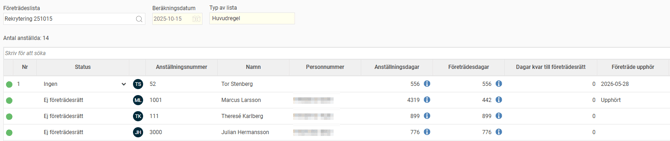
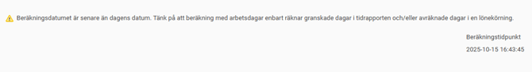
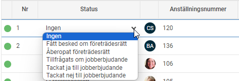
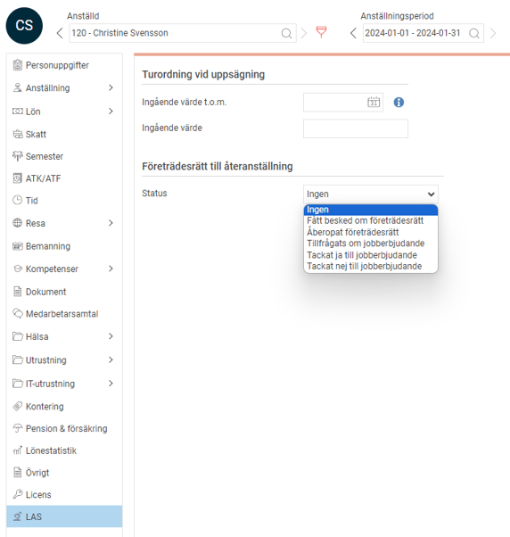
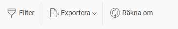

# LAS - Företräde till återanställning

**Datum:** den 20 oktober 2025  
**Kategori:** Employee  
**Underkategori:** Anställningshantering  
**Typ:** other  
**Svårighetsgrad:** advanced  
**Tags:** anställning, kurs  
**Bilder:** 9  
**URL:** https://knowledge.flexhrm.com/sv/las-foretrade-till-ateranstallning-0

---

I denna artikel fokuserar vi på LAS-listan Företrädesrätt till återanställning som används när en verksamhet har möjlighet att anställa och därmed återanställa personal. 

Om du behöver rekrytera, måste vissa personer erbjudas möjligheten att återkomma till tjänsten innan en extern rekrytering initieras. Detta ger en tidigare anställde företräde till arbetet, under förutsättningen att hen har tillräckliga kvalifikationer för tjänsten. Förturen gäller under en begränsad period, upp till nio månader efter avgångsdatum.

Ingår i modulerna HRM Employee och HRM Payroll
I HRM finns en egen vy under
Personal > LAS > Företrädesrätt till återanställning
, där beräkningarna för företräde utförs och visas.
Så här skapar du en företrädeslista
För att skapa en ny lista klickar du på
Ny
.
Börja med att ange ett namn för listan.
Ange ett
Beräkningsdatum / Datum för säsongsstart
. All beräkning av dagar i listan görs till och med det datum du anger här.
Observera att detta datum inte är samma sak som
Beräkningstidpunkt
. Beräkningstidpunkt visas högst upp till höger i den färdiga listan och visar när själva beräkningen utfördes.
Välj vilken typ av lista du vill skapa. Du har följande alternativ:
Huvudregeln
: Används när du ska anställa en person som tidigare blivit uppsagd eller inte fått sin tidsbegränsade anställning förlängd på grund av arbetsbrist eller konkurs.
Företräde till ny SÄVA
: Används när du ska anställa en person med anställningsformen särskild visstidsanställning (SÄVA).
Företräde till ny säsongsanställning
: Används när du ska anställa en person för en säsong.
Klicka på
Spara
när du har gjort dina val.
När beräkningen är klar visas den färdiga företrädeslistan.

Beräkningsdatum / Datum för säsongsstart
Företrädeslistan beräknar dagar fram t.o.m. det angivna datumet.
Har listan ett framtida datum, t.ex. datumet för när nästa säsong startar, kommer dagar att räknas fram t.o.m. det angivna datumet. Det blir som en slags simulering av framtida dagar.
En anställning med en anställningsform som beräknas på kalenderdagar räknar samtliga dagar fram till det satta datumet. En anställning med en anställningsform som beräknas på arbetsdagar räknar alla dagar som är granskade i tidrapporten (HRM Time) och/eller avräknade dagar i en lönekörning (HRM Payroll) fram till det satta datumet.
Om beräkningsdatumet är senare än dagens datum kommer du bli uppmärksammad på det genom en varning.

Företrädeslistan
Högst upp till vänster i vyn väljer du vilken företrädeslista du vill arbeta med och du kan där enkelt ta fram andra skapade listor.
När du har valt en företrädeslista får du upp de anställda som ingår i den. Du kan sortera på kolumner genom att klicka på rubriken.
Till vänster finns en kolumn för
Nr
, d.v.s. vilken företrädesordning respektive anställd har. Det är alltså i den ordningen du ska tillfråga dem om ny anställning.
Färgförklaring
De färgade bollarna visar om den anställde kunnat beräknas korrekt d.v.s. det har inget att göra med om företräde är uppnått eller inte.

Beräknades utan problem.

Beräknades med varning. Exempelvis kan det finnas perioder i tidrapporten som inte är granskade och därmed inte kan beräknas eller att övergångsregeln har tagits i beaktande. Mer information om vilken anställningsperiod det gäller finns under info-bubblorna.

Beräknades inte. Exempelvis om någon av den anställdes anställningsperioder saknar fr.o.m. datum.

Info-bubblan, som du hittar i kolumnerna för företrädesdagar och anställningsdagar, visar från vilka perioder de insamlade dagarna kommer ifrån samt om beräkningen är gjord på kalenderdagar eller arbetade dagar.
Info i listan
Avgångsorsak
ligger direkt efter "Avgångsdatum". Detta hjälper dig att snabbt förstå varför en person finns i listan. Du kan till exempel enklare se om en person med en relevant historik har avslutat sin senaste anställning på egen begäran och därmed inte har företrädesrätt, vilket gör listan lättare att tolka.
Anställningsdagar
visar LAS-grundande anställningsdagar. Klicka på informationsikonen för att se beräkningsdeltaljer.
Företrädesdagar
visar de anställningsdagar som är företrädesrättsgrundande.
Dagar kvar till företrädesrätt
visar hur många anställningsdagar dagar det är kvar till att den anställde har uppnått företreädesrätt. Visar listan 0 har den anställde redan uppnått företrädesrätt. Observera att den hör ihop med kolumnen Företräde upphör.
Företräde upphör
visar om/när den anställdes företrädesrätt förfallit/förfaller. Har den anställde en gällande visstidsanställning så visas inget i denna ruta.
Status
Kolumnen
Status
används för att följa vilken status respektive anställd i listan har. Du kan redigera statusen för anställda som uppnått företrädesrätt. För anställda i listan som ännu inte uppnått företrädesrätt eller att den upphört är statusen fast till Ej företrädesrätt.
Status sparas per anställningsperiod och kan redigeras antingen från en lista den anställde är med i:

eller från den anställdes LAS-flik i anställdaregistret:

Statusen hämtas direkt från anställningsperioden och är därmed live. Det kräver alltså inte en omräkning av listan. Ändras statusen slår den igenom på alla listor som anställningen finns på, där det är samma gällande period för beräkningsdatum.
Notera att status för anställningsperioder som inte är företrädesrättsgrundande inte visas varken i anställdaregistrets LAS-flik eller i företrädeslistan. I företrädeslistan ser du alltid status för den senaste anställningsperioden som var företrädesrättsgrundande.
Anställda
Listan innehåller anställda som:
uppnått företrädesrätt
ännu inte uppnått företrädesrätt
företrädesrätten upphört för
Krav för att anställd ska kunna komma med i listan är att den anställde:
ingår i urvalet som användes när ny lista skapades
har minst en anställningsperiod som är helt granskad i nyanställningsvyn
(enbart granskade anställningsperioder beräknas)
har anställningstyp
Anställd
har inte en aktiv
Tillsvidareanställning
eller
Provanställning
har en anställningsperiod som:
har en anställningsform av typen
Tillsvidareanställning
och att avgångsorsaken är
Uppsägning på grund av arbetsbrist
eller
Uppsägning på grund av konkurs
eller
har en pågående/avslutad tidsbegränsad anställning där avgångsorsaken inte är
Egen begäran.
för att komma med i en SÄVA-lista
måste ha arbetat minst en SÄVA-period inom 3 år från beräkningsdatumet
för att komma med i en Säsongs-lista
måste ha arbetat minst en säsongsperiod inom 2 år från beräkningsdatumet
Krav för att anställda ska ha uppnått företrädesrätt:
enligt
Huvudregeln
ha varit anställd
inom nio månader från beräkningsdatumet och
haft en anställningstid som uppnått 12 månader (30x12 = 360 dagar) inom 3 år från beräkningsdatumet.
enligt
Företräde till ny SÄVA
ha varit anställd i SÄVA
inom nio månader från beräkningsdatumet och
haft en anställningstid i SÄVA som uppnått nio månader (30x9 = 270 dagar) inom 3 år från beräkningsdatumet.
enligt
Företräde till ny säsongsanställning
ha varit säsongsanställd
inom nio månader från beräkningsdatumet (när den nya säsongen börjar) och
haft en anställningstid som uppnått sex månader (30x6 = 180 dagar) inom 2 år från beräkningsdatumet.
Övriga ikoner

Filter
Du kan välja att inte visa alla anställda i listan genom att sätta ett filter. Filtret tittar på värden som är sparade i respektive lista d.v.s. inte värdet från anställdaregistret.
Exportera
Du kan när som helst exportera aktuell lista som .csv och .xlxs-fil.
Räkna om
Räknar om hela företrädeslistan. Användbart när du gjort ändringar på anställningar som ska tas hänsyn till.
