# ⚙️LAS - Inställningar och beräkningsdetaljer

**Datum:** den 5 december 2025  
**Kategori:** Employee  
**Underkategori:** Anställningshantering  
**Typ:** config  
**Svårighetsgrad:** advanced  
**Tags:** anställning  
**Bilder:** 21  
**URL:** https://knowledge.flexhrm.com/sv/las-installningar-och-berakningsdetaljer-0

---

Funktionen LAS ingår i modulerna HRM Employee och HRM Payroll. LAS-listor är viktiga verktyg inom arbetsrätt och personaladministration. Dessa listor hjälper arbetsgivaren att hantera vissa anställningsfrågor på ett strukturerat sätt.
I Flex HRM hittar du tre olika LAS-listor: Turordning vid uppsägning, Rätt till tillsvidareanställning och Företrädesrätt till återanställning.
Samtliga listor i HRM utgår från LAS - Lag (1982:80) om anställningsskydd som reglerar förhållandet mellan arbetstagare och arbetsgivare i syfte att skydda de anställda. Det finns även förhandlade undantag som regleras i kollektivavtal och därför är det viktigt att du stämmer av just ert kollektivavtal för att se om något avviker från LAS.
Här beskriver vi de inställningar och behörigheter som krävs för att använda LAS-vyerna i HRM, samt hur beräkningarna av anställningsdagar fungerar i detalj.
Innehåll i denna artikel
Checklista för inställningar
Anställningsdagar
Behörigheter
Licens & Basland
Anställningsform
Utökad tillfälleshantering SÄVA
Personalkategori
Avgångsorsaker
LAS-flik per anställd
Checklista för inställningar
✅Behörigheter
✅Anställningsformer
✅Personalkategorier
✅Avgångsorsaker
Om beräkning på arbetsdagar
✅Lönearter
✅Ev. Kontering
Säkerställ anställningsuppgifter per anställd
✅Anställningsperioder
✅Anställningsform
✅Personalkategori
✅Ev. ingående värde (LAS-flik per anställd)
Anställningsdagar
Samtliga LAS-vyer utgår från samma standardberäkning för att få fram totalt antal anställningsdagar. Dessa dagar visas i kolumnen
Anställningsdagar
i respektive vy.
Anställningsdagar beräknas antingen utifrån samtliga kalenderdagar eller utifrån antal arbetade dagar under respektive anställningsperiod. Detta styr du via anställningsformen.
Genom att klicka på
info-bubblan
i kolumnen för anställningsdagar får du upp en förklaring på beräknade dagar.
Här hittar du mer info och fördjupning om beräkningsdetaljerna i LAS.
Arbetade dagar kan hämtas på två olika sätt vilket du kan ställa in per personalkategori.
Arbetade dagar via tidrapporten i HRM Time
En granskning krävs i tidrapporten för att arbetade dagar ska beräknas.
Som arbetad dag räknas samtliga registrerade tidkoder i den anställdes tidrapport d.v.s. även frånvaro och odefinierade tidkoder.
Se även avsnittet nedan,
Beräkna utifrån kontering
,
om att kunna blanda olika
anställningsformer sa
mma dag/period. Eller för att ställa in utökad tillfälleshantering.
Arbetade dagar via lönearter i HRM Payroll
Arbetsdagar summeras från de lönearter som är inställda på att räknas som arbetsdagar för LAS.
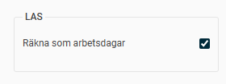
Enheten på lönearten måste vara arbetsdagar
Datumen på löneraden måste ligga helt inom anställningsperioden (annars kommer inte dagarna räknas med i LAS-beräkningen).
Lönekörningen måste vara avräknad för att dagarna ska räknas med.
Om löneraden saknar datum kommer den räknas tillhöra lönekörningens avvikelseperiod.
Sysselsättningsgrad
Det har ingen betydelse, för beräkningen av dagar, vilken sysselsättningsgrad den anställde har eller har haft.
Ålder
Vid lika anställningstid är det den med högst ålder som har förtur.
Om två anställda har samma anställningstid innebär det i turordning vid uppsägning att den yngsta får gå först och i listan för företräde till återanställning att den äldsta har företräde till återanställningen.
Anställningsperioder och fler anställningar
Beräkning utförs på anställningsperioder som har kopplats på anställningar som har samma
personnummer.
Om flera anställningar, inom samma eller olika företag inom samma koncern, har samma personnummer så räknas de som kopplade. Här kan det förekomma överlappande perioder eller arbetade dagar.
Eftersom perioder kan överlappa innebär det att vissa perioder/dagar kan räknas dubbelt. En unik dag
räknas per företag/organisationsnummer
inom koncernen. Exempelvis om en anställd arbetar på förmiddagen i ett företag och på eftermiddagen i ett annat företag i samma koncern så kommer den anställde tillgodoräkna sig två anställningsdagar. Detsamma gäller om en anställd har arbetat i samma företag  samma dag men på olika anställningsnummer.
Behörigheter
För att aktivera någon av LAS-vyerna behöver du först aktivera den på aktuella roller:
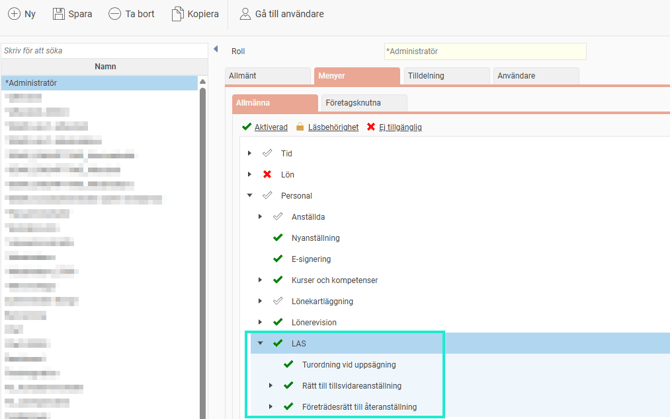
Listan
Rätt till tillsvidareanställning
är behörighetsstyrd vilket innebär att du ser de anställda som du har behörighet att se enligt inställningar på din användare.
Övriga listor
är inte behörighetsstyrda per anställd.
Bockar du även i
Visa logg
enligt nedan, för
Rätt till tillsvidareanställning
, blir aktuell roll behörig till information i loggen för samtliga anställda i den listan dvs inte bara för de anställda rollen har behörighet till. Läs mer om loggen i separat avsnitt.
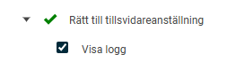
Bockar du i
Ta bort anställd
för listan
Företrädesrätt till återanställning
har du möjlighet att ta bort en anställd ur den listan.
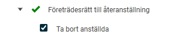
Licens och basland
För att kunna koppla på behörigheten enligt ovan behöver du ha HRM Employee eller HRM Payroll i licensen och du måste ha basland Sverige enligt inställningen under
Allmänt > Företag.
Anställningsform
För att hantera beräkningen i HRM krävs att du ser över inställningarna
LAS
under
Inställningar > Personal > Anställningsformer
.
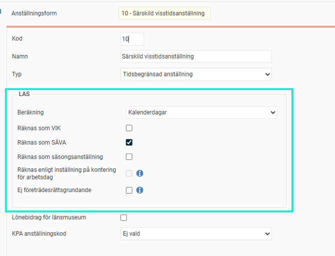
Default ligger beräkning
Kalenderdagar
på alla anställningsformer. För er med kollektivavtal som beräknar utifrån arbetade dagar behöver ni därför ändra detta på den eller de anställningsformer som berörs.
I vissa kollektivavtal finns det även anställningsformer som ska undantas helt från LAS-beräkningen och då väljer ni istället
Undantagen
. Det innebär att anställningsperioder med en sådan anställningsform inte kommer ge några LAS-dagar.
Beräkningsinställningen per anställningsform påverkar alla LAS-vyers beräkningar.
För de anställningsformer som är någon form av visstidsanställning, och som ska räknas i rätten till tillsvidareanställning och företrädesrätt till återanställning, behöver ett val göras för vad den ska beräknas som. Det går enbart att bocka i ett av nedan alternativ per anställningsform.
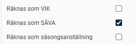
Alternativet för
Räknas enligt inställning på kontering
för arbetsdag
går enbart att välja på anställningsformer där LAS-beräkningen är inställd på
Arbetsdagar
och det finns en konteringsdimension i aktuellt företag som har inställningen för
Används för LAS - Rätt till tillsvidareanställning
.
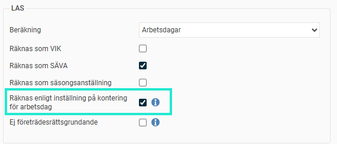
Läs mer om denna inställning
nedan.
I de fall en anställningsform inte ger rätt till företrädesdagar behöver du ha
Ej företrädesrättsgrundande
ibockad.
Det innebär att anställningsperioder med denna anställningsform enbart räknas som
Anställningsdagar
och exkluderas från
Företrädesdagar.
OBS!
Det är viktigt att alla anställningsperioder på en anställd har anställningsform och personalkategori ifylld för att beräkningar ska kunna göras.
Beräkna utifrån kontering (kräver HRM Time)
För att kunna arbeta på olika anställningsformer samma dag/period (vissa avtal tillåter det) kan du använda ett eget register för olika anställningsformer att tidrapportera på. Notera att det endast kan användas på anställningsformer med beräkningen
Arbetsdagar
.
För att använda funktionen skapar du en egen konteringsdimension för detta ändamål och bockar i
Används för LAS-beräkning på arbetsdagar
.
Denna bock tillåts inte för utökade register.
Inställningar > Allmänt > Konteringsdimensioner
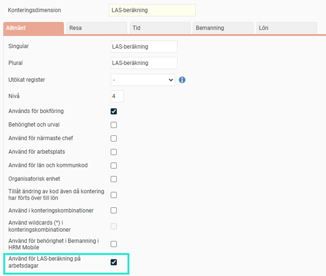
När du aktiverat ovan behöver du lägga upp val i registret för den skapade konteringsdimensionen genom att gå till
Register
och skapa upp nya koder med kod och namn. Därefter väljer du om respektive val ska räknas som SÄVA eller VIK vid beräkningen av arbetsdagar.
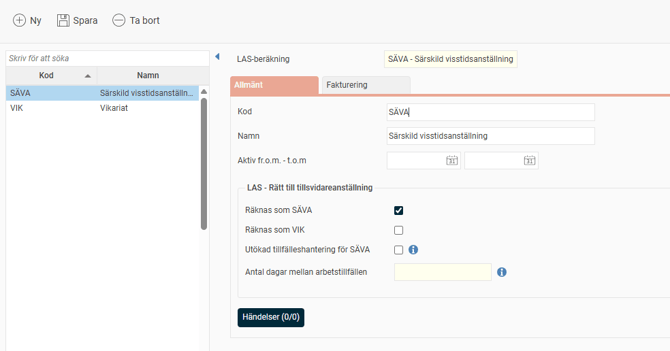
Om enbart kontering för
SÄVA
använts en dag genererar det en SÄVA-dag.
Om enbart kontering för
VIK
använts en dag genererar det en VIK-dag.
Om kontering för SÄVA och VIK använts samma dag på olika tidrader genererar det två dagar d.v.s. en för SÄVA och en för VIK.
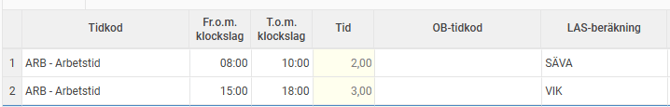
På de arbetsdagar inget av ovan val gjorts används den inställning som finns på den anställningsform som den anställde har inställt i fliken Anställning i anställdaregistret.
Notera
Om kontering för VIK använts på tidrad och det även finns en tidrad samma dag utan LAS-kontering kommer enbart en VIK-dag genereras.
Du anger kontering för LAS-beräkning direkt i tidrapporten. Kom ihåg att du måste visa aktuell kontering för LAS i tidrapporten för att det ska kunna anges.
Om du har modulen HRM Plan kan du ange konteringen per dag direkt i schemaläggningen. Det gör det möjligt för den som bemannar passet att redan i schemat ange om tiden ska räknas som SÄVA eller Vikariat.
Utökad tillfälleshantering för SÄVA
Syftet med denna inställning är att kunna frångå att varje arbetad dag räknas som ett tillfälle.
Väljer du
Utökad tillfälleshantering för SÄVA
krävs att
Räknas som SÄVA
också är valt och att
Antal dagar mellan arbetstillfällen
är ifyllt.
Antal dagar mellan arbetstillfällen
styr hur många dagar mellan två SÄVA-dagar som krävs för att räknas som ett nytt SÄVA-tillfälle.
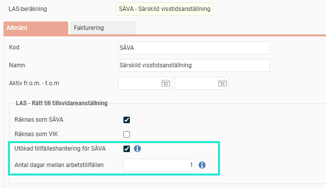
Exempel med utökad tillfälleshantering (antal dagar mellan arbetstillfällen inställt 1 enligt ovan bild)
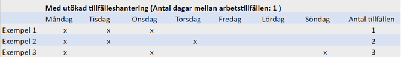
Använder du inte utökad tillfälleshantering kommer varje arbetad dag att räknas som ett tillfälle, vilket är grundinställningen i HRM vid SÄVA .
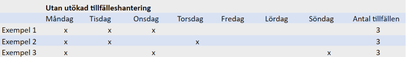
Personalkategori
Under
Personalkategorier
ställer du in vilket gränsvärde som ska gälla för SÄVA respektive VIK vid beräkning av rätt till tillsvidareanställning. Inställningen är per personalkategori.
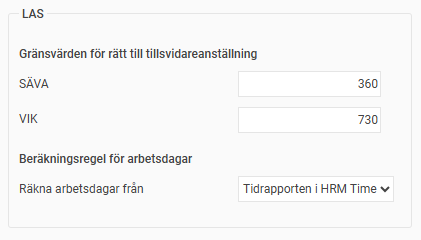
Beroende på om du använder HRM Time och/eller HRM Payroll kan du här välja om arbetsdagar ska räknas utifrån tidrapporten i HRM Time eller lönearter i HRM Payroll. Inställningen är per personalkategori.
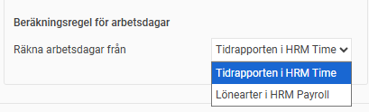
Detta gäller de anställningsformer där man ställt in att beräkning görs med
arbetsdagar.
Om du ska räkna arbetsdagar via löneart i HRM Payroll krävs även vissa inställningar på
lönearten.
OBS!
Det är viktigt att alla anställningsperioder på en anställd har anställningsform och rätt personalkategori ifylld för att beräkningar ska kunna göras.
Avgångsorsaker
Avgångsorsaker
kan påverka vilka anställda som kommer med i listan för företrädesrätt till återanställning. Det är därför viktigt att sätta rätt avgångsorsak på anställda som slutat.
Beräkning utgår från inställningen för
Avgångsorsak i arbetsgivarintyget och företrädeslistan i LAS
och ställs in per avgångsorsak enligt exemplet nedan:
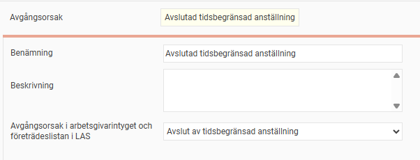
LAS-flik per anställd
I denna meny i anställdaregistret kan information sparas per anställd.
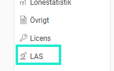
Ingående värde för Turordning vid uppsägning
Ingående värde
och
Ingående värde t.o.m
. är användbart om du har vissa uppgifter om den anställde i ett annat system och vill flytta över det till HRM.

Finns ett värde i dessa fält räknar HRM anställningsdagar enligt värdet fram till t.o.m. datumet och efter det ingående datumet beräknas dagarna från HRM (anställningsperioder/arbetsdagar). Det innebär att i Anställningsdagar slås antalet dagar ihop.
I exemplet nedan har den anställde totalt 3866 anställningsdagar i Listan Turordning vid uppsägning.
1022 (Ingående värde) + 2844 (Anställningsperioder i HRM from 20218-01-02) = 3866.

Viktigt att notera att dessa värden enbart tillämpas på beräkningen av anställningsdagar i listan turordning vid uppsägning.
Dessa fält går även att importera via fil samt att exportera till fil.
Status för Företrädesrätt till återanställning
Status för
Företrädesrätt till återanställning
används för att på ett strukturerat vis se vem som fått besked om företrädesrätt, åberopat sin företrädesrätt, tillfrågats om jobberbjudande, tackat ja till jobberbjudande samt tackat nej till jobberbjudande.
Ändras statusen här slår den igenom på den anställde i alla företrädeslistor som anställningen finns på och som beräkningsdatumet också är inom anställningsperiodens datum.
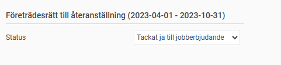
Ändras status i företrädeslistan som anställningen finns i så ändras det i anställdaregistret.
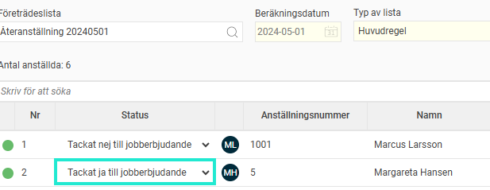
Relaterade artiklar
⚙️LAS - Beräkningsdetaljer fördjupning
LAS - Företräde till återanställning
LAS - Rätt till tillsvidareanställning
LAS - Turordning vid uppsägning
