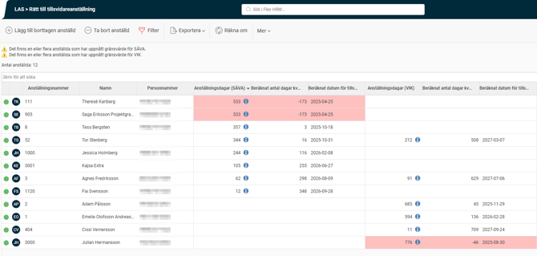
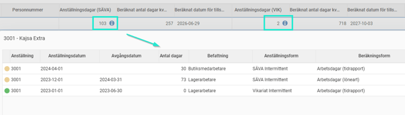
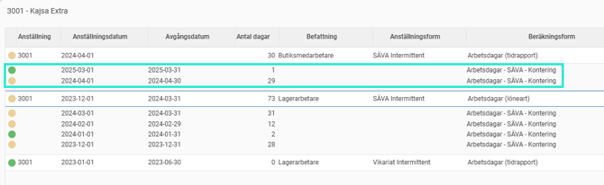
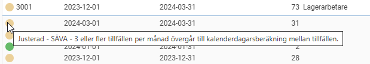

# LAS - Rätt till tillsvidareanställning

**Datum:** den 15 oktober 2025  
**Kategori:** Employee  
**Underkategori:** Anställningshantering  
**Typ:** other  
**Svårighetsgrad:** advanced  
**Tags:** anställning  
**Bilder:** 4  
**URL:** https://knowledge.flexhrm.com/sv/las-ratt-till-tillsvidareanstallning-0

---

I denna artikel fokuserar vi på LAS-listan Rätt till tillsvidareanställning som är en funktion i HRM som hjälper dig att hålla koll på om en anställd med Särskild visstidsanställning eller vikariat börjar närma sig en Tillsvidareanställning. 

Ingår i modulerna HRM Employee och HRM Payroll
När någon med anställningsformen Särskild visstidsanställning (SÄVA) varit anställd i sin SÄVA i mer än 12 månader under en femårsperiod övergår anställningen till en tillsvidareanställning.
För vikariat gäller att någon varit anställd som vikarie i sammanlagt mer än två år under en femårsperiod.
Avvikelser kan finnas för när en SÄVA eller ett vikariat övergår till en tillsvidareanställning enligt ditt kollektivavtal. Denna artikel utgår ifrån standardreglerna enligt
Lag (1982:80) om anställningsskydd
.
Skapa en lista för tillsvidareanställning
I HRM finns en egen vy under
Personal > LAS > Rätt till tillsvidareanställning
, där beräkningar för vilka som närmar sig eller uppnått tidpunkten för när deras visstidsanställning övergår till en tillsvidareanställning.

Denna lista är "live" och behöver därför inte skapas upp som övriga LAS-listor.
Anställda
Listan visar aktiva och avslutade anställningar vid
beräkningstidpunkten
som har eller har haft en anställningsform som räknas som SÄVA eller VIK inom fem år bakåt. Listan tar inte med aktuella tillsvidareanställningar vid beräkningstidpunkten.
Listan är behörighetsstyrd vilket innebär att du ser de anställda som du har behörighet att se enligt inställningar på din användare.
Ta bort anställd ur listan
Vill du dölja en anställd från listan t.ex. när någon avlidit, väljer du
Ta bort anställd
i menyn, markerar aktuell anställd, skriver en
kommentar
om varför (valfritt) och klickar sedan på
Spara
.
Vill du få tillbaka den anställde till listan väljer du istället
Lägg till borttagen anställd
i menyn.
Det du gör här loggas i listans
logg
under
Mer
.
Beräknat antal dagar kvar
Kolumnerna för Beräknat antal dagar kvar till tillsvidareanställning (SÄVA/VIK) räknar varje kalenderdag framåt från idag vilket ger tidigast möjliga datum för tillsvidareanställning.
Information om beräknade dagar
För att se vad SÄVA-dagar respektive VIK-dagar beräknats utifrån kan du klicka på
info-bubblorna
i respektive kolumn.

Du kan även klicka på rader med dagar i eller som har en gul/röd statusboll i första kolumnen.

Då får du mer information om en period justerats eller att beräkningen påverkas på ett annat sätt. Exempelvis kan du få information om en period överlappar med en annan eller som i nedan exempel där den anställde har haft 3 eller fler tillfällen samma månad:

Övriga ikoner
Filter
Du kan välja att inte visa alla anställda i listan genom att sätta ett filter.
Exportera
Du kan när som helst exportera aktuell lista till Excel som .csv och .xlxs. Exporten är behörighetsstyrd likt listan i övrigt.
Logg
Loggen visar följande händelser:
skapad
borttagen anställd
tillagd anställd
tidpunkt
vem som ändrat
vilken anställd det gäller
kommentar
Notera
att loggen inte är behörighetsstyrd på anställd som övriga listan är. Det innebär att har du tillgång till loggen ser du ovan händelser för samtliga anställda. Separat behörighet för att visa loggen finns, se rubriken för behörigheter ovan.
Uppdatering av listan / Räkna om
Har det gått mer än 24 timmar sedan listan uppdaterades kommer en varningstext upp och du kan själv göra en ny omräkning via
Räkna om
. Det kan vara bra att göra om du vet att du har gjort en justering på en anställd som du vill se direkt i listan.
När du räknar om räknas hela listan om oavsett din behörighet, dvs. du räknar om för samtliga anställda oavsett om du har behörighet att se dem i listan.
