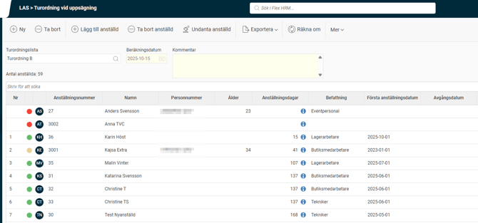
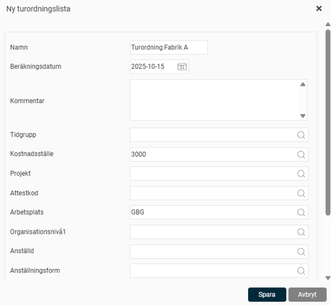
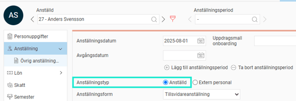
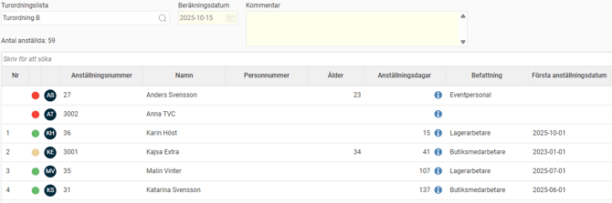
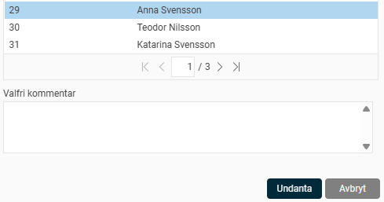

# LAS - Turordning vid uppsägning

**Datum:** den 15 oktober 2025  
**Kategori:** Employee  
**Underkategori:** Anställningshantering  
**Typ:** other  
**Svårighetsgrad:** advanced  
**Tags:** anställning  
**Bilder:** 11  
**URL:** https://knowledge.flexhrm.com/sv/las-turordning-vid-uppsagning-0

---

I denna artikel fokuserar vi på Turordning vid uppsägning som används när en verksamhet behöver minska på personalen på grund av arbetsbrist eller sviktande ekonomi. 

Turordningen bestämmer i vilken ordning de anställda får gå, där i Sverige (lite förenklat), den med kortast anställningstid får gå först. Den anställd som ligger överst i listan är den med kortast anställningstid.

Ingår i modulerna HRM Employee och HRM Payroll
Skapa en turordningslista
I HRM finns en egen vy under
Personal > LAS > Turordning vid uppsägning,
där beräkningarna för turordningen utförs och visas.

Här guidar vi dig genom stegen för att skapa och beräkna en ny turordningslista.
Klickar du på
Ny
och definierar aktuell turordningskrets med hjälp av urval
Börja med att ge din lista ett namn.
Ange ett
Beräkningsdatum
. All beräkning kommer att göras till och med det datum du anger här.
I fältet
Kommentar
kan du till exempel förklara turordningskretsen. Det här fältet är valfritt.
Välj vilka anställda som ska ingå i turordningskretsen.
När du har gjort dina urval klickar du på
Spara
.

När du sparar startar systemet en beräkning i bakgrunden. Turordningslistan visas så snart beräkningen är klar.
Skillnaden mellan Beräkningsdatum och Beräkningstidpunkt
Det är viktigt att skilja på de två datumen:
Beräkningsdatum
är det datum du själv väljer som slutdatum för beräkningen.
Beräkningstidpunkt
visas högst upp till höger i listan och är den tidpunkt då själva beräkningen utfördes.
Vilka anställda kommer med?
Kravet för att en anställd ska komma med i listan är, förutom att den passar in i urvalet
Att det finns en aktiv anställningsperiod för beräkningsdatumet.
Att den anställde är markerad som Anställd i
Anställningstyp
i anställdaregistret.

Turordningslistan
Högst upp till vänster i vyn väljer du vilken turordningslista du vill arbeta med och du kan enkelt ta fram tidigare listor.
När du har valt en turordningslista får du upp en lista med de anställda som ingår. Du kan enkelt sortera på vilken kolumn du vill genom att klicka på rubriken.
Längst till vänster finns en kolumn för
Nr
, dvs. vilken turordningen är för uppsägning för respektive anställd. De som inte har något nummer är antingen undantagna från turordningen, saknar anställningsdatum i anställningsperiod eller är nyss tillagda i listan utan att en omräkning gjorts sedan senaste beräkningen.

Färgförklaring

Beräknades utan problem.

Visas endast vid beräkning av perioder via arbetsdagar, där det finns tidrapporter som är preliminära. Anställningen är beräknad men det finns perioder i tidrapporten som inte är granskade. Mer information om vilken anställningsperiod det gäller finns under info-bubblan i kolumnen
Anställningsdagar
.

Någon av den anställdes anställningsperioder saknar fr.o.m. datum. OBS! Det går att ha tomt i fr.o.m. datum om anställningen har ett ingående värde med tillhörande datum.

Anställningen är undantagen.

Anställningen är inte beräknad. Detta sker efter manuellt tillägg av anställd till turordningslistan och kräver omräkning av hela listan.

Info-bubblan, som du hittar i kolumnen för anställningsdagar, visar från vilka perioder de insamlade dagarna kommer ifrån samt om beräkningen är gjord på kalenderdagar eller arbetade dagar.
Lägg till, Ta bort och Undanta anställd
För att kunna justera urvalet kan man manuellt hantera vilka anställda man vill lägga till, ta bort eller undanta.
Lägg till anställd
– visar anställda som ännu inte är del av turordningslistan, vald anställd läggs till i turordning. Du måste sedan manuellt trigga omräkning av hela turordningen när alla anställningar som ska med är tillagda.
Ta bort anställd
– visar anställda som är del av vald turordningslista, vald anställd tas bort helt från listan. En anställd som inte är del av turordningskretsen ska tas bort från listan.
Tips:
den anställde du markerar i listan kommer även vara markerad i den popup som kommer vid Ta bort anställd och Undanta anställd.
Undanta anställd
– visar anställda som är del av turordningslistan. Dessa kommer alltså vara kvar i listan, men undantagna vilket innebär att oavsett deras placering av antal dagar så får de ingen turordning. Detta används för anställda som är del av en turordningskrets, men som av särskilda skäl ska undantas t.ex. särskilt betydande person, familjemedlem, VD etc.
Notera:
för att ångra ett undantag i listan behöver du först ta bort den anställde från listan för att sedan lägga till den igen, vilket då kräver omräkning.
En
valfri kommentar
kan anges för respektive funktion ovan. Denna kommentar kommer att synas i ändringsloggen.

Övriga ikoner
Räkna om
Räknar om hela turordningslistan. Användbart när du gjort ändringar på anställningar som ska tas hänsyn till i turordningslistan.
Turordningslistan visas som en ögonblicksbild av hur anställningar ser ut vid tillfället för beräkningen. Det innebär att ändringar på anställningar som görs i efterhand inte kommer att påverka den beräknade listan förens den räknas om.
Logg
Visar en ändringslogg där du ser vem som gjort ändringar, på vilken anställd och när, även kommentar visas här. Denna logg går även att exportera till Excel (.csv eller .xlsx). Följande ändringar loggas:
Skapandet av turordningslistan.
Omräkningar.
Tillägg av anställd.
Borttag av anställd.
Undantagande av anställd.
Exportera
Hela listan kan här exporteras till Excel som .csv eller .xlsx.
