# Ny anställning? - Så hanterar HRM Employee onboarding av anställda

**Datum:** den 23 september 2025  
**Kategori:** Employee  
**Underkategori:** Anställningshantering  
**Typ:** other  
**Svårighetsgrad:** intermediate  
**Tags:** anställning, dokument, hrm-employee, offboarding, onboarding, signering  
**Bilder:** 21  
**URL:** https://knowledge.flexhrm.com/sv/hur-hanterar-flex-hrm-employee-onboarding-och-offboarding-av-anst%C3%A4llda

---

HRM Employee effektiviserar onboarding genom guidade anställningsprocesser där man lägger upp nya anställda eller anställningsperioder, fyller i uppgifter och godkänner granskningssteg. Systemet stöder också generering och e-signering av anställningsavtal, samt hanterar påminnelser för granskning och uppföljning av uppdrag via en panel på startsidan.
Innehåll
Lägg upp ny anställd
Ta fram anställningsavtal
E-signering
Lägg upp ny anställningsperiod
Notis om ny anställning
Uppdrag - Digital checklista vid onboarding
Onboarding - Lägg upp ny anställd eller ny anställningsperiod
Att lägga upp en nyanställd med hjälp av anställningsprocessen
Gå till
Personal > Nyanställning
.
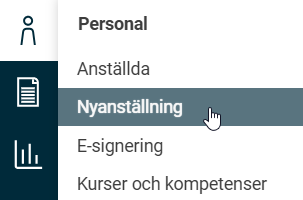
Klicka på
Ny anställd
och välj lämplig
anställningsmall
för den aktuella medarbetaren.
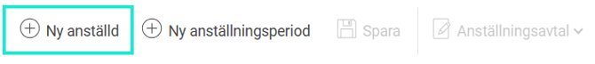
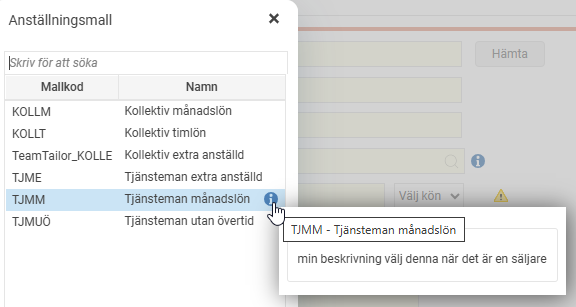
Anställningsmall i HRM hjälper till att effektivisera anställningsflödet med default-värden och genom att skapa en användare till den anställde med automatik
Fyll i alla uppgifter om den anställde. Tryck på
spara
för att spara uppgifterna.
Nu syns den anställde i listvyn
Anställda > Nyanställning
.
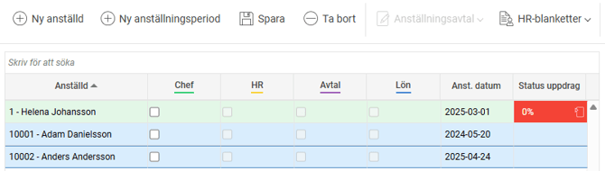
Om du inte kan fylla i alla uppgifter direkt kan du spara och sedan komma tillbaka vid ett senare tillfälle.
*
visar vad som måste anges innan du kan spara första gången.
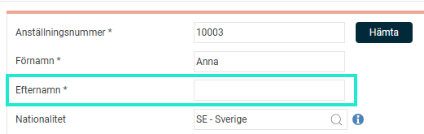
När du fyllt i alla uppgifter så ska du godkänna din nyanställning.
Du godkänner genom att
bocka i
aktuellt granskningssteg
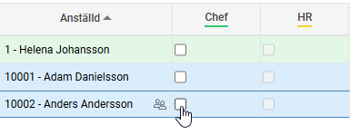
Om du inte har fyllt i alla fält som åläggs dig i och med ditt granskningssteg får du ett
felmeddelande
.
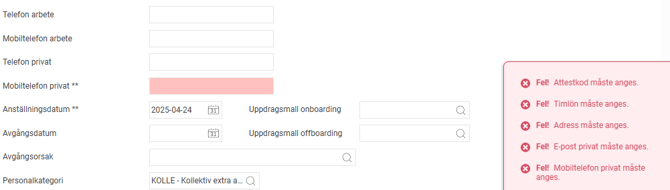
När du fyllt i de
obligatoriska fälten (**)
kan du gå vidare i processen och granska enligt ovan och nästa nivå för granskning träder då in.
Om man har aktiverat minst en granskningsnivå i företaget kommer det i anställdaregistret visas att den anställde ej är aktiverad och att ytterligare granskning krävs.
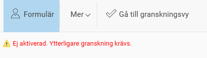
Vilket innebär att den anställde inte kommer att synas någon annanstans i systemet än i anställdaregistret. Den anställde kan alltså inte registrera tidrapport eller reseräkning.
När alla nivåer för granskning är genomförda kommer den anställde eller den nya anställningsperioden att bli tillgänglig i resten av systemet, och den anställde kan då till exempel börja tidrapportera och göra reseräkningar. Det innebär även att den anställde inte längre syns i Nyanställningsvyn.
I anställdaregistret får man information om vem som utfört granskningen samt tidpunkt för detta via
Mer – Granskningslogg
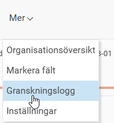
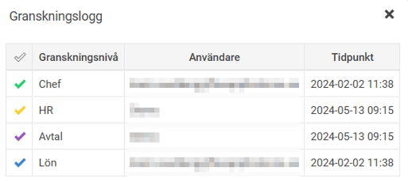
Ta fram ett anställningsavtal
Har du behörighet att hämta ett anställningsavtal syns ikonen
Anställningsavtal
.
Observera att det kan vara styrt i vilket granskningssteg som det går att ta fram ett anställningsavtal. Är den utgråad behöver ett eller flera granskningssteg godkännas innan avtalet kan tas ut i nyanställningsvyn. I nedan exempel är det i steget
Avtal
som
Anställningsavtalet
kan hämtas.
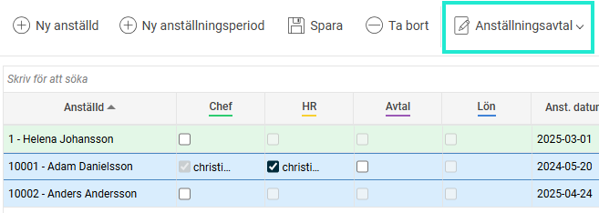
Välj rätt A
nställningsavtal
, fyll i uppgifter i rutan och ladda ner eller skicka avtal för e-signering.
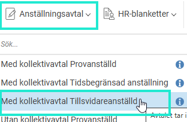
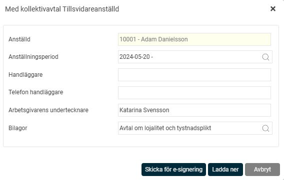
Läs om hur du skickar dokumentet för E-signering
Skapa ny anställningsperiod
När en anställd som redan har varit eller är anställd i företaget får en ny anställning/nya anställningsvillkor så ska en ny anställningsperiod läggas upp på den anställde. Det görs via
Personal > Nyanställning
.
Välj
Ny anställningsperiod

Hämta upp den anställde i listan
Anställd
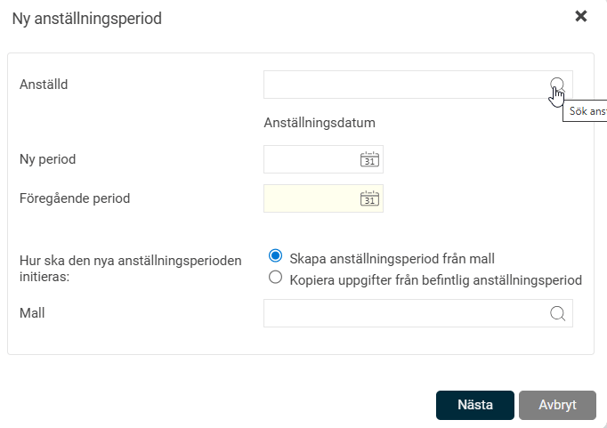
Bra att veta!
Hittar du inte den anställde i listan? Ta hjälp av din systemadministratör som då behöver lägga upp den nya perioden för den anställde för att du ska få behörighet till den anställde.
Välj datum för den
nya perioden
Välj
anställningsmall
alt.
kopiera uppgifter från en befintlig tidigare anställningsperiod
.
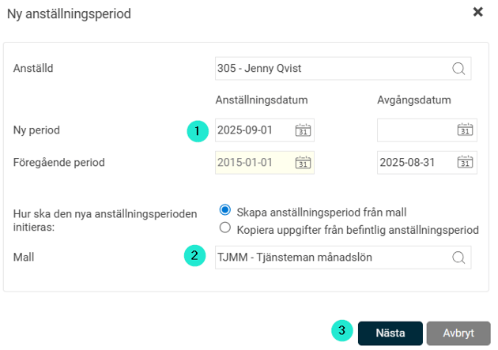
Observera att vid
Kopiera uppgifter från tidigare anställningsperiod
använder systemet den anställningsmall som den tidigare perioden lades upp på och följer de regler som gäller det flödet.
När den nya anställningsperioden har initierats följer den sedan samma flöde som vid nyanställning och du fyller i de uppgifter som behövs, ex. lägger till ny lön och övriga uppgifter, sparar och granskar sedan den anställde. Avtal hämtas, se avsnitt
Ta fram ett anställningsavtal
.
Bra att veta!
Uppgifter så som ny månadslön/timlön, sysselsättningsgrad, egna fält och kontering som sätts för den nya perioden inte är direkt kopplade till en anställningsperiod i HRMs anställdaregister. Det innebär att dessa fält uppdateras direkt i personregistret när du sparar den nya perioden, med det datum som du satt som fr.o.m datum på den nya anställningsperioden. Men om en anställningsperiod tas bort igen så kommer inte dessa datumstyrda fält att tas bort med automatik. De behöver då tas bort manuellt i anställdaregistret. Ta hjälp av din systemadministratör om du behöver. Vill du ha mer info?
Läs mer om att ta bort anställningsperiod
Påminnelser för granskning av anställningsperioder
Du ser notis om det finns anställda kvar att granska på startsidan i HRM. Påminnelsen ligger kvar så länge det finns någon anställd kvar att granska.
På
startsidan
ser du också vilka anställda påminnelsen avser, och inom parentes hur många anställningsperioder det rör sig om. Om du
klickar på den anställdes namn
öppnas vyn för nyanställning, där du får en överblick över alla anställda som är kvar att granska.
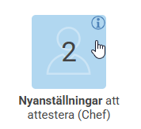
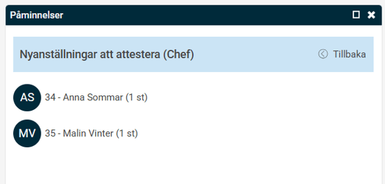
Uppdrag - En digital checklista vid onboarding
När en
uppdragsmall för onboarding
används i anställningsflödet triggas uppgifter till ansvariga igång för vad som ska göras när en anställd börjar.
Uppdragsmall för onboarding kopplas vanligen på en anställninsgperiod via Nyanställning. Det kan ske med automatik från Anställningsmallen eller manuellt av en användare.
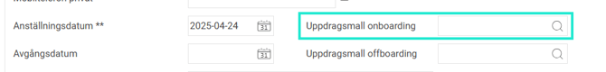

I uppgiftspanelen på
startsidan
kan du se de uppgifter du är ansvarig för. Här kan du, allteftersom du utför dina uppgifter, ändra status på dem och vid behov skriva kommentarer genom att klicka på pratbubblan till höger om statusen.

Hur hanterar jag uppgifter vid en onboarding?
Relaterade artiklar
Hur hanterar jag uppgifter och uppdrag i HRM?
Hur registrerar man personaldata och anställningsuppgifter i HRM Employee?
Hur gör man för att registrera nyanställd och användare manuellt?
Hur hanterar HRM Employee Offboarding av anställd?
Hur tar jag bort en anställd?
Hur tar jag bort en anställningsperiod?
Hur hanterar jag anställda med skyddad folkbokföring?
