# ⚙️Nyanställning - Hur skapar jag ett effektivt anställningsflöde?

**Datum:** den 26 augusti 2025  
**Kategori:** Employee  
**Underkategori:** Anställningshantering  
**Typ:** howto  
**Svårighetsgrad:** intermediate  
**Tags:** anställning, dokument, onboarding  
**Bilder:** 17  
**URL:** https://knowledge.flexhrm.com/sv/nyanstallning-hur-skapa-0

---

Processen för att hantera nyanställda i systemet kan se väldigt olika ut i olika organisationer, och inte sällan sköter man delar av denna process med hjälp av dokument vid sidan av systemet. För att kunna hålla ihop hela hanteringen har vi därför byggt en funktion för att kunna skapa ett antal granskningssteg när man lägger upp en nyanställd eller en ny anställningsperiod på en befintlig eller tidigare anställd.

Denna artikel beskriver hur du som administratör ställer in ett flöde för att hantera nyanställningar i HRM.
⚙️Guide
Anställningsmallar
Inställningar - Vad måste alltid anges innan du kan spara?
Nyanställningsflöde
Granskningsnivåer för anställningar
Påminnelser
Behörigheter
Skapa ett effektivt anställningsflöde
1. Anställningsmallar
Börja med att skapa upp vilka
anställningsmallar
som ska användas i företaget.
När du har HRM Employee och har flera
Nyanställningsflöden
så kommer
anställningsmallen
bli nyckeln för att systemet ska identifiera vilket nyanställningsflöde som ska användas för en anställning.
Här beskrivs anställningsmallar i HRM.
2.  Vad måste alltid anges innan du kan spara?
Under en egen inställning i HRM kan man ställa in vilka uppgifter som är krav att ange innan en användare kan spara en anställd.
Uppgifter som måste anges innan du sparar
ger dig möjlighet att säkerställa att till exempel en anställningsmall anges direkt samt att eventuell styrning för attest (exempelvis kostnadsställe/närmaste chef) anges direkt. På så sätt undviker du att en chef som lägger upp nyanställda förlorar behörighet till den anställde om behörighet är styrd på en hem-kontering så som "Kostnadsställe" eller "Närmaste chef".
Gå till
I
n
ställningar > Personal > Anställdaregistret – inställningar
f
ör
att göra dina val.
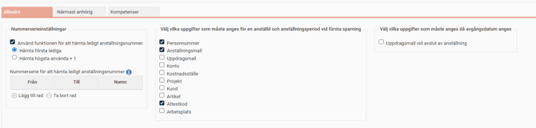
Rekommendation
Ställ in att Personnummer måste anges - för att få en tidig koll på om en anställd redan finns upplagd i systemet.
Ställ in att Anställningsmall måste anges - undvik att chef/HR missar att välja en mall.
Ställ in att Hem-konteringen som används för behörigheter måste anges - undvik att chef tappar behörighet till anställd.
Under denna meny kan du även ställa in andra standardinställningar för till exempel Nummerserieinställningar för ledigt anställningsnummer. Inställningar för att hämta ledigt anställningsnummer kan även göras i Anställningsmallar.
3. Definiera olika granskningsflöden
Inställningar - Allmänt - Granskningsnivåer - Nyanställningar
I granskningsflöden har vi möjlighet att definiera olika flöden för olika typer av personal. Som utgångspunkt finns det ett granskningsflöde som heter
Standard
som inte går att ta bort eller redigera. Detta kommer alltid gälla om inget annat granskningsflöde specificeras.
Ta reda på detta
Har vi olika behov av uppgifter för olika personalgrupper?
Har vi till exempel konsulter eller anna
n extern personal som ska läggas in i HRM men där vi inte alls har krav
på att samla in sam
ma uppgifter som för en ordinarie anställda
?
Standardflöde
Aktiveras endast ett flöde är det vanligast att man nyttjar
Standard
.
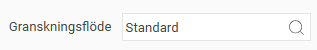
Då hamnar alla nya anställningar/anställningsperioder på detta standard-flöde. Det vill säga det blir ett flöde för alla anställningar. Ser vi inget behov av att kunna styra in olika anställda på olika flöden räcker oftast detta gott och väl.
Ett granskningsflöde räcker för oss! Gå vidare och ställ in granskningsnivåerna under Standardflödet.
Behov av nya granskningsflöden
Har du identifierat att det behövs ett eller flera nya flöden behöver de skapas upp som separata granskningsflöden.
För att skapa ett nytt granskningsflöde klickar du på knappen
Lägg till.
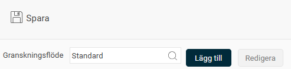
Du får upp en ruta där du väljer ett
namn
på granskningsflödet samt vilka
anställningsmallar
som ska starta detta granskningsflöde.
Spara
.
I vårt exempel nedan har vi skapat ett granskningsflöde för extern personal. Om vi lägger upp en ny anställd och väljer anställningsmallen för
Extern personal
kommer vi aktivera just detta granskningsflöde.
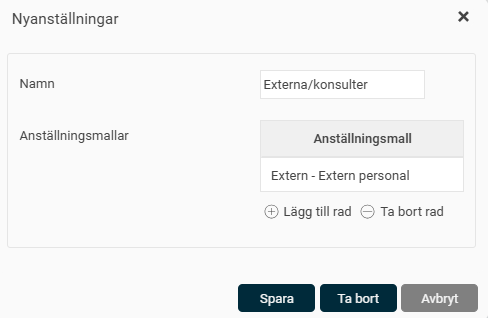
När du har sparat nya granskningsflödet kan du ställa in inställningarna för hur flödet ska se ut och fungera.
Tips!
Om man inte vill att nya anställningsperioder ska hamna i granskningsflödet kan man sätta upp ett alternativt granskningsflöde som kopplas till en egen anställningsmall Exempelvis:
NYANST - Ny anställningsperiod.
Är det flödet
inaktivt
kommer då nya anställningsperioder upplagda mot denna anställningsmall att gå utanför granskningsflödet.
Detta används främst av företag som har väldigt många nya anställningsperioder och som upplever att granskningsflödet annars blir en flaskhals.
Bra att veta om att ändra i befintliga flöden
Ta bort ett Granskningsflöde helt
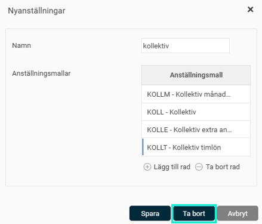
Följande Varning/information kommer upp när du klickar på Ta bort
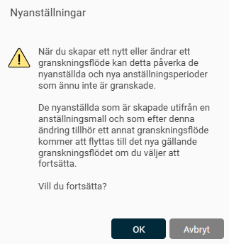
Dvs har du personer som ligger i granskningsflödet för denna som inte är färdiggranskade kommer dessa flyttas till Standardflödet. Lägger du upp en ny anställningsperiod på en person som tidigare lades in med det flödet, kommer den nu hamna på Standardflödet.
Ta bort en anställningsmall i ett flöde som används/har använts
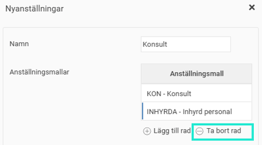
Vad händer vid återanställning? De som då tidigare har hört till INHYRDA (detta används inte längre och togs bort från flödet). Vart hamnar då den anställde?
Har du tidigare anställda som lagts upp på detta flöde och sedan kopierar du från befintligt anställningsperiod till en ny period – kommer du hamna på Standardflödet om inget nytt flöde lagts till kopplat till den anställningsmall som använts tidigare.
Skulle man sedan gå in i granskningsflödet och lägga tillbaka anställningsmallen i flödet – kommer den anställde (så länge den ligger kvar i granskningsvyn) att flyttas till det flödet igen.
Följande Varning/information kommer upp när du justerar anställningsmallarna i flödet och Sparar.
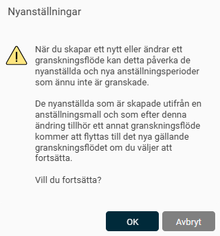
4. Ställ in Granskningsnivåer för nyanställning
Välj det granskningsflöde ovanför listan, som du vill börja ställa in. Nedan börjar vi ställa in inställningarna i Standard.
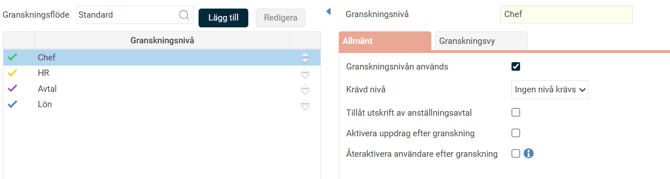
Under ett gemensamt systemregister ligger inställningarna för vilka granskningsnivåer som finns att välja på. Se
Allmänt - Granskningsnivåer - Nyanställningar
för att justera eller lägga till fler.
OBS!
Att detta är ett gemensamt register för alla företag i din installation, ändrar du namn på någon nivå kommer det att ändra namn i alla företag.
Börja med att justera ordningen på granskningsnivåerna vid behov. Ställ markören på en av
pilarna
till höger om namnet på respektive nivå och
dra och släpp
om du vill ändra ordningen på raderna.
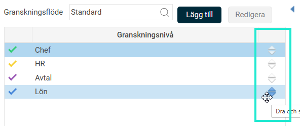
Under
Allmänt
ställer du in vad som ska gälla för denna nivå.
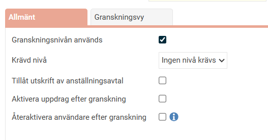
Granskningsnivån används
Här anges om aktuell granskningsnivå ska användas eller inte vid upplägg av nyanställda/nya anställningsperioder.
Krävd nivå
Här anges den granskningsnivå som eventuellt måste föregå aktuell granskningsnivå vid upplägg av anställningsuppgifter. Här kan du till exempel ange att Chef måste ske före HR.
Tillåt utskrift av anställningsavtal
Med denna inställning kan du styra vilken eller vilka granskningsnivåer som ska ha behörighet att skriva ut anställningsavtal via ikonen för detta i funktionen
Personal – Nyanställning
.
Ett vanligt flöde är att det först är i granskningsnivå
Avtal
som det går att skriva ut ett avtal.
Aktivera uppdrag efter granskning
I HRM finns möjlighet att välja i vilken granskningsnivå som vald uppdragsmall ska aktiveras d.v.s. när uppdraget och dess uppgifter ska skapas. Har du denna inställning markerad innebär det att uppdraget startas först när valt granskningssteg är ibockat i nyanställningsvyn. Om du inte gör något val betyder det att uppdragsmallen aktiveras så snart den väljs och sparas på den anställde.
Om du väljer uppdragsmall på den anställde i ett granskningssteg senare än vald granskningsnivå som har denna inställning markerad kommer uppdragsmallen aktiveras direkt när du sparar.
Återaktivera användare efter granskning
Denna inställning kan användas i samband med att en användare får en ny anställningsperiod och ni önskar att användaren ska kunna logga in i systemet innan anställningen börjar. Genom att markera denna ruta på önskad granskningsnivå styr du i vilket steg en ny anställningsperiod ska återaktivera den anställdes tidigare användare i HRM. Hänsyn tas även till den inställning gällande återaktivering som ligger på respektive användare.
Under
Granskningsvy
ställer du in vilka uppgifter som ska samlas in under respektive granskningsnivå.
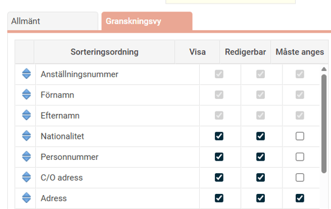
I kolumnen
Visa
sätter du kryss för de fält som ska visas. I kolumnen
Redigerbar
markerar du de fält som ska kunna redigeras av behörig användare. I kolumnen
Måste anges
styr du vilka uppgifter som måste anges för att kunna utföra granskning på aktuell nivå. Du kan välja ordning på fälten genom att
dra och släppa de blå pilarna
till vänster i listan av fält.
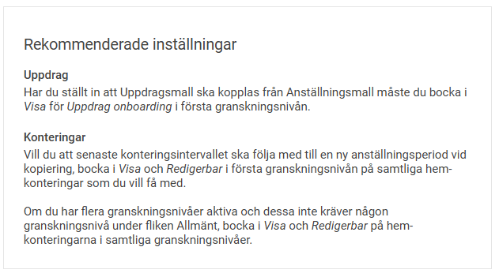
När en granskningsnivå aktiveras i företaget kommer alla redan upplagda anställda automatiskt att bli markerade som granskade för denna nivå. Detta för att man inte ska behöva bocka i granskad på alla sedan tidigare anställda, utan bara de som läggs upp efter det att man aktiverat granskningsprocessen.
När du har ställt in alla inställningar för respektive granskningsnivå och alla flöden kan anställningar läggas upp via menyn
Personal - Nyanställning.
Hur hanterar HRM Employee onboarding av anställda?
5. Påminnelser
Det finns möjlighet att aktivera påminnelser för granskning av nyanställda som då går ut till de som har behörighet att utföra granskning för den anställde. På så sätt kan den som t.ex. ska utföra steg 2 få en påminnelse när steg 1 är klart och man kan gå in och göra sin del.
Påminnelsen ligger kvar så länge det finns någon nyanställd kvar att granska.
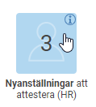
Påminnelser kan fås både på startsidan, som e-post samt som notis i HRM Mobile. På startsidan ser du också vilka anställda påminnelsen avser, och inom parentes hur många anställningsperioder det rör sig om. Om du klickar på den anställdes namn öppnas vyn för nyanställning, där du får en överblick över alla anställda som är kvar att granska.
För att aktivera påminnelsen går du in under
Administration – Inställningar – Allmänt – Påminnelser.
Här lägger du upp påminnelser av typen Granskning av nyanställningar samt anger vilken granskningsnivå påminnelsen gäller.
6. Behörigheter
Vilka användare som ska ha behörighet att utföra de olika granskningsnivåerna styrs av rollerna under
Administration –Användare/Behörigheter– Roller
. En användare kommer att kunna granska de anställda denne har en roll för med denna behörighet.
I exemplet är det Chef som initierar en ny anställning och ska granska steget Chef.
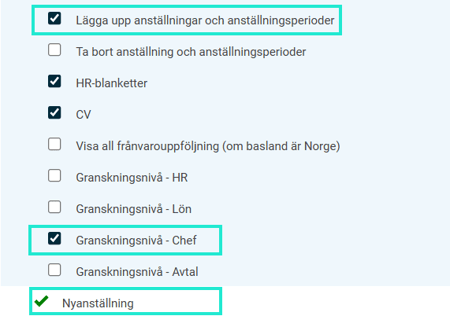
Observera att om ex. Chef är den som skapar upp en anställning så måste den rollen också vara behörig att tilldela de roller som finns som standard på Användarmallen. Annars kommer inte rollerna att läggas på användaren med automatik.
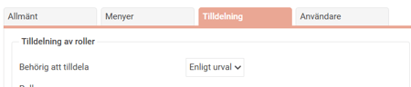
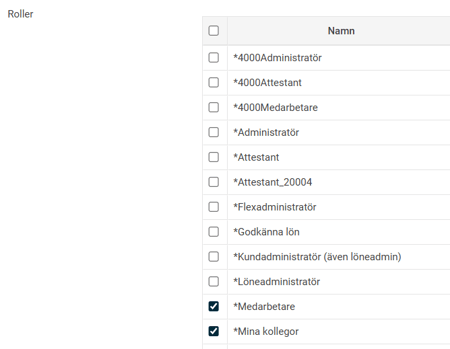
Notera
att det oavsett inställning på granskningsnivåerna aldrig är tillåtet för någon utan behörighet till anställningsavtal att skriva ut i något steg. Se mer ang. inställningar för behörighet till anställningsavtal under avsnittet
HR-blanketter.
