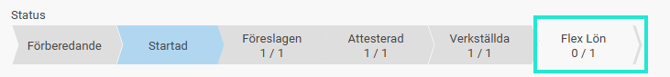
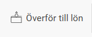

# Överför Lönerevision till Flex Classic Lön

**Datum:** den 29 september 2025  
**Kategori:** Employee  
**Underkategori:** Anställningshantering  
**Typ:** other  
**Svårighetsgrad:** advanced  
**Tags:** lönerevision  
**Bilder:** 2  
**URL:** https://knowledge.flexhrm.com/sv/overfor-lonerevision-till-flex-lon

---

I artikeln hittar du information om hur du enkelt arbetar med årets lönerevision.  

Nedan beskrivs funktionen Överför till lön.

Denna funktion finns inte i Flex HRM Payroll. Då nya löner finns tillgängliga i HRMs gemensamma anställdaregister så snart du
verkställer ny lön
behövs inte denna funktion.
Överför nya löner till Flex Lön
Använder du Flex Lön som lönesystem? Då finns en funktion för att överföra de nya lönerna direkt. På så sätt slipper du manuella steg i lönerevisionen och kan direkt börja arbeta med utbetalning av retroaktiv lön i Flex Lön.
Förutsättningar
För att kunna överföra de nya lönerna krävs en koppling till FLEX API som du ställer in under
Administration
>
Inställningar
>
Allmänt
>
Programlänkar
.
Om du redan kan se lönespecifikationer från Flex Lön på startsidan i Flex HRM är alla inställningar klara och du behöver inte göra något extra. Mer information om dessa inställningar finns i en separat instruktion om integrationen mellan systemen.
Så här överför du löner
För att överföra alla verkställda nya löner klickar du på knappen
Överför till lön
och bekräftar sedan ditt val.

Om du bara vill överföra löner för ett urval av anställda behöver du först filtrera listan. Se till att endast de anställda du vill överföra löner för visas i listan innan du klickar på
Överför till lön
.
Efter överföringen
När överföringen är klar ser du tidpunkt och signatur i kolumnen
Överförd till lön
. Klicka på
i-symbolen
för att se informationen.
