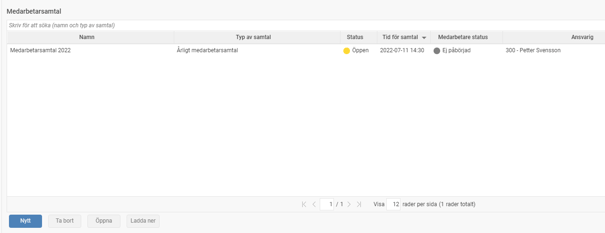
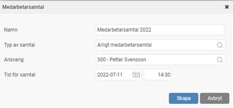
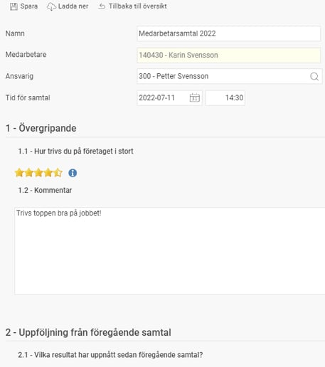
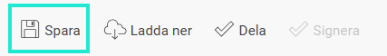
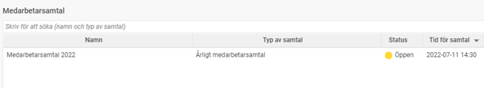
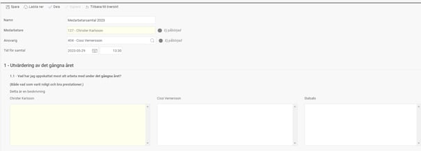
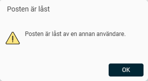
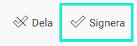

# Performance managemant - Hur genomför jag ett medarbetarsamtal i HRM Employee?

**Datum:** den 16 oktober 2025  
**Kategori:** Employee  
**Underkategori:** Dokument & E-signering  
**Typ:** other  
**Svårighetsgrad:** intermediate  
**Tags:** dokument, hrm-employee, medarbetarsamtal, signering  
**Bilder:** 10  
**URL:** https://knowledge.flexhrm.com/sv/hur-genomfor-jag-ett-medarbetarsamtal-i-hrm-employee-0

---

I HRM Employee kan du dokumentera och hantera medarbetarsamtal direkt i systemet, inklusive använda funktionalitet för delning och signering.
Medarbetarsamtal
När det är dags för medarbetarsamtal kan det dokumenteras direkt på den anställde i HRM. Under ikonen
Medarbetarsamtal
hittar du funktionen för medarbetarsamtal.

För att lägga upp ett nytt medarbetarsamtal klickar du på knappen
Nytt
under listan. Därefter anger du grundläggande uppgifter, såsom namn på medarbetarsamtalet, vilken mall du utgår från samt ansvarig och datum.
I nästa steg kommer du till själva formuläret med frågor som öppnas i en egen flik.

När du har fyllt i frågorna
sparar
du medarbetarsamtalet med knappen högst upp.

Om du gör en ändring loggar systemet information om när ändringen gjorts och av vem.
Därefter finns det nya medarbetarsamtalet sparat i listan.

Du kan sedan när som helst öppna medarbetarsamtalet och titta och fortsätta fylla i svar på frågorna (så länge det inte är signerat).
Om den mall som används för medarbetarsamtal är inställd att tillåta den anställde och dig som ansvarig att svara på frågorna i separata rutor kan det se ut så här:

Anställda fyller då i sina reflektioner och svar i ruta ett och delar sedan sina svar med dig som ansvarig. Du som ansvarig har samma möjlighet att fylla i svar inför samtalet i mittenrutan och sedan
dela
de svaren med medarbetaren. Den gemensamma slutsatsen skrivs i ruta tre och brukar innehålla vad man kommit fram till under själva samtalet.
Viktigt att tänka på när du fyller i ett medarbetarsamtal
För att varken du eller medarbetaren ska förlora era svar i medarbetarsamtalet är det viktigt att ni inte är inne och sparar i samtalet samtidigt.
Vad händer om båda parter sparar samtidigt?
Endast en person i taget kan spara ändringar i ett medarbetarsamtal. Om du försöker spara samtidigt som den andra parten får du upp en varning med texten: "Posten är låst av annan användare".

Detta innebär att de svar du precis har skrivit inte kan sparas och kommer att försvinna. Du behöver då vänta tills samtalet inte längre är låst, skriva in dina svar på nytt och sedan spara. Tänk på att spara ofta!
Vår rekommendation för att undvika problem
För att undvika risken att osparade svar försvinner rekommenderar vi att ni följer detta flöde:
Medarbetaren fyller i, sparar och delar sina svar först.
När medarbetaren är klar går du som ansvarig chef in i samtalet och fyller i dina svar.
På så sätt ser ni till att ni inte arbetar i formuläret samtidigt.
Dela och signera
Om samtalet har funktionerna
Dela
och/eller
Signera
aktiverat (systemadministratörer aktiverar det för frågeformuläret i inställningarna), klickar du på
Dela
för att dela svaren med den anställde.

Ikonen
Signera
används när samtalet är klart och ni vill låsa det för redigering.

Observera att svaren måste vara delade av båda innan det går att signera samtalet.
Det går även att välja att ladda ner samtalet via ikonen
Ladda ner
.
