# ⚙️Performance managemant - Hur skapar jag samtalsmallar för medarbetarsamtal i HRM Employee?

**Datum:** den 11 september 2025  
**Kategori:** Employee  
**Underkategori:** Medarbetarsamtal  
**Typ:** howto  
**Svårighetsgrad:** intermediate  
**Tags:** dokument, hrm-employee, medarbetarsamtal, signering  
**Bilder:** 29  
**URL:** https://knowledge.flexhrm.com/sv/performance-management-hur-skapar-jag-en-samtalsmall-i-hrm-employee-0

---

I HRM Employee kan du dokumentera och hantera medarbetarsamtal direkt i systemet, inklusive använda funktionalitet för delning och signering.

Denna artikel beskriver hur du skapar samtalsmallar för performance management.
Innehåll
Skapa frågemallar
Påminnelser
Behörigheter
Samtalsmallar
Samtalsmallar kan användas för olika typer av samtal i HRM. Det används ofta för performance management så som medarbetarsamtal, lönesamtal eller andra typer av uppföljning- och feedbacksamtal.
1. Gå till
Inställningar > Personal > Anställdaregistret – egna fält
för att skapa mallar.
2. Välj menyn Medarbetarsamtal till höger i menyn.
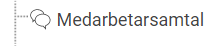
3. Skapa ett sidinnehåll alternativt skapa frågor i befintligt sidinnehåll.
Inget sidinnehåll?
Lägg till rad
med önskat
namn
och välj typen
Medarbetarsamtal
.

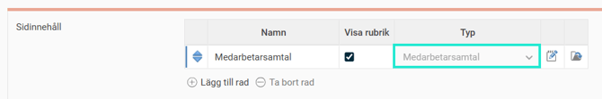
När sidinnehåll finns
Klicka på pennan
för att skapa frågeformulär
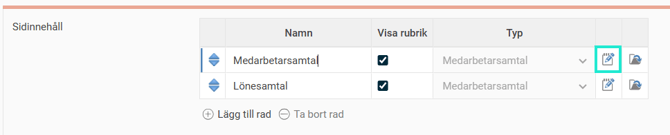
Klicka på
Ny
Under
Allmänt
sätt
Namn
på samtalet och ev.
beskrivning.
Gör önskade inställningar för vilka som ska fylla i svar, vem som ska signera och om delning ska användas.

Dessa delar kan du välja mellan:
Vilka ska fylla i svar på frågorna?
Du kan välja att kombinera dessa hur du vill. Fälten för ansvarig och medarbetare kommer alltid vara låsta till dessa två personer. Den gemensamma slutsatsen kan alla med behörighet komma åt och mata in ett värde för.
Vem ska signera?
Välj om båda parter eller bara en av parterna ska signera. Minst en måste dock signera samtalet för att man ska veta när allt är klart för att låsas.
Använd funktionen för delning
Du kan välja om funktionen för att dela svar ska användas. Om man inte använder delning kommer sparade svar vara tillgängliga för alla behöriga direkt.
Gå till sedan
Formulär
och börja skapa rubriker och frågor
Lägg till rad
, ange typ
Rubrik
eller
Fråga
och skapa sedan innehållet.
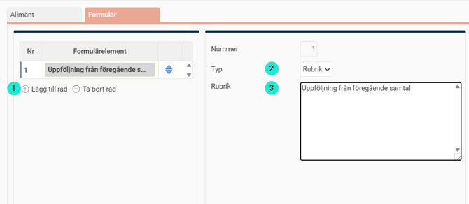
För typ
Fråga
anger du frågan, eventuell beskrivning till frågan och sist väljer du vilken typ av svar som ska användas.
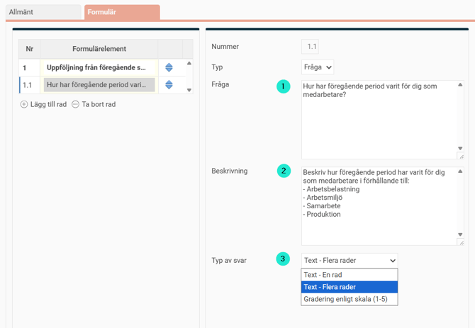
Beskrivning till en fråga i mallen är användbart om du t.ex. vill förklara en betygsskala eller vill ge lite mer information bakom en fråga i formuläret.
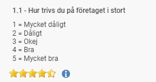
4.
Spara
Ändra i en befintlig mall?
En mall som har börjat användas kan inte ändras utan vidare och därför visas information om detta när du öppnar en mall som används. Om en användare har fyllt i svar på frågor i en mall är det inte helt lämpligt att ändra denna fråga, då svaret kanske får en annan innebörd. Dock är det tillåtet att ändra frågor och rubriker för att kunna förbättra frågor eller rätta stavfel och liknande. Det går också bra att lägga till nya frågor.
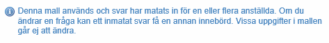
Arkiverad mall
En
arkiverad mall
skiljer sig från inaktiv mall. En mall blir arkiverad när en medarbetarsamtalsmall signeras i anställdaregistret. Arkiveringen sker automatiskt för att låsa samtalet för eventuella förändringar som görs i huvudmallen.
Det innebär att om du ändrar i huvudmallen efter att alla startade samtal är signerade så kommer det endast att påverka nya samtal som skapas från mallen. Det är viktigt att alla samtal är signerade om du inför nästa samtal vill ändra/lägga till frågor i mallen utan att påverka befintliga samtal. Du kan se arkiverade mallar genom att kryssa i rutan
Visa arkiverade mallar
.
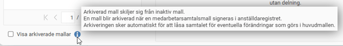
Inaktivera mall
Om du inte vill att en chef ska kunna använda en gammal samtalsmall, behöver du inaktivera den mallen. Då kommer den inte längre vara valbar när någon skapar upp ett nytt samtal i anställdaregistret.
Påminnelser för samtal
För att medarbetare och ansvarig hela tiden ska få information om vad som händer och förändringar i processen använder vi påminnelser. Dessa används både för att visa information om vad du har kvar att göra på startsidan samt att skicka ut information då något händer med ett samtal.
Inställningarna för påminnelser hittar du under
Administration > Inställningar > Allmänt > Påminnelser.
För att få påminnelser för hela processen kan du skapa sju olika påminnelser. Nu går vi igenom hur du skapar dessa.
Välj först
Medarbetarsamtal
under Typ av påminnelse. Därefter kan du välja bland fyra olika alternativ som man ska generera påminnelser.
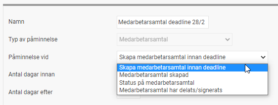
Skapa medarbetarsamtal innan deadline
Denna används för att påminna den som ska initiera och skapa samtalet för den anställde. Detta är vanligtvis chefen, men kan också vara den anställde själv eller HR.
Följande inställningar gör du för denna typ av påminnelse:
Välj hur många
dagar före och efter deadline
man ska se en påminnelse på startsidan.
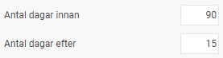
Under
Urval mallar
väljer du vilka samtalsmallar påminnelsen gäller.
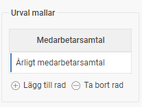
Schemaläggning av påminnelse
. Här anger du
deadline
för när alla medarbetarsamtal ska vara klara. I exemplet nedan är deadline för att skapa upp samtal för årligt medarbetarsamtal den 28 februari kl. 13.00.
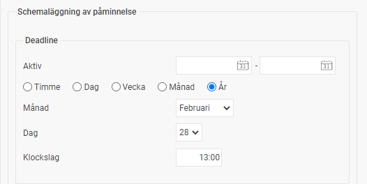
Under
Påminnelser innan deadline
anger du vid vilka tidpunkter innan deadline man ska få påminnelse via e-post eller notis i HRM Mobile om man ännu inte startat samtalen för alla.
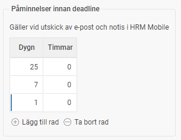
Om inte alla anställda omfattas av medarbetarsamtal kan du göra
urval
på vilka anställda som berörs.
Om du vill att medarbetaren ska få information om att medarbetarsamtal ska startas kan du aktivera det under
Meddelande till anställd
och skriva ett meddelande.
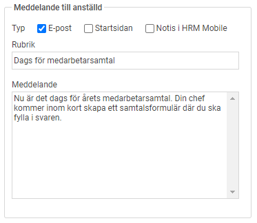
Meddelande till användare.
Här anger du vilken typ av påminnelse som ska gå till chefen eller t.ex. HR. I exemplet nedan anger vi rollerna Administratör och Attestant för att administratörer ska se en status för hela organisationen och attesterande chef ska få påminnelse för sin grupp anställda. Här skriver du också ett meddelande med information till mottagaren. Vill du ha olika meddelanden till de olika rollerna lägger du istället upp två separata påminnelser.
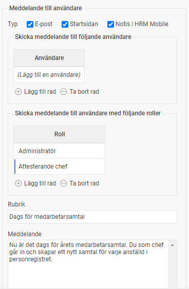
Medarbetarsamtal skapad
Denna typ av påminnelse används för att informera om att ett nytt medarbetarsamtal har skapats och är redo att fyllas i. Denna typ av påminnelse kan du få via e-post och som notis i HRM Mobile.
Följande inställningar gör du för denna typ av påminnelse:
Välj vilka samtalsmallar påminnelsen gäller under
Urval mallar.
Om inte alla anställda omfattas av medarbetarsamtal kan du göra
urval
på vilka anställda som berörs.
Meddelande till anställd
. Här anger du om medarbetaren ska få information via e-post eller notis.
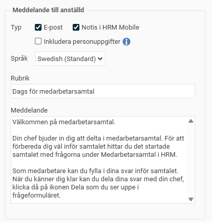
Under
Meddelande till användare
kan du välja om t.ex. chefen eller HR ska få en notis när medarbetarsamtal skapats. Detta kan vara användbart om chefen själv inte skapar medarbetarsamtalet.
Status på medarbetarsamtal
Denna typ av påminnelse används för att den anställde och ansvarig chef ska få påminnelse om att samtalet ska delas eller signeras.
Följande inställningar gör du för denna typ av påminnelse:
Skicka påminnelse då
- Här väljer du om påminnelsen gäller anställd eller ansvarig som inte har delat eller signerat. För att få påminnelse på alla fyra behöver du alltså skapa fyra olika påminnelser.
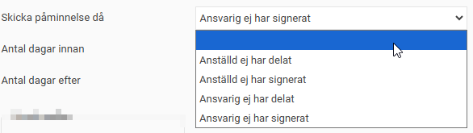
Därefter anger du
antal dagar före och efter
tidpunkten för samtal man ska se påminnelsen på startsidan. Påminnelsen för att dela samtal kan t.ex. ställas in så att man får den ett antal dagar före samtalet, och påminnelsen för signering efter det att samtalet hållits.
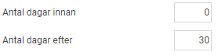
Under
Urval mallar
väljer du vilka samtalsmallar påminnelsen gäller.

För utskick av påminnelser till e-post och notiser i HRM Mobile anger du under
schemaläggning av påminnelse
hur ofta utskick ska göras.
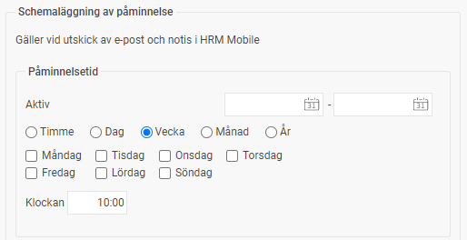
Om inte alla anställda omfattas av medarbetarsamtal kan du göra
urval
på vilka anställda som berörs.
Meddelande till anställd
- Här anger du vilken typ av påminnelse och meddelande till den anställde som samtalet gäller. Normalt använder man denna för att påminna den anställde som själv glömt att dela eller signera ett samtal. Men man kan också välja att visa en påminnelse även då ansvarig inte delat eller signerat.
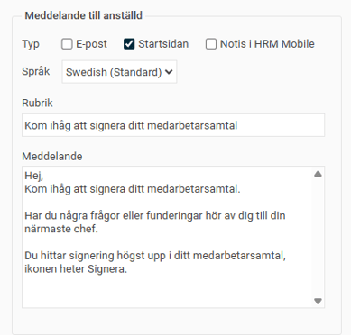
Under
Meddelande till användare
anger du vilken typ av påminnelse och meddelande som den ansvarige ska få. Man kan här välja om chefen ska få påminnelser både för samtal denna själv inte delat/signerat samt om man också ska få påminnelser om anställda inte delat eller signerat.
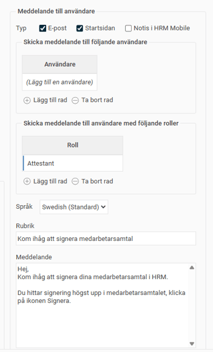
Medarbetarsamtal har delats/signerats
Denna typ av påminnelse används för att informera om att ett medarbetarsamtal har delats eller signerats av anställd eller ansvarig. Denna typ av påminnelse kan man få via e-post och som notis i HRM Mobile.
Följande inställningar gör du för denna typ av påminnelse:
Under
Urval mallar
väljer du vilka samtalsmallar påminnelsen gäller.

Om inte alla anställda omfattas av medarbetarsamtal kan du göra
urval
på vilka anställda som berörs.
Meddelande till anställd/
Meddelande till ansvarig
- Här anger du meddelandet till den anställde/ansvarige som samtalet gäller.
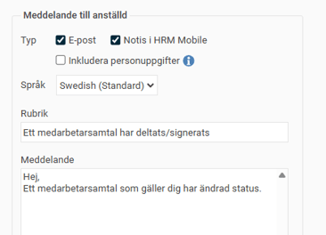
När meddelandet skickas framgår också vem som ändrat status samt den nya statusen.
Behörigheter
Behörigheterna för medarbetarsamtal är till viss del skräddarsydda för att få processen att fungera på ett effektivt sätt för just er organisation.
Vem räknas som ansvarig för ett medarbetarsamtal?
E
n användare som
har behörighet till den anställde samt fliken i anställdaregistret där medarbetarsamtalet ligger.
Vilka får skapa, ändra och ta bort ett medarbetarsamtal?
För att kunna lägga upp nya eller ta bort medarbetarsamtal behöver användaren skrivbehörighet till fliken där medarbetarsamtalet finns i anställdaregistret.
Svarsfälten för medarbetaren och den ansvarige samt möjligheten att dela och signera är i systemet styrda att endast vara tillgängliga för användare som är kopplad till motsvarande anställda. Detta är för att säkerställa att ingen annan skriver svar eller signerar i någon annans ställe. Det enda som krävs för att mata in svar i för användaren dedikerade fält, signera och dela är att användaren har läsbehörighet till fliken där medarbetarsamtalet finns.
För att kunna skriva svar i fältet för Gemensam slutsats krävs att användaren har skrivbehörighet. På så sätt kan man styra vem som har möjlighet att skriva här. Notera att även andra användare än medarbetaren och ansvarig på så sätt kan få behörighet att skriva i detta fält. Dock är det bara medarbetaren och ansvarig som sedan kan signera och godkänna det som skrivits. Av denna anledning går det heller inte att begränsa vilka delar man ser. Tanken är inte att man ska skriva hemliga noteringar här, utan bara sådant som båda parter kan ta del av och signera.
Vilka får se medarbetarsamtal?
Berörd medarbetare samt ansvarig får alltid se de medarbetarsamtal som finns på en flik de har tillgång till.
Exempel behörighet för Medarbetare
Med följande behörighet kan en medarbetare fylla i svar i sin ruta, dela och signera samtal som skapas för medarbetaren under fliken
Medarbetarsamtal
.
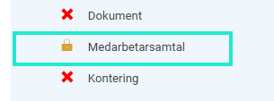
Exempel behörighet för Chef
Med följande behörighet kan en chef starta nya samtal för sina medarbetare, skriva svar i sin ruta, skriva slutsats samt dela och signera. Chefen har även behörighet att ta bort samtal.
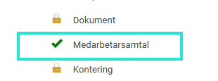
Om en anställd får en ny chef då man byter avdelning eller om avdelningen får en ny chef kan det vara lite olika om den nya chefen ska få tillgång till tidigare medarbetarsamtal. Detta går att styra på rollen med kryssrutan
”Visa alla medarbetarsamtal”
under
Personal > Anställda
.
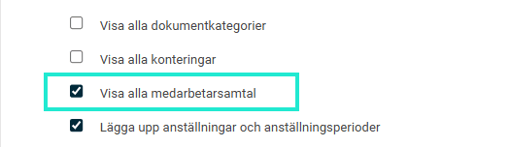
En roll som har denna ruta ikryssad får då se alla medarbetarsamtal på de flikar man har behörighet till. Man får då se medarbetarsamtal även om man inte är ansvarig eller berörd medarbetare. På så sätt kan man låta en ny chef se gamla samtal, eller ge en HR tillgång till samtal.
