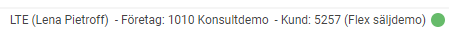
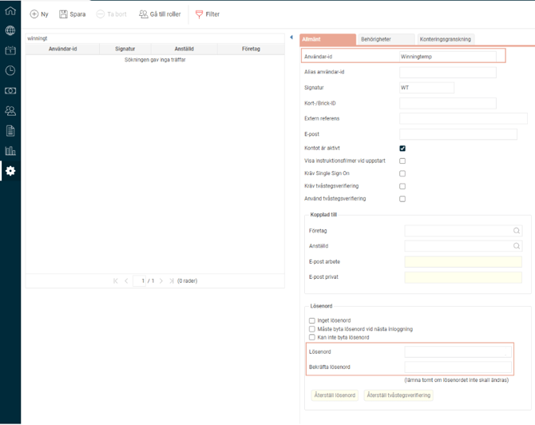
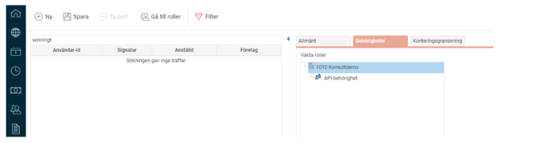
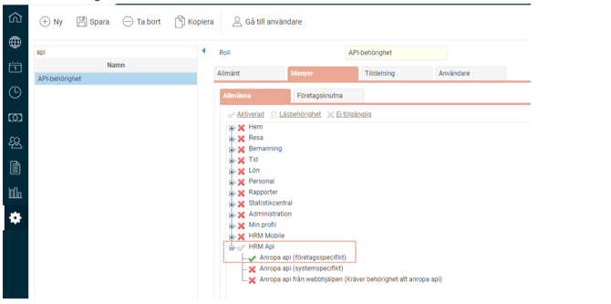
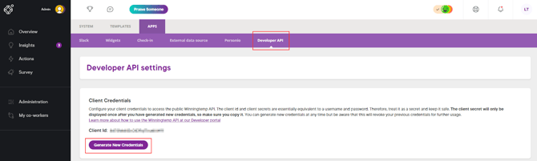
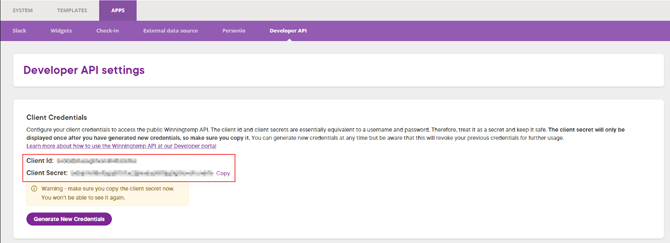
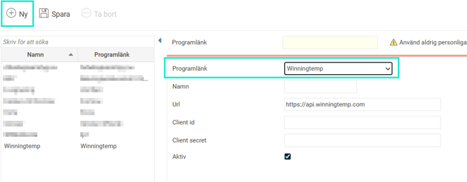
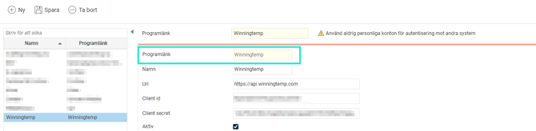

# ⚙️Pulsmätningar och medarbetarundersökningar - Hur integrerar jag Winningtemp & HRM?

**Datum:** den 13 januari 2026  
**Kategori:** Employee  
**Underkategori:** Anställningshantering  
**Typ:** config  
**Svårighetsgrad:** advanced  
**Tags:** Ingen  
**Bilder:** 9  
**URL:** https://knowledge.flexhrm.com/sv/aktivera-integration-winningtemp-hrm-0

---

Winningtemps kompletta medarbetarundersökning samlar löpande anonym feedback kring hur era medarbetare upplever sitt jobb och sin arbetssituation. Med sin unika kombination av pulsundersökningar och fokusundersökningar kan ni både följa trender över tid och zooma in när det behövs.

HRM har tillsammans med Winningtemp utvecklat en integration där HRM är master för personaldata. Integrationen gör det även möjligt att visualisera nyckeltal från pulsmätningarna direkt i er dashboard i HRM. 

Den här guiden hjälper dig att aktivera integrationen mellan HRM och Winningtemp.
Är ni kunder hos Winningtemp?
Då kan ni nu effektivisera ert arbete ytterligare med vår smidiga integration. En förutsättning är ett aktivt avtal med Winningtemp.
Innehåll
Aktivera integration Winningtemp
Visa temperaturdata i HRM
Aktivera integration i HRM

Integration Winningtemp & HRM
Integrationen består av två huvuddelar:
Automatisk överföring av anställda:
Personuppgifter synkroniseras från HRM till Winningtemp. Detta säkerställer att Winningtemp alltid har uppdaterad information och minskar dubbelarbete, eftersom du bara behöver lägga till anställda i HRM.
W
inningtemp utgår från organisationsstrukturen som finns uppsatt i HRM
(kommer i slutet av 2025).
Visualisering av nyckeltal:
Hämta och visa temperaturdata från Winningtemp direkt i era Das
hboards i HRM för att få en samlad överblick av era nyckeltal.
Automatisk överföring av anställda
För att anställda löpande ska kunna hämtas från HRM till Winningtemp behöver du följa stegen nedan.
För mer information kan du kontakta Winningtemp via
integrations@winningtemp.com
.
Aktivera integration i Winningtemp
Meddela Winningtemp ert företags- och kundnummer som du hittar längst ner till höger när du är inloggad i HRM.
I nedan exempel är 1010 företagsnumret och 5257 kundnumret:

I HRM
Skapa en integrationsanvändare för just Winningtemp i HRM med behörighet till HRM Api och meddela Winningtemp
användarnamn
och
lösenord
:

Rollens behörighet:

Visa temperaturdata i HRM
För att kunna visa data från Winningtemp i HRM behöver du följa nedan steg.
Det kräver också att du har ett aktivt konto hos Winningtemp.
Hämta Client-uppgifter i Winningtemp
För att HRM ska kunna hämta data från Winningtemp behöver du hämta rätt
Client id
och
Client Secret.
Logg in
som administratör i Winningtemp. Tänk på att växla till
Admin
när du loggat in.
Gå till
Settings - APPS - Developer API
.
Klicka på
Generate New Credentials
.

Kopiera
Client id
och
Client Secret
som ska klistras in i HRMs programlänk för Winningtemp (se nästa avsnitt):

Aktivera integration i HRM
För att aktivera funktionen måste du först aktivera licensen och skapa en programlänk till Winningtemp.
Logga in i HRM.
Gå till
Allmänt > Företag
och aktivera licens för Winningtemp på aktuellt företag. Se fliken
Licens
.
Gå till
Administration > Inställningar > Import/export > Programlänkar
.
Välj
Programlänk
Winningtemp.

Skriv ett namn t.ex. Winningtemp.
Klistra in
Client id
och
Client secret
som du fick fram i Winningtemp (se första avsnittet):

Spara.
Notera:
Om du inte får programlänken att fungera så kan du behöva kontrollera statusen på integrationen för Winningtemp under
Systemregister > Integrationer.
Läs mer om hur du skapar en Dashboard i HRM med Winningtemp-paneler.
