# Så får du full överblick över vilka kompetenser dina anställda har – och saknar?

**Datum:** den 5 september 2025  
**Kategori:** Employee  
**Underkategori:** Kompetens & Kurser  
**Typ:** other  
**Svårighetsgrad:** intermediate  
**Tags:** cv, kompetens, kurs  
**Bilder:** 36  
**URL:** https://knowledge.flexhrm.com/sv/sa-far-du-full-overblick-over-kompetenser

---

HRM Employee möjliggör centraliserad hantering av kompetenser och kurser för anställda. Systemet tillåter koppling av kompetenser till roller och individer, spårning av kompetensnivåer och målnivåer, samt hantering av kurstillfällen. Dessutom finns funktioner för detaljerad sökning, kompetensmatris för översikt av kompetensgap i team, och automatiska påminnelser för utgående kompetenser. Läs mer om detta nedan.
Innehåll
Kompetensroller
Lägg till kompetens för anställd
Lägg till kurs för anställd
Sök kompetenser direkt på startsidan
Kurshantering
Kompetenssökning
Kompetensmatris
Kompetensteam
Påminnelser för utgående kompetenser
Kompetens och Kurshantering
I HRM finns kompetenser som kan kopplas till de anställda. Det gör det möjligt att se vilka kompetenser som en anställd har samt planera ev. kompetensutveckling.
Kompetensroller
För att se om anställda uppfyller ev. kompetenskrav som deras roll innebär kan man koppla kompetenser till kompetensroller. Dessa knyts sedan till de anställda, och det syns då vilka kompetenser som krävs i en specifik kompetensroll.
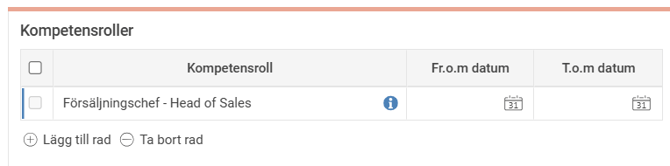
Koppla anställd till olika kompetenser
När du knyter kompetenser till anställda gör du det lättast genom att koppla kompetensroller. Här kopplas också datum, nivåer för kompetens osv.
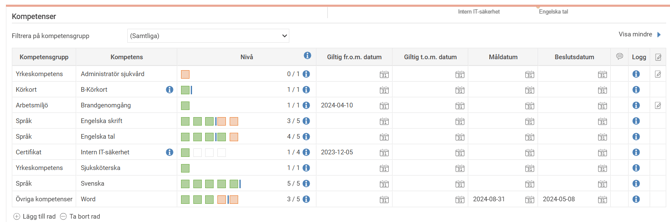
Det går också att koppla kompetenser direkt, utan att det finns ett krav på en viss kompetens i kompetensroller.
Lägg till en rad
och välj aktuell kompetens i listan. Markera sedan vilken nivå den anställde har idag, och ev. om en målnivå ska uppnås för den anställde att höja sin kompetens.  Målnivå sätts genom att hålla ned
ctrl
och klicka i önskad nivå.
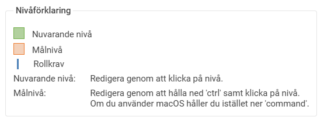
Kompetensanalys
Upptill till höger i vyn finner du funktionen för
kompetensanalys
som illustrerar kompetensgap i form av olika diagram.
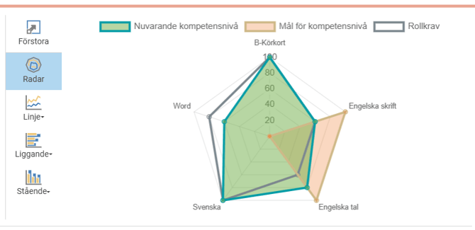
I knappraden till vänster om diagrammet kan du välja olika typer av diagram beroende på vad som passar dig bäst.Om man har många kompetenser rekommenderas radardiagrammet som enligt bilden ovan.
I radardiagrammet visas nuvarande kompetensnivå med grön färg, uppsatta mål för kompetenserna med röd färg och rollens krav på kompetensen med grå färg. För de ställen där den gröna ytan täcker den grå ytan betyder det att nuvarande kompetens uppfyller rollens krav. Om den grå ytan går utanför den gröna finns det en kompetensbrist. Den röda ytan visar uppsatta mål för kompetensutveckling.
Om en anställd har flera kompetensroller kan du också välja att markera en åt gången för att se kompetenserna och kompetensanalysen för just denna kompetensroll.

Endast de kompetenser som är relevanta för kompetensrollen visas då i listan samt i diagrammet.
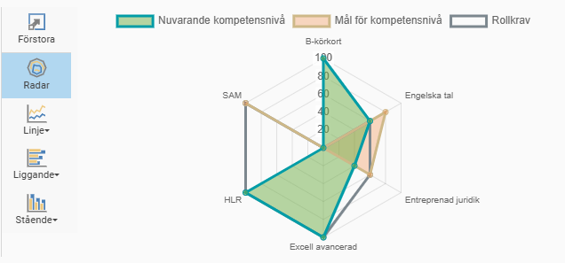
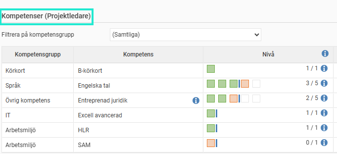
Kurser
Kurser är till för att planera in utbildningar för att nå de kompetenser som man ska ha.
Kurser kan också hamna i ett CV om det används.
Koppla kurser till anställda
Här kan man lägga in de kurstillfällen som planeras in samt andra fristående kurser som är utförda.
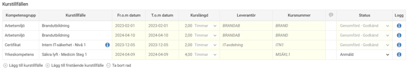
Lägg till kurstillfälle med +
, klicka på förstoringsglaset för att se valbara kurstillfällen.
För att visa avslutade kurstillfällen, dvs. kurstillfällen med tom-datum som har passerat, behöver du markera rutan Visa även avslutade kurstillfällen.
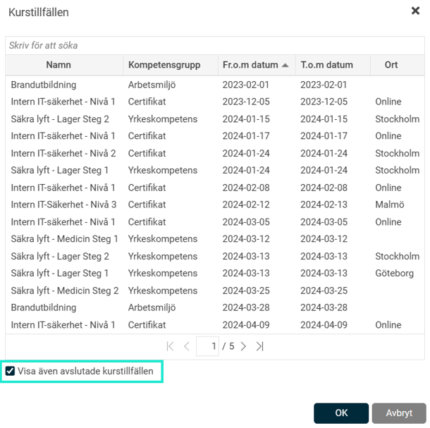
Sök kompetenser direkt på startsidan
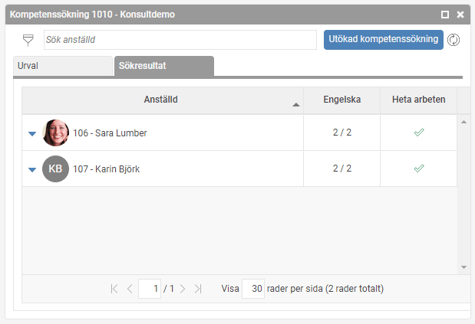
Du kan söka kompetenser på anställda direkt via startsidan i HRM. Där får du en lite förenklad sökning, som snabbt visar ex. vilka som har en viss kompetens.
Om du vill se den anställdes samtliga kompetenser kan du
klicka på pilarna bredvid namnet
, så expanderas fler uppgifter, dvs. samtliga kompetenser respektive anställd besitter.
Du kan även begränsa sökningen på en grupp av anställda genom att klicka på
filter-symbolen
och här göra ett urval på önskad grupp. Detta kan vara användbart om du t.ex. bara vill söka på anställda från en viss avdelning.
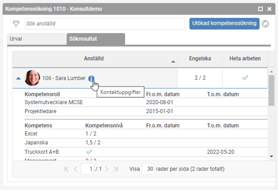
Vill du se listan med sökresultat i en större vy klickar du på knappen
Utökad kompetenssökning
. Då öppnas samma sökning i den stora sökvyn som du också kan komma åt under
Kompetenssökning.
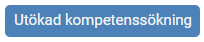
Kurshantering
I HRM finns det en kurshanteringsvy där det är enkelt att administrera anställdas kurstillfällen.
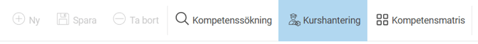
När behörighet finns till kurshanteringsvyn kan du, för de anställda du har behörighet till, lägga till deltagare i ett kurstillfälle samt justera status på ett kurstillfälle för en eller flera anställda på en gång.
Klicka på önskad kurs
V
älj kurstillfälle
Lägg till deltagare i ett kurstillfälle via
Lägg till deltagare
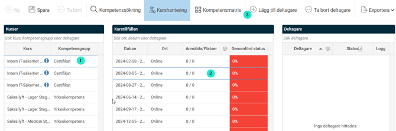
När kurstillfällets slutdatum har passerat kan du ändra status på de anställda genom att markera någon av följande val
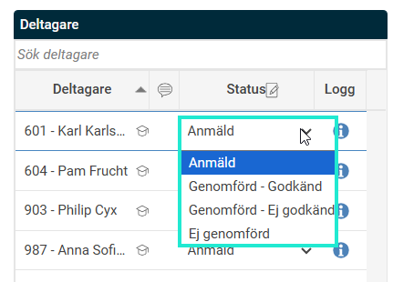
Om du vill markera alla som godkända görs det snabbast via ikonen
Status
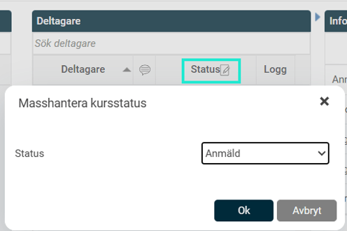
Utökad Kompetenssökning
Här kan du söka på både kurser och kompetenser för att hitta anställda med viss kompetens.
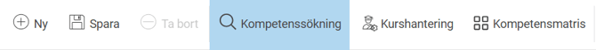
Sök anställda som gått en kurs
För att söka anställda som gått en viss kurs klickar du på Lägg till urval längst ner i listan av urval. I rutan som då dyker upp anger du vilken kurs du vill söka på samt vilken status kursen ska ha. Genom sökning på status kan du hitta vilka anställda som är planerade att gå en kurs eller som har klarat kursen. Du kan också välja att söka på samtliga statusar för att se både de som är planerade att gå en kurs och de som genomfört kursen.
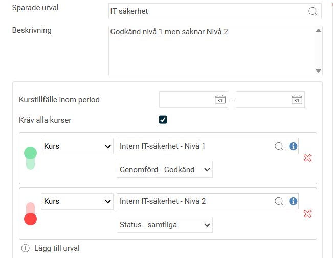
I listan med sökresultatet ser du kursens status.
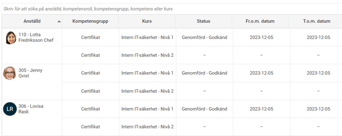
Du kan också välja att söka på en datumperiod som kursen ska vara genomförd på. Detta är användbart om vi vill hitta någon som nyligen har gått en kurs eller någon som är inplanerad på en kurs vid ett specifikt kurstillfälle.
Vid sökning av både kompetenser och kurser kan du välja att bocka ur valet
Kräv alla kurser/kompetenser
om du vill hitta anställda som gått endast en av de sökta kurserna. Detta kan vara användbart om du söker anställda som gått snarlika kurser.
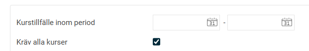
Sök anställda som saknar kompetens eller inte gått en kurs
Ibland är det intressant att söka efter anställda som saknar en viss kompetens eller som inte gått en specifik kurs. Detta kan du nu göra genom att klicka på den gröna knappen till vänster om urvalet för en kompetens eller kurs. Knappen ändrar då färg till röd (cirkel nedåt) för att indikera att sökning görs på anställda som saknar kompetensen eller kursen.
Man kan också använda detta för att kombinera sökningen på sådant man har och sådant man inte har. I exemplet nedan har vi gjort en sökning på anställda som saknar kompetensen truckkort, men som är planerade att delta i kursen truckförarutbildningen Truckkort A + B.
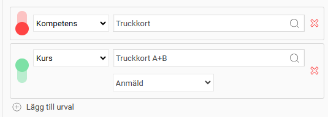
Under
info
-knappen i knappraden finns också information om hur detta fungerar.
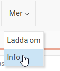
Sök anställda som har en kompetens som snart går ut
Man kan också söka på utgångsdatum för kompetenser. Detta är användbart t.ex. då man har certifikat som ska förnyas med jämna mellanrum och man behöver planera in vilka anställda som behöver förnya sitt certifikat. I exemplet nedan har vi sökt på kompetens som går ut i december månad 2018. För att detta ska fungera måste man ha lagt in t.o.m.-datum på kompetensen i anställdaregistret som sökningen går på.
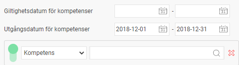
Spara sökurval
Ofta söker man på liknande saker när man arbetar i kompetenssökningen och då kan det vara smidigt att spara ett sökurval för att snabbt och enkelt kunna göra samma sökning på nytt.
För att spara ett sökurval anger du ett
namn
och eventuellt en beskrivning på urvalet och klickar sedan på
Spara
i knappraden. De urval du gjort sparas då och du kan i fältet för namn hitta ditt sparade urval nästa gång. Ett sparat urval är personligt, vilket innebär att bara användaren som sparat urvalet kommer att kunna använda det igen.
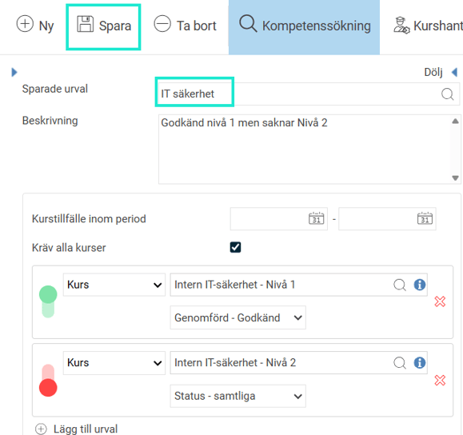
Kompetensmatris
En kompetensmatris är ett verktyg för att få en överblick över en grupps kompetenser.
Kompetensmatrisen
i HRM har flera användningsområden. Först och främst är det ett bra sätt att få en överblick över kompetenserna för en grupp av anställda. Dessutom får man information om kompetensgap och uppsatta kompetensmål. Det finns också en funktion för att definiera olika team och på så sätt få en enkel överblick över teamets kompetensbrister. Nedan finns de olika användningsområdena beskrivna i detalj.
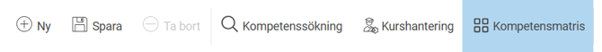
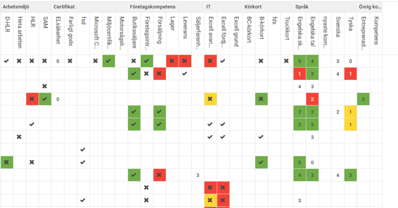
Översikt över kompetenser och kompetensgap
Det huvudsakliga användningsområdet för en kompetensmatris är att få en överblick över kompetenserna för en grupp anställda. Matrisen är uppbyggd som ett rutnät, där varje kolumn representerar en kompetens och varje rad en anställd. Med hjälp av
filtret
i knappraden kan du göra ett urval på vilken grupp av anställda samt vilka kompetenser du vill visa i matrisen.
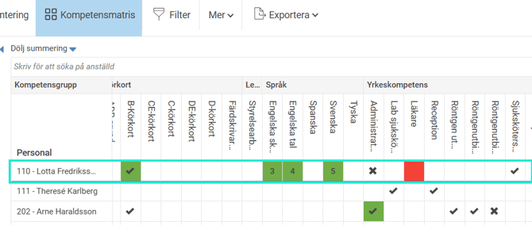
Varje cell i rutnätet representerar kompetensnivån för en anställd och kompetens. För kompetenser med en flergradig bedömningsskala visas den aktuella nivån som en siffra i cellen. För kompetenser såsom certifikat eller körkort som man antingen har eller inte har visas det en bock eller kryss i cellen.
Cellens bakgrundsfärg ger information om kompetensgap och kompetensmål enligt följande
Vit bakgrund
innebär att den anställde inte har en kompetensroll med krav på aktuell kompetens.
Grön bakgrund
innebär att den anställde uppfyller det krav som kompetensrollen har för aktuell kompetens.
Gul bakgrund
innebär att den anställde inte uppfyller det krav som kompetensrollen kräver för aktuell kompetens. Men den gula bakgrunden indikerar att en åtgärd i form av mål, är planerad.
Röd bakgrund
innebär att den anställde inte uppfyller det krav som rollen har för aktuell kompetens. Den röda bakgrunden indikerar att ingen åtgärd är planerad.
Genom att
markera en anställd
kan du få upp detaljerad information om den anställdes kompetenser som visas till höger om matrisen.
Här visas information om nuvarande nivå, målnivå samt vilken nivå som krävs av den anställdes kompetensroller. Det färgade strecket motsvarar färgsignalen i kompetensmatrisen enligt ovan.
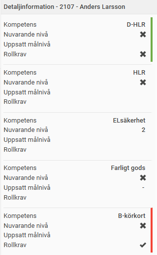
För att enkelt hitta detaljer för en specifik kompetens kan du istället för att klicka på den anställdes namn i matrisen klicka på en specifik cell i tabellen. Då visas detaljinformation för bara just den kompetensen.
Visa graf för kompetensgap
Man kan också direkt ifrån kompetensmatrisen visa grafen för
kompetensgapen
som finns i anställdaregistret. När du pekar på en anställds namn i kompetensmatrisen dyker en ikon upp som du kan klicka på för att visa kompetensgrafen.
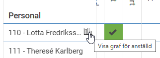
Grafen visas då som ett nytt fönster där du har samma möjligheter som i anställdaregistret (se föregående avsnitt). Du kan enkelt bläddra mellan de anställda i kompetensmatrisen genom att använda
pilarna uppe till höger
i fönstret.

Arbeta med kompetensteam
Med hjälp av ett
kompetensteam
kan du sätta ihop en grupp anställda och sätta krav på gruppens behov av kompetenser. På så sätt kan du med hjälp av systemet hålla koll på om gruppen har den kompetens som behövs.
Om vi som exempel tänker oss att vi har ett team av städare på 4 personer som åker runt och städar olika lokaler, då kanske vi vill att minst en måste ha ett körkort för att kunna köra bilen, en måste ha de miljöcertifikat som krävs samt att alla måste ha grundläggande kompetens för städteknik och minst en som är mer erfaren.
Detta städteam definierar du till vänster om kompetensmatrisen genom att ange följande uppgifter:
Kompetensteam
Här anger du ett namn på teamet.
Beskrivning
Här kan du ange en beskrivning för teamet.
Urval
Här anger du vilken grupp av anställda som ingår i teamet. Du kan också ange vilka kompetenser som är intressanta att visa i kompetensmatrisen för teamet.
Krav på kompetenser i teamet
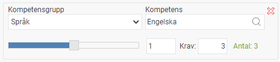
Här lägger du in alla de krav på kompetenser som finns i teamet. Du väljer kompetens och nivå som krävs av denna kompetens samt krav på antal anställda som ska ha denna kompetensnivå. Nere till höger visas antal personer i teamet som har denna kompetens. Färgen indikerar om kravet är uppfyllt eller inte (grönt eller rött).
Här är ett exempel på hur man kan definiera teamet av städare enligt exemplet. Lägg märke till att kompetensen Städteknik finns två gånger för att sätta krav på att alla fyra personer måste ha minst nivå 1, och minst en av dem måste ha minst nivå 4. Kravet på en person som har nivå 4 uppfylls inte, vilket indikeras med den röda texten.
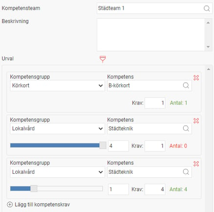
I själva kompetensmatrisen visas nu de anställda som ingår i teamet samt att det i kolumnrubriken för respektive kompetens i teamets krav finns en färgmarkering som visar om kraven uppfylls eller inte. Grönt streck betyder att kompetenskrav är uppfyllt, och rött streck betyder att det saknas kompetens i teamet.
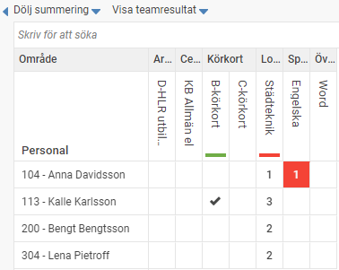
Genom att klicka på Visa teamresultat får du mer information om vad som saknas i teamet. Här visas detaljerad information om kravnivå, antal anställda som behövs på denna nivå samt hur många som faktiskt finns med aktuell kompetensnivå. Den röda markeringen för kompetensen Städteknik med krav på nivå 4 visar att det saknas anställda med den nivån (kravet är en person men det finns ingen).
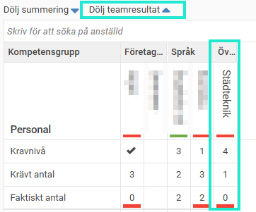
Vi har här snabbt ringat in att det finns en kompetensbrist i teamet, och man kan planera in en åtgärd i form av kompetensutveckling. Anställd, 113 – Kalle Karlsson, har redan nivå 3 och ligger nära tillhands att vidareutbilda för att täcka teamets behov.
Påminnelser för kompetenser
Vissa typer av kompetenser, såsom certifikat, behöver förnyas med jämna mellanrum, och andra vill man se över och uppdatera nivån på ibland. För att göra detta enklare kan man skapa en påminnelse som varnar när en kompetens är på väg att gå ut.
En påminnelse som visas på startsidan utgörs av en rubrik med påminnelsens namn som kan expanderas för att se vilka anställda som påminnelsen gäller.
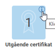
Du kan sedan expandera raden för den anställde för att se vilka kompetenser som är på väg att gå ut (utgångsdatumet visas inom parentes). Om du klickar på den anställdes namn öppnas den anställdes kompetenser i anställdaregistret. Om du klickar på påminnelserubriken öppnar du istället kompetenssökningen.
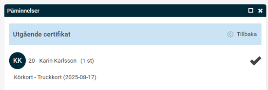
Påminnelser som skickas ut via e-post och som notiser i HRM Mobile innehåller inte information om vilka anställda påminnelsen gäller.
Relaterade artiklar
Hur tar jag fram ett CV för en anställd i HRM Employee?
⚙️Kompetenserhantering i HRM - Hur skapar jag nya kompetenser?
⚙️Kurshantering i HRM - Hur skapar jag nya kurser?
