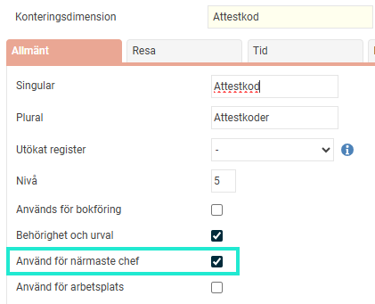
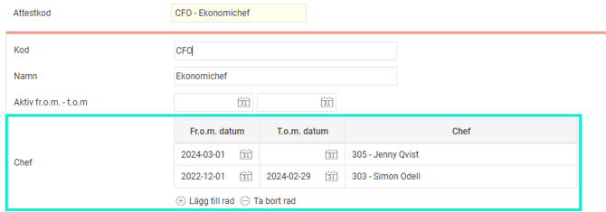
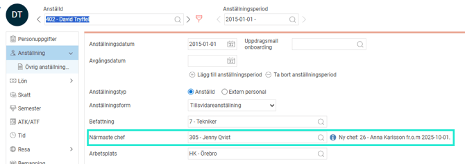
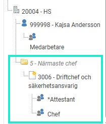

# ⚙️Så här fungerar Närmaste chef i HRM Employee

**Datum:** den 17 september 2025  
**Kategori:** Employee  
**Underkategori:** Organisation  
**Typ:** config  
**Svårighetsgrad:** advanced  
**Tags:** anställning, hrm-employee  
**Bilder:** 4  
**URL:** https://knowledge.flexhrm.com/sv/sa-har-fungerar-narmaste-chef

---

Funktionen Närmaste chef i HRM Employee hjälper dig att tydligt visa och hantera vem som är ansvarig chef för varje anställd.

Den här artikeln beskriver hur närmaste chef fungerar i HRM.
Här visas närmaste chef
I registret för
Anställda > Anställning
Uppgifter/uppdrag
där ansvarig är satt till "Närmaste chef"
Som ansvarig befattningshavare i
Organisationsträdet
Utdata och rapporter
Rapportgenerator (datakälla "Anställda")
Export(exporttyp Anställda/användare)
Standardrapport Personallista
API
Aktivera funktionen för Närmaste chef
För att kunna använda funktionen behöver du först bestämma vilken av era
konteringsdimensioner
som ska användas för "Närmaste chef." Konteringsdimensionen kan heta vad som helst, vanliga exempel är "Närmaste chef" eller "Attestkod".
Inställningar > Allmänt > Konteringsdimensioner
Klicka på den konteringsdimension som du vill använda för närmaste chef.
Under
Allmänt
markera kryssrutan
Använd för närmaste chef
för att aktivera funktionen

Register
När du har aktiverat inställningen för konteringsdimensionen enligt beskrivningen ovan, aktiveras en lista i registret. I den listan anger du vem som är aktuell chef för respektive kod.

Detta gör att du enkelt och i god tid kan förbereda ett chefsbyte. Den nya chefen blir automatiskt synlig för de anställda från och med det datum som chefsbytet sker enligt registret. Om det finns flera kommande chefer i listan, visas endast den nuvarande och den närmast kommande chefen för den anställde.

Bra att veta
En anställd måste vara kopplad till en användare i HRM för att kunna väljas som närmaste chef.
Välj chef från hela koncernen: Om ni använder koncernhantering kan du välja en närmaste chef från ett annat företag inom samma koncern.
Detta gäller för N
ärmaste chef i
Uppgifter/uppdrag
I uppgifter i HRM Mobile och på startsidan kan du se vem som är närmaste chef, vilket gör det enkelt för både chefer och anställda att snabbt hitta rätt person.
Systemet sätter alltid den chef som är närmaste chef för tillfället. Om en anställd får en ny närmaste chef efter att en uppgift har skapats, ändras inte den som är ansvarig för uppgiften.
Ett felmeddelande visas om det saknas en närmaste chef, eller om den anställde som ska vara ansvarig inte har en kopplad användare när uppdraget startar. Du ser felmeddelandet bredvid fältet för huvudansvarig i uppdragsvyn.
Kom ihåg att när du anställer en ny chef så räcker det inte att endast uppdatera listan för närmaste chef. Du behöver även lägg till behörigheter på användaren. Så att den nya chefen kan se och hantera sina anställda.

