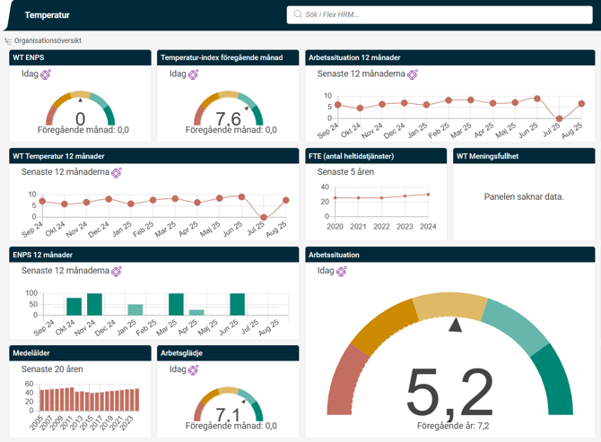
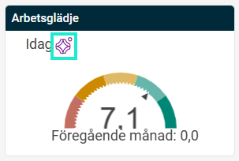
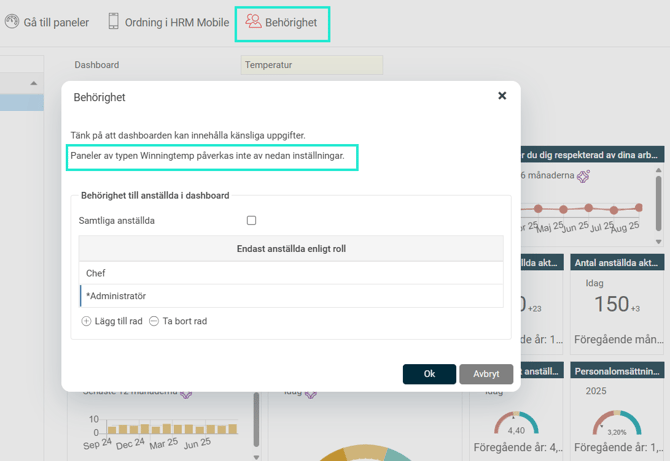
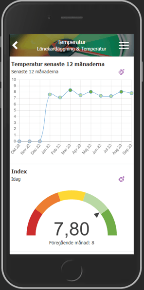
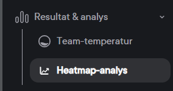
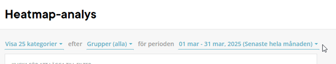
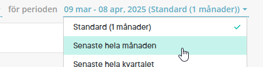

# ⚙️Skapa Dashboard i HRM med Winningtemp-paneler

**Datum:** den 11 september 2025  
**Kategori:** Employee  
**Underkategori:** Anställningshantering  
**Typ:** config  
**Svårighetsgrad:** intermediate  
**Tags:** dokument  
**Bilder:** 7  
**URL:** https://knowledge.flexhrm.com/sv/skapa-dashboard-i-hrm-med-winningtemp-paneler

---

Den här artikeln beskriver hur du skapar en dashboard i HRM med temperaturer från Winningtemp.
Skapa Dashboard i HRM med Winningtemp-paneler
För att skapa nya Dashboards i HRM går du in under
Systemregister > Dashboard > Dashboards
. Varje dashboard byggs upp av olika paneler med data i. Det går att blanda de vanliga HRM-panelerna med paneler av typen Winningtemp.

Mer information om hur du skapar och redigerar paneler och dashboards hittar du i hjälpen i HRM samt i separat dokumentation på om rapporter och statistik.
Varje gång du
sparar
i en Dashboard som har en eller flera paneler med Winningtemp-data så kommer ett bakgrundsjobb att köras i HRM som uppdaterar informationen. Det kan medföra en fördröjning innan du ser siffror i dina Winningtemp-paneler.
I det övre högra hörnet på en Winningtemp-panel finns en
lila logotyp
. Om du klickar på den kommer du direkt till inloggningen för Winningtemp.

Notera:
Behörighet per dashboard gäller inte för paneler med data från Winningtemp
En användare som har behörighet att se dashboarden med data från Winningtemp kommer att se data baserat på samtliga anställda.

Du kan även se din Dashboard i
HRM Mobile

Beskrivning Winningtemp-paneler i HRM Dashboard
När du skapar paneler med typen Winningtemp har du ett antal olika val. Nedan beskrivs de olika valen.
Fråga
Index
- Visar index för alla kategorier sammanräknat. Den totala temperaturen i Winningtemp visar ett aggregerat resultat för alla aktiverade kategorier, exklusive eventuella anpassade kategorier.
Kategori
- Visar en sammanfattning av flera frågor inom samma kategori. Exempelvis ledarskap.
Fråga
- Visar värden för en specifik fråga.
Typ av fråga
Temperatur
- Visar ett värde mellan 0-10
ENPS
- eNPS är en förkortning av Employee Net Promotor Score, som mäter om de anställda skulle rekommendera företaget som arbetsgivare eller inte. Visar värde från -100 till +100
Custom
- Tillval i Winningtemp för skräddarsydd/anpassad kategori.
D
e
t innebär att du kan
skapa egna ka
tegorier med egna frågor. Exempelvis säkerhet eller segmentsfrågor ex. för kollektivanställda eller timanställda etc.
Här hittar du exempel Winningtemp-paneler i HRM
Vilken data visas i HRM?
Vi visar hel månad dvs föregående månad i Winningtemp-panelerna i HRM. Exempelvis idag är det den 5 april då visas data för perioden 1-31/3.
I Winningtemp kan du som administratör se en
Heatmap analys
- här kan man som användare i Winningtemp visa hel månad om man vill jämföra siffrorna.

Relaterade artiklar
⚙️Pulsmätningar
och
medarbetarundersökningar
- Hur integrerar jag Winningtemp & HRM?
