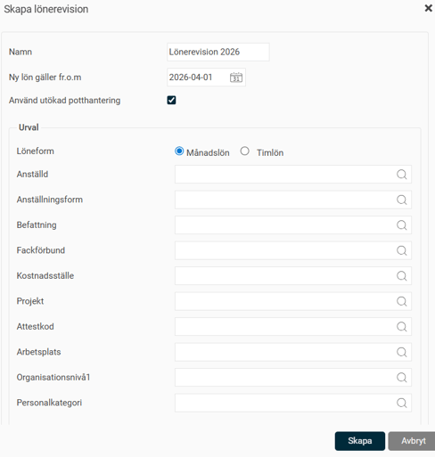
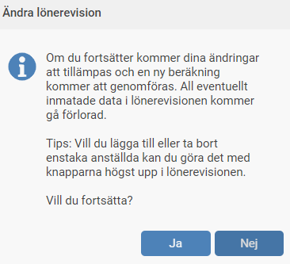

# Skapa en lönerevision

**Datum:** den 29 september 2025  
**Kategori:** Employee  
**Underkategori:** Anställningshantering  
**Typ:** other  
**Svårighetsgrad:** intermediate  
**Tags:** anställning, lönerevision  
**Bilder:** 3  
**URL:** https://knowledge.flexhrm.com/sv/skapa-lonerevision-0

---

Här beskriver vi hur du arbetar med årets lönerevision. 

Läs vidare för att se hur du som administratör skapar upp lönerevisionen och gör de förberedande stegen.

Skapa en lönerevision
Här beskriver vi hur du skapar en ny lönerevision i HRM. Arbetet sker under
Personal > Lönerevision
. Processen innebär vanligtvis att en administratör eller HR-ansvarig skapar lönerevisionen, går igenom underlaget och fördelar potter innan själva lönesättningen påbörjas.
För att skapa en ny lönerevision, klicka på knappen
Ny
.
Grundinställningar
Börja med att ge lönerevisionen ett namn och ange det datum som den nya lönen ska gälla från.

Om ni arbetar med
utökad potthantering
, markera kryssrutan
Använd utökad potthantering
. Tänk på att detta val inte kan ångras efter att du har klickat på
Skapa
. Om du skulle behöva ändra detta i efterhand måste du ta bort lönerevisionen och skapa en ny.
Urval av anställda
Därefter gör du ett urval av vilka anställda som ska ingå i lönerevisionen. Tänk på att du behöver göra separata lönerevisioner för månadsavlönade och timavlönade, eftersom summeringar och potter inte kan hanteras för båda grupperna samtidigt.
Du kan antingen skapa en stor lönerevision för alla anställda i företaget, eller flera mindre revisioner för olika grupper av anställda. Vad som passar bäst för din organisation beror ofta på hur ni vill arbeta med potter.
När du gjort dina grundinställningar och urval är det dags att klicka på
Skapa.
Förutsättningar för att en anställd ska inkluderas
För att en anställd ska kunna inkluderas i en lönerevision måste följande villkor vara uppfyllda:
Aktiv anställning
Den anställde måste ha en aktiv anställning på det datum då den nya lönen börjar gälla. Om den nya lönen gäller från 1 april kommer en person som anställs 1 maj inte att inkluderas.
Löneuppgifter
Det måste finnas uppgifter om löneform och aktuell månads- eller timlön registrerade i HRM.
Rätt lönerevisionsår
En anställd som redan har fått sin lön reviderad under året tas inte med. I anställningsregistret, under fliken
Lön
, kan du se vilket år lönen senast reviderades. När en ny lönerevision skapas inkluderas anställda som har ett lägre lönerevisionsår än det aktuella, eller där uppgiften saknas. Fältet uppdateras automatiskt när de nya lönerna verkställs.
Pågående lönerevision
En anställd som redan ingår i en pågående lönerevision för samma år kan inte läggas till i en ny.
Ändra i en skapad lönerevision
Om du har skapat en lönerevision och behöver justera något i efterhand kan följande justeras.
Ändra urval, namn eller datum
Om du vill ändra namn, datum för ny lön eller det övergripande urvalet av anställda, för muspekaren över lönerevisionens namn och klicka på knappen
Ändra
. Observera att lönerevisionen då rensas och skapas på nytt med de nya inställningarna.

Lägga till eller ta bort enskilda anställda
Om du bara vill lägga till eller ta bort enstaka anställda använder du knapparna
Lägg till anställd
och
Ta bort anställd
.
När alla anställda som ska ingå i lönerevisionen är tillagda är du redo att fortsätta med förberedelserna -
Nästa steg - Skapa potter
