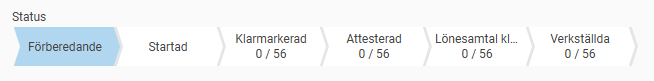
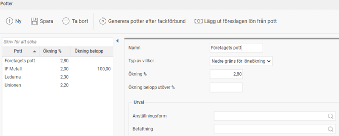
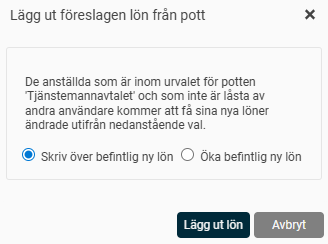
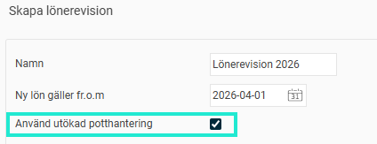
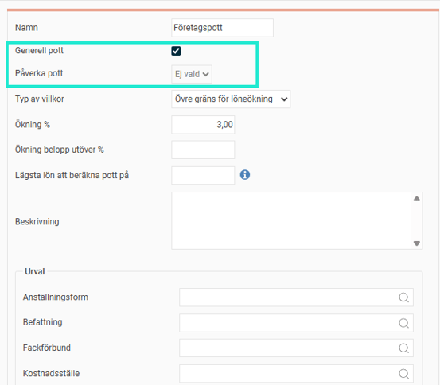
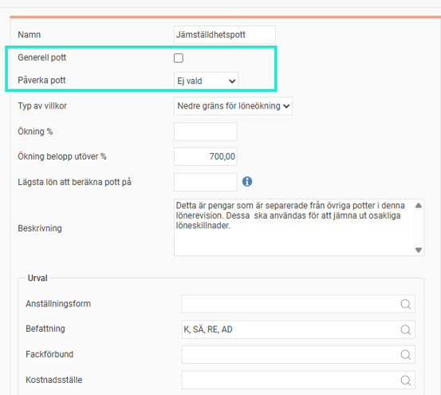
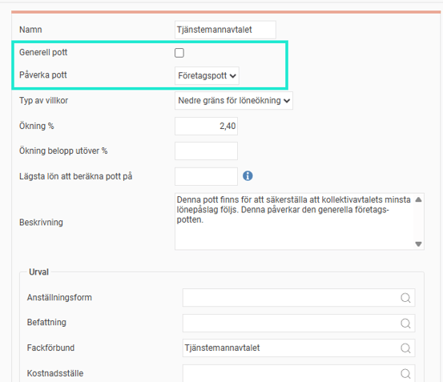
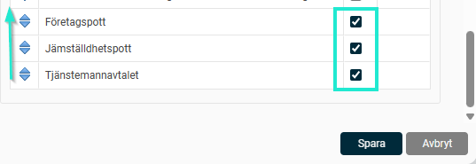
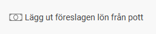

# Skapa potter i en lönerevision

**Datum:** den 30 september 2025  
**Kategori:** Employee  
**Underkategori:** Anställningshantering  
**Typ:** other  
**Svårighetsgrad:** advanced  
**Tags:** lönerevision  
**Bilder:** 10  
**URL:** https://knowledge.flexhrm.com/sv/skapa-potter-i-en-lonerevision-0

---

Här beskriver vi hur du arbetar med årets lönerevision. 

Läs vidare för att se hur du som administratör skapar upp potter i lönerevisionen.

Potter i lönerevisionen
För att skapa och hantera potter i lönerevisionen klickar du på knappen
Potter
. I den här artikeln går vi igenom hur du ställer in och använder dina potter.
Potter hjälper dig att säkerställa att företaget håller sig inom de överenskomna ramarna för årets lönerevision. En pott kan fungera som antingen en nedre eller en övre gräns:
En nedre gräns
används till exempel när ett kollektivavtal bestämmer att en grupp anställda ska ha en löneökning på minst tre procent.
En övre gräns
används för att säkerställa att den budget du har satt för lönerevisionen inte överskrids.
Skapa en pott
För att ställa in de olika potterna i lönerevisionen klickar du på knappen
Potter
i knappraden.

För varje pott fyller du i följande fält:
Namn:
Ange ett namn för potten.
Typ av villkor:
Här väljer du om potten ska fungera som ett golv eller ett tak för löneökningen.
Nedre gräns för löneökning:
Välj detta om potten ska säkerställa en minsta löneökning, till exempel för att följa ett kollektivavtals krav.
Övre gräns för löneökning:
Välj detta om potten ska fungera som ett tak för löneökningen, till exempel för att hålla budgeten.
Ökning %:
Ange den procentuella löneökning som potten ska beräknas på. Beräkningen blir summan av procentökningen för alla anställda som ingår i potten.
Plus ökning kr:
Fyll i ett fast belopp som varje anställd ska få utöver den procentuella ökningen. Detta är vanligt om ett kollektivavtal garanterar en viss ökning i kronor.
Beskrivning av pott:
Skriv en valfri förklaring eller hjälptext för potten.
Urval:
Här kan du
göra ett urval
för att bestämma vilka anställda som potten ska gälla för. Du kan till exempel skapa en pott per avdelning eller per fackförbund.
När du har definierat potterna är du redo att starta lönerevisionen.
Funktionsknappar
I knappraden finns två funktioner som du kan använda:
Generera potter efter fackförbund:
Använd den här knappen för att enkelt skapa en pott per fackförbund. Därefter kan du lägga in fackens krav för minsta löneökning per pott för att kontrollera att kraven följs.
Lägg ut föreslagen lön efter pott:
Med denna funktion kan du fördela den beräknade potten som en föreslagen löneökning för de anställda. Detta kan vara en bra utgångspunkt för lönerevisionen.

Du kan välja mellan två alternativ:
Skriv över befintlig ny lön:
Ersätter en eventuellt redan inmatad ny lön med den nya lönen som beräknas från pottvillkoret.
Öka befintlig ny lön:
Lägger till pottens värde på den befintliga nya lönen. Detta är användbart om du vill att flera potter ska läggas på varandra, till exempel om du har en separat jämställdhetspott.
Utökad potthantering
Med utökad potthantering kan du visa vilken pott som löneökningen kommer ifrån för varje anställd. Du kan också välja vilka potter som ska påverka varandra.
För att aktivera funktionen, bocka i rutan
Använd utökad potthantering
när du skapar en ny lönerevision. Tänk på att när du har klickat på
Skapa
kan du inte ångra detta val utan att ta bort lönerevisionen och skapa en ny.

När du använder utökad potthantering får du följande val för dina potter:
Generell pott:
Innebär att potten kan påverkas av andra potter, men den kan inte själv påverka någon annan pott.
Påverka pott:
Innebär att potten kan påverka en annan generell pott.
Exempel på en pott som inte påverkar någon annan pott

Exempel på en pott som är helt fristående från övriga potter, det vill säga den varken påverkar eller påverkas av någon annan pott

Exempel på en pott som påverkar en annan pott

Lägg till kolumner för potter
Vid utökad potthantering behöver du lägga till kolumner för de olika potterna för att kunna se dem och lägga ut föreslagen lön. Det gör du under
Mer > Välj kolumner.

Välj dina potter genom att klicka i rutan till höger och flytta upp dem till önskad plats med hjälp av de blå pilarna.
Spara
.

Här kan du hitta mer info om valbara kolumner.
När du har lagt till kolumnerna kan du välja att lägga ut
föreslagen lön från potten.

När du har gjort alla förberedelser är du redo för
Nästa steg - Starta lönerevision
