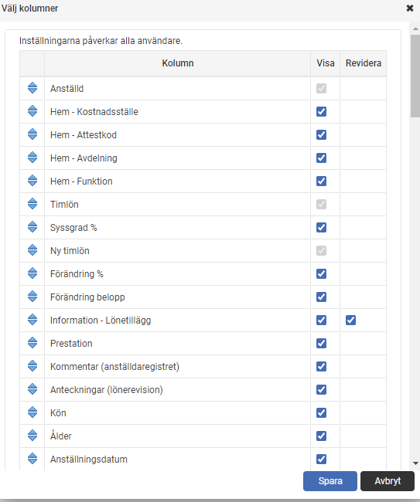

# Valbara kolumner i Lönerevision

**Datum:** den 30 september 2025  
**Kategori:** Employee  
**Underkategori:** Anställningshantering  
**Typ:** other  
**Svårighetsgrad:** intermediate  
**Tags:** lönerevision  
**Bilder:** 2  
**URL:** https://knowledge.flexhrm.com/sv/valbara-kolumner-i-lonerevision-0

---

I artikeln hittar du information om hur du enkelt arbetar med årets lönerevision.  

Nedan beskrivs funktionen Valbara kolumner under systemets förberedande steg.

Valbara kolumner i lönerevisionen
Personal > Lönerevision
När du arbetar med lönesättning i en lönerevision behöver du ofta ta hänsyn till olika saker, till exempel lönetillägg, förmåner och flexpension. För att ge dig en tydlig överblick kan du därför ställa in vilka kolumner som ska visas i lönerevisionen.
Ställ in vilka kolumner som ska visas
Om du är administratör och har behörighet att skapa och ändra en lönerevision, kan du välja vilka kolumner som ska visas. Du gör inställningarna via knappen
Välj kolumner
i knappraden.
De kolumner du väljer här visas för alla användare som arbetar i just den här lönerevisionen. Tanken är att du som administratör bestämmer vilken information de lönesättande cheferna ska se, så att alla får en så rättvis bild som möjligt.
Inställningarna är unika för varje lönerevision.
När du skapar en ny lönerevision föreslår systemet samma kolumner som användes i den föregående.
Du kan ändra ordningen på kolumnerna med de blå pilarna.

Gröna kolumner
Vissa kolumner är gröna i lönerevisionsvyn. Dessa innehåller extra information om den anställde och visar alltid det aktuella värdet i systemet. Det betyder att värdet inte nödvändigtvis är detsamma som det var när lönerevisionen genomfördes.
Tillgängliga kolumner
Här är de kolumner du kan välja att aktivera.
Hemkontering
Visar vilken hemkontering den anställde tillhör, till exempel kostnadsställe eller avdelning.
Personalkategori
Visar vilken personalkategori den anställde tillhör.
Tidgrupp
Visar vilken tidgrupp den anställde tillhör i HRM Time.
Semesterrätt
O
m du använder HRM Payroll kan du även visa den anställdes semesterrätt.
Personnummer
Vanligtvis är det bäst att undvika att visa personnummer. Om du däremot behöver få med personnumret i en export till Excel kan du välja att visa denna kolumn.
Sysselsättningsgrad
Visar
den sysselsättningsgrad som gällde för den anställde på lönerevisionens startdatum.
Viktigt!
Om en anställds sysselsättningsgrad ändras efter att lönerevisionen har skapats, uppdateras den inte automatiskt i revisionsvyn. För att hämta den nya sysselsättningsgraden måste du ta bort den anställde från lönerevisionen och lägga till hen igen. Tänk på att alla löneförslag och ändringar du har gjort på den anställde då försvinner.
Om den anställde saknar en registrerad sysselsättningsgrad på lönerevisionsdatumet visas 100 %.
Egna fält
Du kan visa alla egna fält som finns i fältgrupper, oavsett om de är datumstyrda eller inte. Det kan till exempel vara fält för olika lönetillägg, förmåner eller hantering av flexpension.
För att visa ett eget fält, gå till inställningarna för
Välj kolumner
:
Bocka i rutan
Visa
.
Om det är ett numeriskt fält som du vill kunna ändra direkt i lönerevisionen, bockar du även i
Revidera
.
