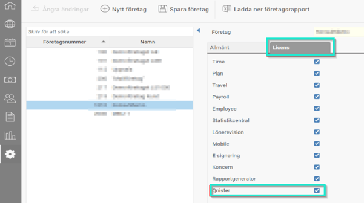
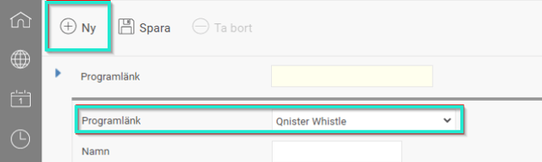
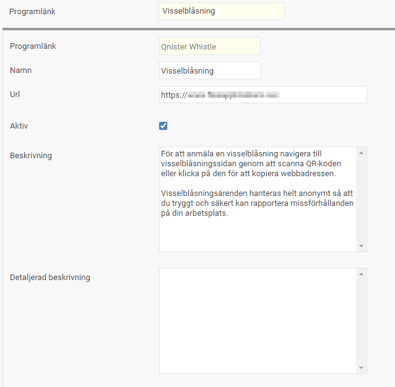
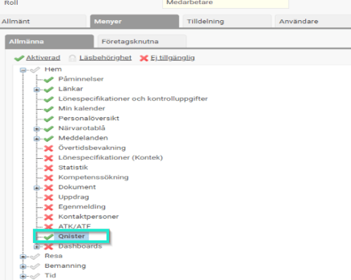
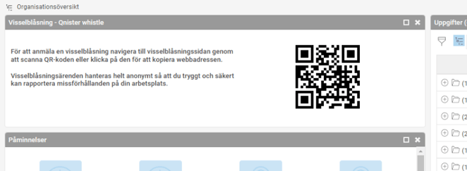

# ⚙️Visselblåsning via Qnister Whistle

**Datum:** den 22 oktober 2025  
**Kategori:** Employee  
**Underkategori:** Anställningshantering  
**Typ:** config  
**Svårighetsgrad:** advanced  
**Tags:** Ingen  
**Bilder:** 5  
**URL:** https://knowledge.flexhrm.com/sv/instruktion-hrm-visselblasning-via-qnister-whistle

---

HRM erbjuder stöd för visselblåsning genom integration med Qnister Whistle, vilket möjliggör en säker och anonym hantering av rapporter om missförhållanden. Lösningen uppfyller lagkraven för interna rapporteringskanaler och är enkel att aktivera i systemet.
Visselblåsning
Visselblåsning kallas det när en person rapporterar om missförhållanden i myndigheter, företag eller samhället i övrigt. Det kan handla om saker som är olagliga, oetiska eller olämpliga. Enligt Lag (2021:890) om skydd för personer som rapporterar om missförhållanden ska alla arbetsgivare med fler än 50 anställda ha en rapporteringskanal för detta.
HRM har därför en koppling till Qnister Whistle som är en molntjänst skapad av bolagsjurister med en säker yta för att hantera, bedöma och arbeta med inkomna visselblåsningar. Visselblåsningsärenden hanteras helt anonymt så att du tryggt och säkert kan rapportera missförhållanden på din arbetsplats.
Aktivering i Flex HRM
Licens
Efter att ha tecknat avtal med
Qnister
behöver du gå in och aktivera en licens i HRM, kontakta oss på Flex Applications om du inte fått licensen tillgänglig.
Gå in under
Allmänt – Företag
och välj aktuellt företag i listan till vänster. Välj fliken Licens och bocka sedan i Qnister.

Programlänk
För att aktivera funktionen behöver du skapa en ny programlänk genom att klicka på Ny och välja Qnister Whistle:

Fyll sedan i övriga uppgifter enligt nedan:

Namn
– här skriver du ett namn som enbart syns i denna vy.
Url
– den adress som du hittar under Inställningar på Qnisters kundportal.
Beskrivning
– i de fall du vill att det står något annat än ovan ändrar du här.
Detaljerad beskrivning
– i de fall du tycker ovan beskrivning inte räcker till. Den texten hamnar under den andra i widgeten på startsidan i HRM.
Notis
: Om du inte ser programlänken för Qnister och du har kopplat på licensen för det kan det bero på att inställningar behöver göras under
Systemregister – Integrationer
. Vi rekommenderar dock att ni tar hjälp av en konsult från Flex Applications för att sätta upp dessa inställningar.
Behörighet
För att en användare ska få tillgång till widgeten på startsidan och kunna rapportera från HRM (enligt nedan instruktion) behöver du först aktivera den på roller som ska ha behörigheten. Förslagsvis läggs det på medarbetarrollen som ofta alla anställda har.

Rapportera via Flex HRM
För att rapportera från HRM scannar du QR-koden på startsidan, alternativt klickar på den för att kopiera webbadressen som du då kan klistra in i din webbläsare.
Därefter följer du instruktionerna i formuläret du kommer till.

