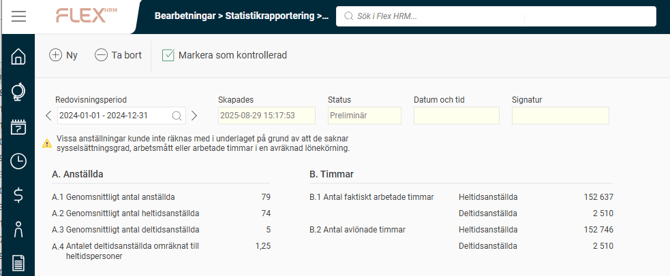
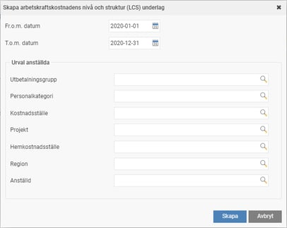
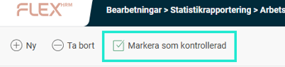
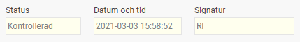
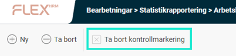

# Arbetskraftskostnadens nivå och struktur (LCS) - Hur tar jag fram statistiken för LCS i HRM Payroll?

**Datum:** den 7 oktober 2025  
**Kategori:** Payroll  
**Underkategori:** Skatt & AGI  
**Typ:** other  
**Svårighetsgrad:** intermediate  
**Tags:** agi, bokföring, lön, löneart  
**Bilder:** 7  
**URL:** https://knowledge.flexhrm.com/arbetskraftskostnadens-niv%C3%A5-och-struktur-lcs-hur-tar-jag-fram-statistiken-f%C3%B6r-lcs-i-hrm-payroll

---

I denna artikel beskriver rapportering av statistiken LCS till SCB. Vi visar hur du tar fram underlaget för de olika delarna av statistiken.
Arbetskraftskostnadens nivå och struktur (LCS)
Arbetskraftskostnadens nivå och struktur (Labour cost survey – LCS) är en undersökning där uppgifter samlas in om de kostnader en arbetsgivare har för att ha personer anställda. Undersökningen är en EU-undersökning som genomförs i respektive medlemsland vart fjärde år.
Rapporteringen är uppdelad i sju olika delar, A – G. Nedan beskrivs hur du får fram underlaget för de olika delarna.
Underlag för del A och B
Uppgifterna för delarna A – Anställda, och B – Timmar kan du i Flex HRM Payroll få fram under
Arbetskraftskostnadens nivå och struktur (LCS).

Skapa underlag
Det första steget i rapporteringen är att skapa ett underlag för det år rapporteringen avser. Detta gör du genom att klicka på knappen
Ny
i knappraden.
Du väljer här vilken period du vill skapa rapporteringsunderlag för. Du kan också välja att göra urval på anställda om du skulle vilja.

När du klickar på knappen
Skapa
påbörjas arbetet med att skapa underlag. När underlaget är skapat ser du underlaget med statusen satt som
Preliminär
i vyn.
Ta bort underlag
Om du upptäcker ett fel i underlaget kan du enkelt ta bort det genom att klicka på
Ta bort
-knappen och skapa ett nytt underlag från början. Du kan även radera äldre underlag som du inte längre vill ha kvar.
Kontrollera underlaget
Nästa steg är att kontrollera underlaget innan du skickar in uppgifterna till SCB. Detta gör du genom att granska underlaget i vyn.
Överst i vyn väljer du vilken redovisningsperiod du vill titta på.

I tabellen visas det underlag för del A och B som sammanställts och som ska rapporteras.

Uppgifterna under A.1, A.2, samt A.3 ska redovisas i heltal. Men för att underlätta felsökning kan man peka på en siffra för att se decimalerna, vilket gör att man kan skapa underlaget för en enstaka anställd och se hur denne blir beräknad. Du kan alltså skapa flera underlag för samma period för att kunna felsöka.
När underlaget är granskat markerar du underlaget som kontrollerat genom att klicka på knappen
Markera som kontrollerad
.

Statusen på underlaget ändras då till
Kontrollerad
. Datum, tid samt signatur för användaren som markerade underlaget som kontrollerat sparas ner på underlaget.

Om du hittar ett fel i ett kontrollerat underlag kan du välja
Ta bort kontrollmarkering
, vilket gör att statusen för underlaget återigen blir
Preliminär
.

Underlag för del C – G
Övriga delar i rapporteringen rör C - Lönekostnader, D - Förmåner, E – Sociala avgifter, F – Andra arbetskraftskostnader, samt G – Bidrag. Dessa uppgifter kan du antingen sammanställa via rapporter i Flex HRM, eller direkt från bokföringen i ert ekonomisystem.
På sista sidan i instruktionen från SCB finns en guide som visar vilka bokföringskonton du kan hämta de olika uppgifterna från i ekonomisystemet om ni använder BAS-kontoplanen.
Om du istället vill hämta uppgifterna med hjälp av rapporter i Flex HRM rekommenderar vi att du använder rapporten Fördelning av antal och belopp. Du kan då summera belopp för de olika delarna genom att göra urval på de lönearter som ska ingå. Uppgifter om arbetsgivaravgifter kan summeras från årets AGI-rapporteringar.
Relaterade artiklar:
Vilka uppgifter kommer med i statistiken till Arbetskraftskostnadens nivå och struktur (LCS) och hur beräknas dem?
Arbetskraftskostnadens nivå och struktur (LCS) - Vilka inställningar behöver jag för att kunna ta ut statistiken för LCS i HRM Payroll?
