# ⚙️Bygglösen - Vilka inställningar behöver jag för att kunna ta ut statistiken i HRM Payroll?

**Datum:** den 11 maj 2026  
**Kategori:** Payroll  
**Underkategori:** Löneberedning  
**Typ:** config  
**Svårighetsgrad:** advanced  
**Tags:** lön, löneart  
**Bilder:** 25  
**URL:** https://knowledge.flexhrm.com/sv/byggl%C3%B6sen-vilka-inst%C3%A4llningar-beh%C3%B6ver-jag-f%C3%B6r-att-kunna-ta-ut-statistiken-i-hrm-payroll

---

Artikeln beskriver de inställningar du behöver göra för att kunna ta ut rapport för rapportering av Bygglösen 1.0 (Tidlön) och Bygglösen 2.0 (Prestationslön).
Behörigheter
Län och kommunkod
Projektregistret
Fördelningstal
Avtalsområde
Lönearter
Anställdaregistret
Lönetransaktioner
Behörigheter
För att få åtkomst till rapporten behöver få detta aktiveras på aktuella roller under
Användare/Behörigheter > Roller
Ställ dig på aktuell roll och i fliken Menyer hittar du Bygglösen under
Administration > Bearbetningar > Statistikrapportering
.
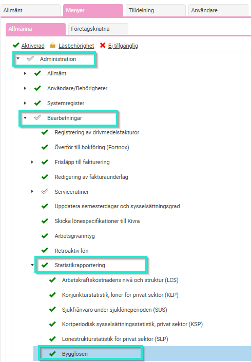
Län och kommunkod
Arbetad tid rapporteras på en län och kommunkod (enligt SCB). Detta ställs in som en konteringsdimension under
Inställningar > Allmänt > Konteringsdimensioner.
Markera att konteringen ska användas för  län och kommunkod.
Under flikarna Tid och Lön markeras
Lägg ut kontering från Projekt
och under fliken Lön markeras även
Använd i löneberedningen
.
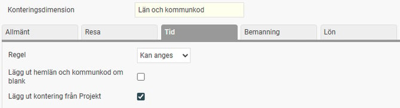
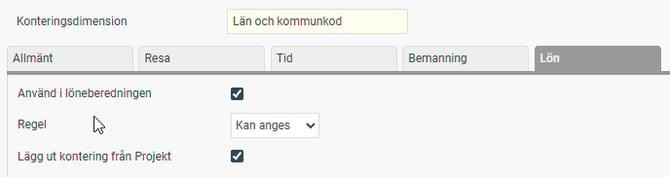
Det tillhörande registret fylls med värden när du sparar konteringsdimensionen första gången med bocken för Använd för län och kommunkod. Tillkommer nya koder måste dessa läggas till i registret.
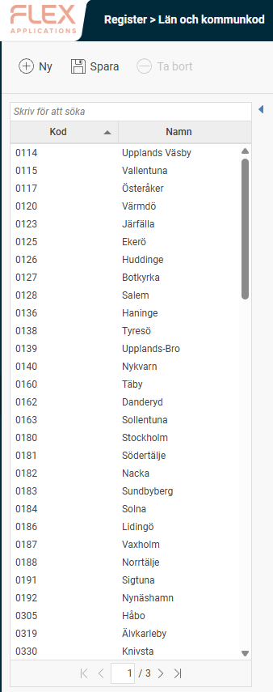
Projektregister
Komplettera projekten i projektregistret med Län och Kommunkod. (Om du tidigare använt Flex Lön och gått över till HRM Payroll och använder 3L Pro behöver du nu för tiden administrera dina projekt manuellt i HRM.)
För projekt som ska hanteras som prestationslöneprojekt finns ytterligare inställningar att göra under fliken
Bygglösen.
Fältet
Lönetyp
avgör om projektet ska hanteras som tidlöneprojekt eller prestationslöneprojekt. Vid prestationslön blir fältet
Utbetalningsnivå
upplåst och används för att ange det aktuella projektets faktiska utbetalningsnivå.
I rapporten till Bygglösen kommer arbetsplatsnummer automatiskt sättas till projektkoden. Önskas ett alternativt arbetsplatsnummer kan detta anges i fältet
Arbetsplatsnummer.
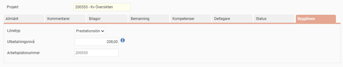
Om medarbetarna inte rapporterar sin tid mot projekt behöver du ett projekt där företagets län och kommun ligger kopplat (detta kopplas sen som en fast kontering på de lönearter som ska inkluderas i rapporteringen).
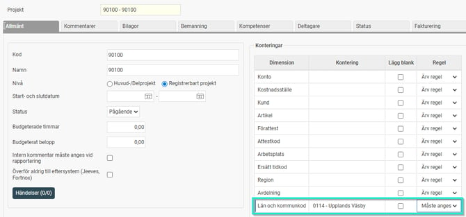
Fördelningstal
Avgör andel av fullbetald timlön för lärlingar.
Detta läggs upp som ett Eget fält under
Inställningar > Personal > Anställdaregistret – egna fält
. Skapa först en tabell för Bygglösen av typen Fältgrupp med datumhistorik.
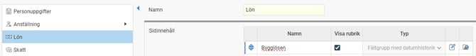
I tabellen skapas ett numeriskt fält för Fördelningstal. Markera
Fältet är ett fördelningstal
.
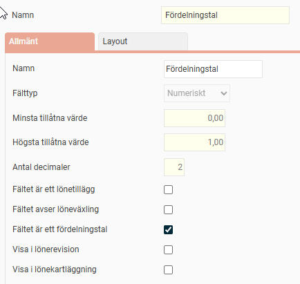
Avtalsområde
Avtalsområde anges på respektive personalkategori under
Inställningar > Lön > Personalkategorier.
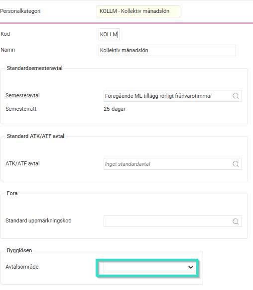
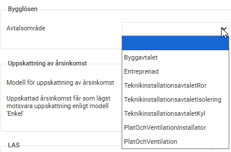
Lönearter
På lönearterna behöver någon av följande bockar markeras beroende på hur lönearten ska rapporteras.
Arbetade timmar
Avser Utbetald lön
Övertidstimmar
Övertidstillägg
OB-tillägg
Utbetalt ackordsöverskott
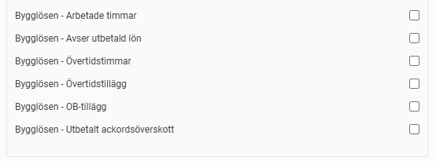
Lönearternas antal/belopp redovisas i rapporten som "varav.....", t.ex. varav övertidstimmar, varav OB-tillägg så flera bockar kan vara aktuella på samma löneart.
Exempel timlön:
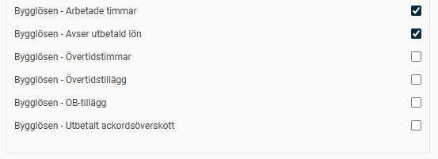
Exempel lönetillägg:
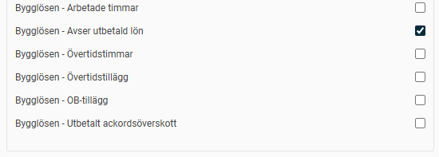
Exempel övertidslöneart:
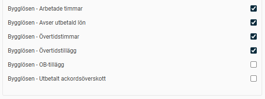
Exempel OB-tillägg:
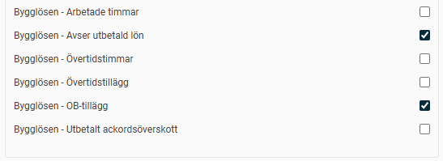
Exempel Ackordsöverskott:
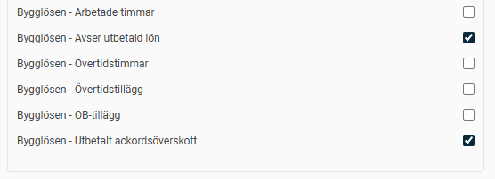
Det finns också en formelfunktion för att hämta fördelningstalet från anställdaregistret i formeln på lönearten.
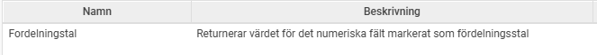
Exempelformel för timlön där hänsyn ska tas till fördelningstal:
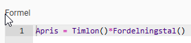
För prestationslöner finns en formelfunktion för att hämta utbetalningsnivå från aktuell transaktions projekt.
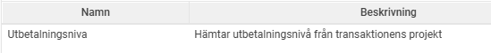
Exempelformel för prestationslön där projektets utbetalnignsnivå ska användas istället för timlön från anställdaregistret:
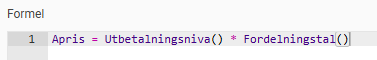
Om medarbetarna inte rapporterar sin tid mot projekt behöver du även lägga in en fast kontering på samtliga lönearter som ska inkluderas i rapporteringen under fliken kontering som pekar på ett projekt där företagets län och kommun ligger kopplat.
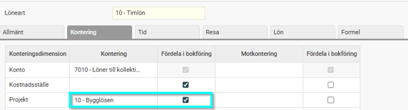
Anställdaregistret
På de anställda registreras följande uppgifter:
Fördelningstal - anges i det egna fältet med datum då respektive fördelningstal ska tillämpas (0,80 = 80%).
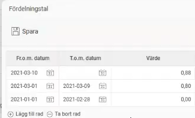
Fälten under fliken Lönestatistik behöver också fyllas i.
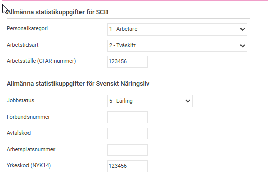
Lönetransaktioner
Transaktionsdatum : För att lönetransaktionerna ska rapporteras korrekt måste det ligga korrekta transaktionsdatum. Om datum saknas använder systemet lönekörningens avvikelseperiod. Om en lärling byter fördelningstal mitt i månaden behöver lönetransaktionerna matcha de olika perioderna för att hämta upp rätt fördelningstal. Om detta inte görs hämtas det senast gällande fördelningstalet. T.ex. behöver då timlön komma in uppdelat (ej läsas in för hela månaden på en rad i lön).
Antal och enhet
Konteringsdimensioner = Projekt, Län & kommunkod
Belopp
Exempel löneberedning där olika timlön ska användas för perioden 1-20/3 och 21-31/3:
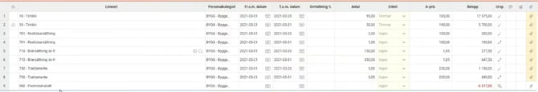
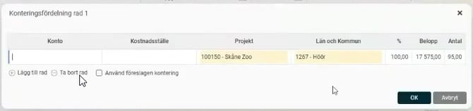
Relaterade artiklar:
Hur tar jag fram rapport till Bygglösen 1.0 (Tidlön) i HRM Payroll?
