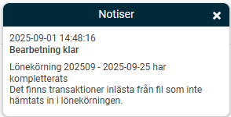
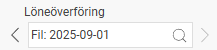
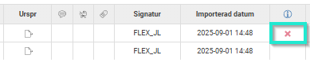

# Det visas en varning att det finns transaktioner som inte hämtats in i lönekörningen, hur hittar jag och hanterar dessa?

**Datum:** den 7 oktober 2025  
**Kategori:** Payroll  
**Underkategori:** Löneberedning  
**Typ:** other  
**Svårighetsgrad:** intermediate  
**Tags:** lön  
**Bilder:** 4  
**URL:** https://knowledge.flexhrm.com/det-visas-en-varning-att-det-finns-transaktioner-som-inte-h%C3%A4mtats-in-i-l%C3%B6nek%C3%B6rningen-hur-hittar-jag-och-hanterar-dessa

---

Den här artikeln beskriver hur du hittar och hanterar transaktioner som ej lästs in i lönekörningen från en fil.
Efter en import av transaktioner via en importfil kan det visas en varning om att det finns transaktioner som ej lästs in i lönekörningen i en notis.

Du kan även se en varningstriangel vid fältet
Åtgärd för transaktioner via fil
när du går in under
Lönekörning > Komplettera
för att hämta in transaktioner.

Hitta de ej inlästa transaktionerna:
Gå till
Bearbetningar > Servicerutiner > Inlästa originaltransaktioner till lönekörningar.
Välj den specifika filen i fältet "Löneöverföring" för att isolera transaktionerna.

Sortera på kolumnen "Utbetalningsdatum". De rader som saknar ett utbetalningsdatum är de som inte har lästs in.
Åtgärda de ej inlästa transaktionerna:
Korrigera och läs in på nytt:
Om transaktionen ska med i lönen, åtgärda felet (t.ex. felaktig information i filen) och importera filen igen.
Manuell registrering:
Om det inte går att läsa in filen på nytt, registrera transaktionen manuellt i lönekörningen.
Ta bort transaktionen:
Om transaktionen inte ska vara med i lönen, ta bort den genom att klicka på krysset på raden. Detta tar bort varningen i lönekörningen.

