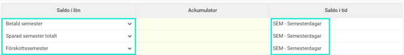
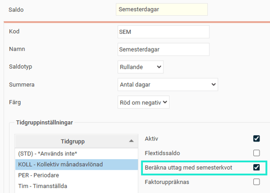
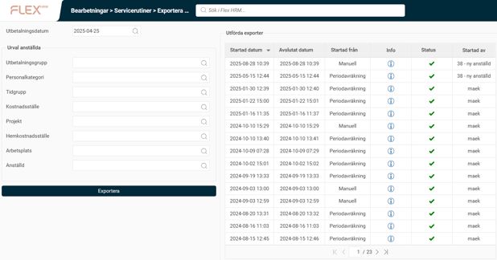

# ⚙️Export av saldon - Hur exporterar man saldon från HRM Payroll till HRM Time?

**Datum:** den 28 november 2025  
**Kategori:** Payroll  
**Underkategori:** Inställningar  
**Typ:** config  
**Svårighetsgrad:** intermediate  
**Tags:** hrm-time, lön, semester  
**Bilder:** 5  
**URL:** https://knowledge.flexhrm.com/export-av-saldon-hur-exporterar-man-saldon-fr%C3%A5n-hrm-payroll-till-hrm-time

---

Artikeln beskriver hur du kan exportera saldon från HRM Payroll till HRM Time. Instruktionen gäller för flera olika typer av saldon, där bland semestersaldo, kompsaldo och flexsaldo.
Export av saldon från HRM Payroll till HRM Time
För att i tidrapporten alltid ha uppdaterade saldon, såsom semester och komp vill man kunna exportera aktuella saldon från lönesystemet till tidrapporterna. Det största behovet är  efter semesterårsbytet då man fått nya semesterdagar. Då saldon ibland justeras direkt i lön vill man oftast göra en export efter varje lönekörning för att alltid ha uppdaterade saldon i  tidsystemet.
Du väljer vilka saldon som ska exporteras från lön till tidrapporterna under
Administration > Inställningar > Lön >Lönekörningar > fliken Saldoexport.

I den första kolumnen väljer du om det är ett semestersaldo eller ett saldo från en ackumulator som ska exporteras. Om det gäller en ackumulator väljer du i den andra  kolumnen vilken ackumulator som avses. Detta används för t.ex. kompsaldo och flexsaldo. I  den tredje kolumnen väljer du vilket saldo i tidrapporten som saldot ska läggas in i. Saldot måste vara av typen rullande.
Om ett saldo i tid inte är aktiverat för alla tidgrupper kommer exporten bara ske för de  tidgrupper där saldot är aktiverat.
Om du bara har ett saldo för semester i tidrapporten kan du välja att exportera betalda, obetalda, förskottsdagar och sparad semester till samma saldo i tid.

När du exporterar semestersaldo kontrollerar systemet om semesterkvot är aktiverad i Time. Du hittar den inställningen under
Administration > Inställningar > Tid och bemanning > Saldon > Definiera saldon
.

Semesterkvot är en inställning som används för att beräkna nettodagar, alltså det faktiska antalet semesterdagar en anställd kan ta ut vid intermittent (ojämn) arbetstid. Om du
inte
har markerat inställningen för semesterkvot exporteras nettosaldot, vilket gör att saldo i tidrapporten alltid visar hur många dagar som faktiskt är tillgängliga för ledighet utifrån varje medarbetares arbetsschema.
För att utföra själva exporten kan du göra det manuellt via rutinen
Exportera saldon från Payroll till Time.
Överst väljer du  vilket utbetalningsdatum (vilken lönekörning) saldon ska hämtas från. Gör önskat urval på  anställda och klicka på
Exportera
för att starta exporten. I listan till höger ser du alla utförda  exporter.
När exporten utförs hämtas lönekörningens utgående saldon, och dessa sätts nu som  ingående saldon i tidrapporten för dagen efter lönekörningens avvikelseperiod.  Lönekörningen med utbetalning den 25 november har vanligtvis en avvikelseperiod 1-31 oktober. Det betyder att ingående värden kommer sättas i tidrapporten den 1 november.

När du gjort inställningarna för saldoexport kommer saldon som standard också exporteras  varje gång en lönekörning periodavräknas. Om du vill göra en periodavräkning utan att  exportera saldon bockar du ur kryssrutan.

