# Flex HRM Payroll - Hur använder man rapporter i Flex HRM Payroll?

**Datum:** den 7 oktober 2025  
**Kategori:** Payroll  
**Underkategori:** Löneberedning  
**Typ:** other  
**Svårighetsgrad:** advanced  
**Tags:** agi, bokföring, lön, löneart, pension, semester, skatt  
**Bilder:** 20  
**URL:** https://knowledge.flexhrm.com/flex-hrm-payroll-hur-anv%C3%A4nder-man-flex-hrm-payroll

---

Här ges beskrivning med fokus på rapporter kopplade till lönehanteringen i Flex HRM.
Allmänt
Personallista
Exempelrapporter man kan få ut via rapporten Personallista
Rapporter under Lön:
Banklista
Bokföringsorder
Fördelning av antal och belopp
Lönespecifikation
Löneunderlag, lönekörning
Semestersaldon
Sjukstatistik
Pensionsrapporter
Allmänt
Rapporter i HRM kan tas ut med olika inställningar och sedan exporteras till valfritt format. Vid export till Excel behöver vissa inställningar och justeringar göras om du önskar arbeta med rapporten.
Ta reda på vad syftet är med rapporten vem som är mottagaren och bygg sedan upp den som du önskar. Ska rapporten tas ut löpande kan du spara rapporten genom att ange ett
Namn på urval
; på så sätt finns dina inställningar/urval för rapporten kvar till nästa gång du ska ta ut den. Dessa sparade rapporter är personliga.
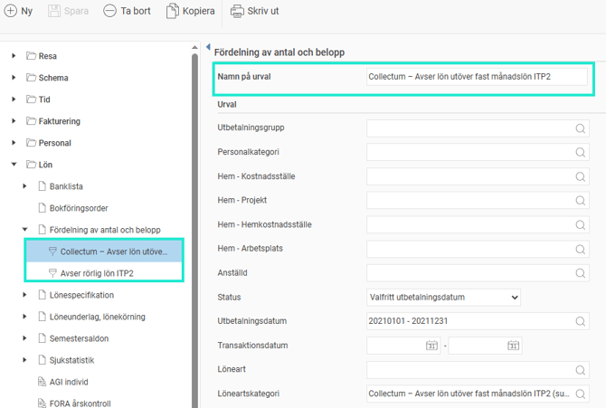
Personallista
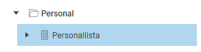
Med rapporten
Personallista
, som du hittar under
Rapporter > Personal
, kan du ta ut en sammanställning av önskade personuppgifter för företagets anställda, såsom adress, telefonnummer, anställningsuppgifter och födelsedatum. Urval kan göras per anställd, tidgrupp, hemkontering, anställnings-/avgångsdatum mm. Det finns också flera grupperings- och sorteringsmöjligheter.
Under
Visningsalternativ
anger du vilken information som ska visas i respektive kolumn i personallistan.
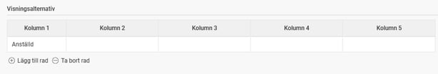
Observera att oavsett vilken behörighet du har på anställda i anställdaregistret så kan du få ut samtliga fält som finns att välja på i rapporten på de anställda du kan skriva ut rapporten för.
Om ni har tilläggsmodulen
Koncern
i er licens finns möjlighet att välja om du vill visa rapporten för hela koncernen eller endast det företag du har öppet. Väljer du hela koncernen kommer ett antal företagsspecifika urval att döljas. Om du valt hela koncernen kommer du också att kunna gruppera på företag.
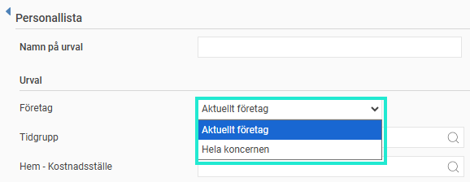
Exempelrapporter man kan få ut via rapporten Personallista
Skatteuppgifter:
Exempel på en rapport för kontroll av vilka skatteuppgifter, t.ex. skattetabell, skattekolumn och sidoinkomst, som de anställda har.
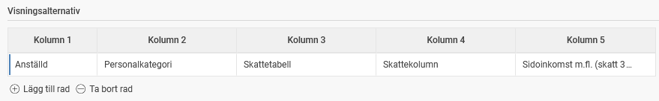
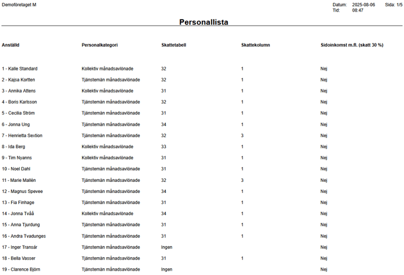
FORA-kategorier:
Exempelrapport för kontroll att alla har en kategori på Fora. I denna rapport ser du om några saknar inställning för rapportering eller har fel.
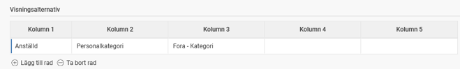
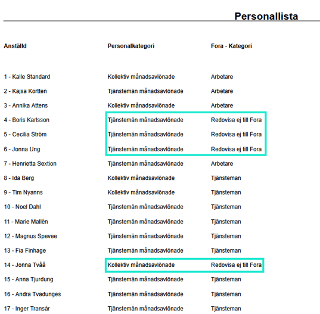
Lön
Under
Rapporter >
Lön
finns alla standardrapporter som gäller för Flex HRM Payroll.
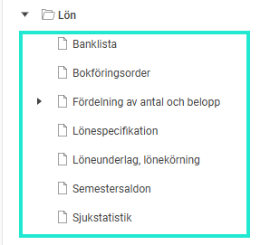
Banklista
Banklistan innehåller aktuell periods nettosummor per anställd som kommer att betalas ut. Listan kan användas för att på sikt kunna stämma av med bankfilens totalsumma. Det finns också möjlighet att skriva listan för underskrift av chef som godkänner utbetalningen. Urval kan göras på status Preliminära, Senaste utbetalningsmånad, Valfritt utbetalningsdatum, utbetalningsgrupp, personalkategori, hemkontering, anställningsnummer och attesterande chef. Gruppering/sortering kan göras på anställningsnummer eller personnummer.
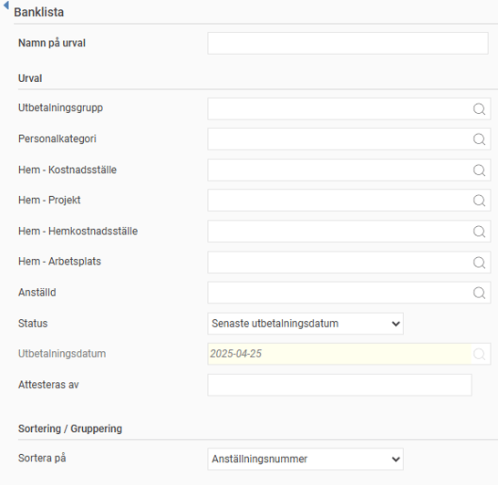
Bokföringsorder
Rapporten
Bokföringsorder
kan du använda för att ta ut en rapport på ett eller flera bokföringsunderlag (som har skapats under
Lön > Bokföring
).
Du kan göra urval på utbetalningsgrupp, personalkategori, hemkontering och anställningsnummer, samt välja hur du vill fördela bokföringsposterna.
Gruppering/sortering kan göras på anställd.
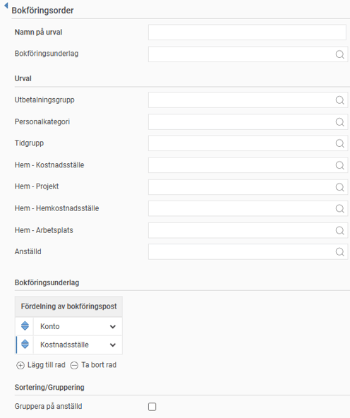
Fördelning av antal och belopp
Med rapporten kan du fördela antal och belopp baserat på flera valbara parametrar, vilket är särskilt användbart vid utredning av differenser i bokföringen.
Du kan göra urval på exempelvis anställningsnummer och personalkategori, samt styra sorteringen via olika grupperingsnivåer.
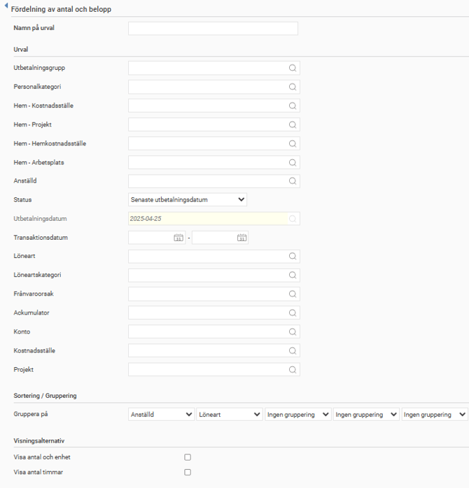
Med urvalet
Löneartskategori
kan du begränsa rapporten till lönearter av en viss typ, vilket underlättar vid specifik pensions- eller statistikrapportering.

Du kan även filtrera på lönearter med särskild frånvaroorsak eller kopplade till specifik ackumulator, något som förenklar avstämning mot AGI. Exempelvis ger
Anställd
som första grupperingsnivå och
Löneart
som andra en struktur där lönearterna grupperas under respektive anställd – och vice versa om prioritetsordningen byts.
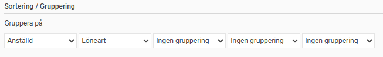
Det är också möjligt att ta fram belopp fördelade per konto och anställd, där rapporten då grupperar anställda under respektive konto.
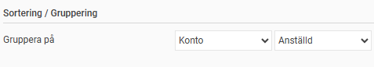
Lönespecifikation
Här kan du skriva ut lönespecifikationer för valda anställda. Du kan välja att generera specifikationerna för den senast avräknade perioden inom aktuell utbetalningsgrupp, ange ett eget utbetalningsdatum eller ta ut preliminära lönespecifikationer innan avräkning för att kontrollera löner i förväg.
Förutom utbetalningsgrupp och anställd kan du filtrera på hemkontering och personalkategori. Resultatet kan sorteras efter anställningsnummer eller personnummer. Det finns även möjlighet att beställa specifikationer anpassade till fönsterkuvert.
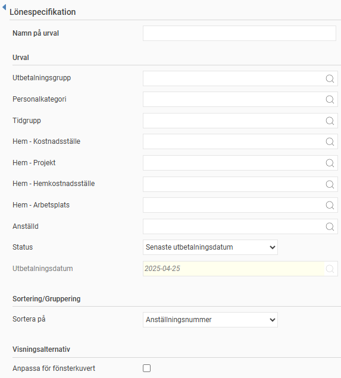
Löneunderlag, lönekörning
Löneunderlaget visar de lönetransaktioner som har registrerats för respektive anställd och period. Rapporten har flera möjliga användningsområden. Exempelvis kan den användas som en avstämningslista för löneutbetalningen som sedan kan skickas ut till respektive avdelningschef eller dylikt. Den kan också användas för att få en överblick över vissa lönearter, såsom övertid eller semester, eller som en detaljerad totalrapport för löneutbetalningen för arkivering.
Du kan välja om rapporten ska tas ut för det senaste utbetalningsdatumet, annat valfritt utbetalningsdatum eller för en preliminär (ej avräknad) period. Ytterligare urval kan göras på utbetalningsgrupp, personalkategori, hemkontering, anställningsnummer och löneart. Du kan även du välja vilka konteringsdimensioner som ska medtas i löneunderlaget.
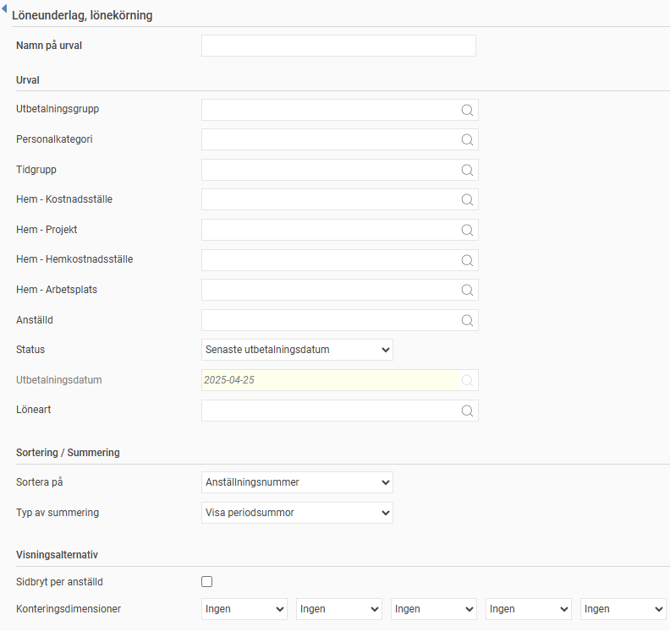
Under
Typ av
Summering
kan du välja mellan alternativen
Summera antal och belopp
eller
Visa periodsummor.
Väljer du
Summera antal och belopp
,  får du en summering av de olika lönetransaktionerna. Detta är användbart i kombination med urval på löneartsnummer. Väljer du
Visa periodsummor
,
visas istället en sammanställning av uppgifter. Detta är användbart för avstämning av bruttolön/nettolön samt semestersaldon och kan betraktas som en enklare och komprimerad typ av lönespecifikation.
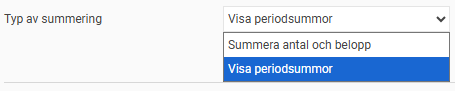
Semestersaldon
Med rapporten
Semestersaldon
kan du ta ut och titta på saldon från olika ställen och med olika parametrar.
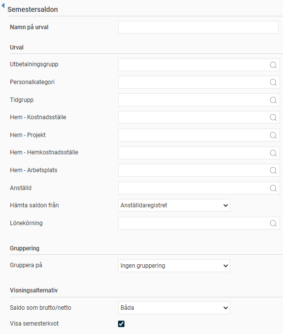
När du tar ut rapporten finns det en rad olika urval:
Urval på anställda:
Begränsa vilka anställda som ska inkluderas i rapporten.
Hämta saldon från:
Du kan välja att antingen hämta semestersaldon från anställdaregistret eller från en lönekörning. Hämtar du saldon från anställdaregistret får du det aktuella saldot från fliken
Semester.
Genom att istället hämta saldon från en lönekörning får du de kvarvarande semestersaldon som fanns i den aktuella lönekörningen. På så sätt kan du få ut historiska semestersaldon från alla tidigare lönekörningar.
Gruppering:
Du kan välja att gruppera de anställda på en konteringsdimension, såsom kostnadsställe, eller på personalkategori. Det finns också möjlighet att gruppera på semesterårets startdatum, vilket är användbart för att se t.ex. om alla anställda kommit med i semesterårsskiftet, eller om man har olika grupper av anställda med olika startdatum för semesteråret.
Visningsalternativ:
Välj här om du vill visa semestersaldon som brutto, netto eller om du vill visa både som brutto och netto. Nettosaldon är bruttosaldot omräknat med aktuell semesterkvot för att visa hur många faktiska dagar man kan vara ledig. För anställda med semesterkvoten 1 blir dessa saldon alltid lika. Du kan här också välja att visa semesterkvoten på rapporten eller ej.
Sjukstatistik
Denna rapport används för sammanställning och uppföljning av företagets sjukstatistik. Rapporten visar antalet sjuktimmar per sjukperiod, antal sjuktillfällen, totalt antal sjuktimmar, total frånvarotid i förhållande till schematid och antal schematimmar under perioden.
En sjukperiod räknas tillhöra den kolumn som stämmer med hela sjukperiodens antal dagar. Sjukperiodens alla timmar summeras till en kolumn, men bara de timmar som hör till urvalsperioden (inte hela sjukperioden om den börjar innan urvalsperioden).
Urval
Du måste ange för vilken datumperiod sjukstatistiken ska beräknas, men kan också göra urval på anställda som ska med i rapporten.
Du får själv välja hur sjukperioder ska grupperas, genom att ange olika dagintervall som ska visas i rapporten.
Gruppering
Möjlighet finns att gruppera de anställda på åldersgrupper, personalkategori, tidgrupp, kön och hemkontering.
Visningsalternativ
Här finns möjlighet att välja om du vill visa detaljrader för de anställda eller enbart en summeringsrad.
Pensionsrapporter
Allmänt
Pensionsrapportering görs i HRM Payroll under
Lön >
Pension
.
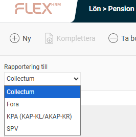
Information om hur du tar ut respektive pensionsrapportering finns att läsa i separata artiklar.
Relaterade artiklar:
Hur genomför man rapportering till Collectum i Flex HRM Payroll?
Hur rapporterar jag pension till Fora månadsvis i Flex HRM Payroll?
Pensionsrapportering (årsvis) till Fora - Hur pensionsrapporterar jag till Fora i Flex HRM Payroll?
Hur rapporterar jag pensionsunderlag till KPA (KAP-KL/AKAP-KR) i HRM Payroll?
