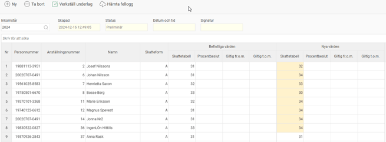
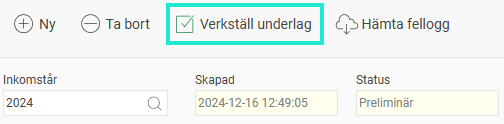

# FOS-förfrågan (fråga om skatteavdrag) - Hur skickar jag in FOS-förfrågan i Flex HRM Payroll?

**Datum:** den 7 oktober 2025  
**Kategori:** Payroll  
**Underkategori:** Löneberedning  
**Typ:** other  
**Svårighetsgrad:** advanced  
**Tags:** lön, skatt  
**Bilder:** 2  
**URL:** https://knowledge.flexhrm.com/fos-f%C3%B6rfr%C3%A5gan-fr%C3%A5ga-om-skatteavdrag-hur-skickar-jag-in-fos-f%C3%B6rfr%C3%A5gan-i-flex-hrm-payroll

---

Guide för FOS-förfrågan i Flex HRM. Lär dig hämta, granska och verkställa nya skatteuppgifter för anställda inför det nya beskattningsåret.
Inför varje nytt beskattningsår behöver du som löneutbetalare hämta information om vilken skattetabell och eventuellt jämkningsbeslut som gäller för dina anställda. Detta gör du genom en FOS-förfrågan (Fråga om skatteavdrag) till Skatteverket. En förfrågan kan också göras under året för nyanställda.
I den här funktionen i Flex HRM Payroll skapar du en FOS-förfrågan och verkställer underlaget. Du hittar funktionen här:
Bearbetningar > Årsrutiner – FOS-förfrågan
Skapa en ny FOS-förfrågan
1.  För att göra en ny förfrågan, klicka på knappen
Ny
.
2. I dialogrutan som kommer upp, välj vilket inkomstår du vill hämta skatteuppgifter för.
Viktigt!
När du hämtar uppgifter för ett nytt skatteår måste du vara helt klar med alla löneutbetalningar för det föregående året.
3.  Under rubriken
Tjänst
väljer du om du vill göra ett test eller en skarp förfrågan.
Skatteverkets testtjänst:
Använd detta val om du vill testa funktionen utan att göra en riktig förfrågan.
Driftsatt tjänst:
Välj detta för att göra en skarp förfrågan till Skatteverkets centrala skatteregister.
4.  Gör ett urval för vilka anställda som ska ingå i förfrågan. Du kan till exempel välja att inkludera avslutade anställda om du har återkommande säsongsanställda.
5.  Klicka på
Hämta
.
En förfrågan skickas nu via Skatteverkets API. Inom några sekunder till några minuter, beroende på antalet anställda, får du ett svar som visas direkt i vyn. Om något blir fel, till exempel om ett personnummer inte finns i registret, visas en fellogg.
Kontrollera och granska uppgifterna
När uppgifterna har hämtats visas de i en preliminär lista och uppdaterar alltså inte anställdaregistret direkt. Alla FOS-förfrågningar som du har gjort sparas och du kan se tidigare förfrågningar via fältet
Inkomstår
.
För att göra det enkelt för dig att se vilka uppgifter som har ändrats markeras dessa med en gul bakgrundsfärg.

Notera att även anställda med sidoinkomst tas med och får sina uppgifter uppdaterade. Så länge den anställda är markerad för sidoinkomst påverkas inte skatteberäkningen. Om hen senare skulle få en huvudsaklig anställning hos er finns då den korrekta skattetabellen redan på plats.
Verkställ underlaget
När du har kontrollerat att allt ser korrekt ut är det dags att verkställa underlaget. Det innebär att de nya skatteuppgifterna förs över till anställdaregistret och kommer att ligga till grund för framtida skatteberäkningar.
Tänk på!
Verkställ underlaget
efter
att alla lönekörningar för det gamla året är klara, och
innan
du gör några lönekörningar för det nya året.
Du verkställer underlaget genom att klicka på knappen
Verkställ underlag.

Observera att ett verkställande inte kan ångras.
