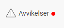
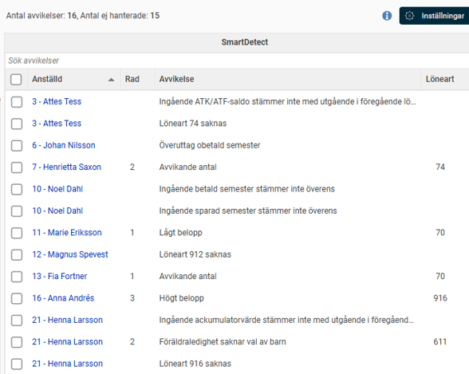
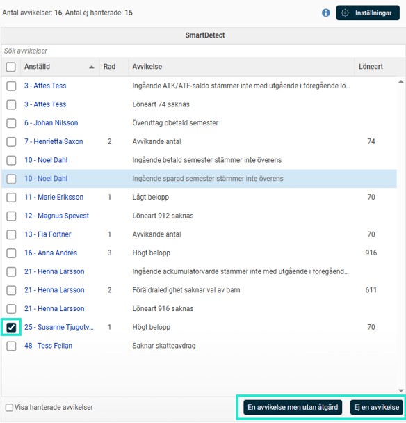
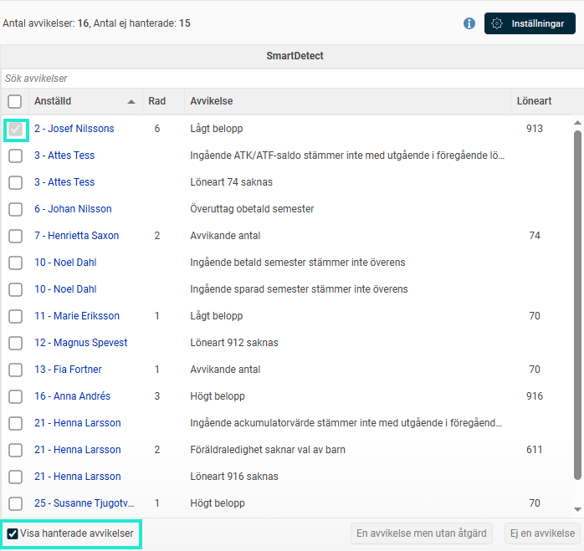
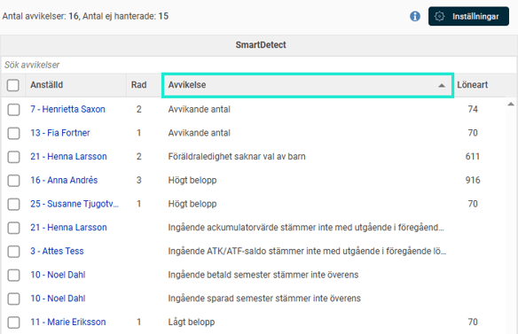
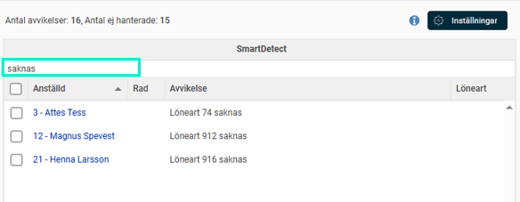

# Hur använder man SmartDetect i Flex HRM Payroll?

**Datum:** den 7 oktober 2025  
**Kategori:** Payroll  
**Underkategori:** Löneberedning  
**Typ:** howto  
**Svårighetsgrad:** intermediate  
**Tags:** lön, löneart, semester, skatt  
**Bilder:** 6  
**URL:** https://knowledge.flexhrm.com/hur-anv%C3%A4nder-man-smartdetect-i-flex-hrm-payroll

---

Den här artikeln visar hur du praktiskt arbetar med SmartDetect i din dagliga löneberedning för att hitta avvikelser samt säkerställa en smidig och korrekt process.
Hitta och granska avvikelser i löneberedningen
Din arbetsgång – Från varning till åtgärd
Ge feedback och gör SmartDetect smartare!
Exempel på vad SmartDetect hittar
Tips för ett effektivare arbetsflöde
Hitta och granska avvikelser i löneberedningen
SmartDetect är helt integrerat i din arbetsvy för att du snabbt ska kunna agera.
Leta efter den röda pricken: Högst upp i löneberedningen finns knappen
Avvikelser
.

När systemet har hittat något som behöver din uppmärksamhet visas en tydlig röd prick på knappen.
Öpp
na
avvikelselistan: Klicka på knappen
Avvikelser
för att öppna en lista i högerkanten med alla avvikelser. Listan uppdateras automatiskt i realtid när du gör ändringar i lönekörningen eller om du gör en ändring i anställdaregistret som uppdaterar lönekörningen. Listan innehåller följande kolumner:
Kryssruta:
Med de
nna funktion kan du
markera raden
i listan som hanterad och samtidigt
skicka feedback till AI-modellen som hjälper den att ge bättre
resultat nästa gång. Läs mer om hur denna fungerar
längre ned i artikeln
.
Anställd:
Här visas vilken anställd avvikelsen gäller. Klicka på namnet för att öppna personen i löneberedningen.
Rad:
Om avvikelsen är kopplad till en lönerad ser du här vilken rad det gäller
Avvikelse:
Här ser du en kortfattad beskrivning av vad avvikelsen gäller. Notera att vi här beskriver vad som avviker, och inte varför.
Löneart:
Om avvikelsen är kopplad till en löneart ser du här vilken löneart det gäller.

Din arbetsgång – Från varning till åtgärd
Följ dessa enkla steg för att beta av listan:
Välj en avvikelse
: Klicka på den anställdes namn i listan. Personens lönebesked öppnas då direkt i huvudfönstret i löneberedningen.
Analysera:
Bedöm om avvikelsen är ett faktiskt fel eller en korrekt men ovanlig händelse (t.ex. en hög bonus).
Åtgärda:
Om det är ett fel rättar du det som vanligt. När du sparar gör SmartDetect en ny analys, och avvikelsen försvinner från listan om felet är löst.
Ge feedback och gör SmartDetect smartare!
Om en avvikelse inte beror på ett fel kan du ge feedback. Detta lär AI-motorn vad som är viktigt för dig. Markera raden i listan genom att bocka i kryssrutan i den första kolumnen och välj ett av alternativen längst ner:
En avvikelse men utan åtgärd:
Välj detta om avvikelsen var relevant, men korrekt den här gången. Du talar då om för AI:n att den ska fortsätta registrera avvikelser för liknande händelser.
Ej en avvikelse:
Välj detta om avvikelsen är irrelevant. AI:n lär sig då att tona ner liknande avvikelser i framtiden.

Efter du har markerat och valt ett av feedbackalternativen ovan, försvinner avvikelsen från listan. Men, det går att se vilka avvikelser du har hanterat genom att bocka i rutan för
Visa hanterade avvikelser
. Dessa dyker då upp i listan igen, men då är bockrutan för dem utgråad.

Exempel på vad SmartDetect hittar
SmartDetect kombinerar AI med fasta regler och kan varna för bland annat:
Transaktioner och skatt:
Ovanligt höga/låga belopp, saknade lönearter, felaktigt eller saknat skatteavdrag samt negativa löner.
Saldon i osynk:
Felaktiga ingångsvärden som inte stämmer överens med utgående värden från föregående lönekörning på ackumulatorer, semester- eller ATK/ATF-saldon.
Frånvaro och ledighet:
Överuttag av semesterdagar, föräldraledighet utan kopplat barn eller frånvaro som sträcker sig över felaktiga perioder.
Övrigt:
Anställda som har slutat men där slutlön inte är hanterad.
Du kan läsa mer om vilka avvikelser som SmartDetect kan hitta i artikeln
Vad kan SmartDetect varna för i Flex HRM Payroll?
Tips för ett effektivare arbetsflöde
Sortera:
Klicka på kolumnrubrikerna för att sortera listan, till exempel per anställd.

Sök:
Använd sökfältet för att snabbt hitta en specifik anställd, löneart eller varning.

Relaterade artiklar:
Vilka inställningar krävs för att man ska kunna använda SmartDetect
i Flex HRM Payroll?
Vad kan SmartDetect varna för i Flex HRM Payroll?
