# Hur arbetar jag med arbetsgivardeklaration på individnivå i Flex HRM Payroll?

**Datum:** den 21 oktober 2025  
**Kategori:** Payroll  
**Underkategori:** Skatt & AGI  
**Typ:** howto  
**Svårighetsgrad:** advanced  
**Tags:** agi, lön, löneart, skatt  
**Bilder:** 31  
**URL:** https://knowledge.flexhrm.com/vad-beh%C3%B6ver-jag-g%C3%B6ra-med-min-arbetsgivardeklaration-agi-p%C3%A5-individniv%C3%A5-i-hrm-payroll

---

Artikeln beskriver månadsredovisningen av arbetsgivardeklaration på individnivå. Bland annat beskrivs hur du skapar, kontrollerar och exporterar underlaget.
Vyns olika delar
Skapa underlag
Specifikationsnummer
Komplettera underlag
Varningar vid felaktiga värden
Kontrollera underlaget
Exportera underlaget till Excel
Direktinlämning till SKV
Skapa fil till SKV
Det löpande arbetet med AGI i Flex HRM Payroll
Redovisning av arbetsgivardeklaration på individnivå ska ske varje månad. För att detta ska ske på ett så smidigt sätt som möjligt har vi byggt en funktion för hantering som du hittar under menyn
Lön > Agi.
Här finns allt samlat på ett ställe för hantering av den nya redovisningen, och du kan med fördel ha denna sida öppen i en egen flik samtidigt som löneberedningen för att enkelt växla mellan.
Vyns Olika delar
Högst upp i vyn ovanför listan hittar du följande uppgifter:
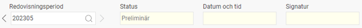
Redovisningsperiod
Här väljer du vilken redovisningsperiod du vill arbeta med. Klicka på sök-knappen för att få upp en lista på äldre redovisningsperioder.
Status
Visar om underlaget är preliminärt eller kontrollerat. Endast ett kontrollerat underlag kan redovisas till Skatteverket.
Signatur, datum och tid
När underlaget är markerat som kontrollerat visas när och av vem detta gjordes.
Centralt i vyn finns listan över de anställda som finns med i redovisningen.
Till vänster i listan finns en statussignal för varningar. Grön signal innebär att inga fel har hittats. Röd signal innebär att fel har hittats. Läs mer om detta under avsnittet för varningar.
I listan visas en sammanfattning av uppgifter som redovisas till Skatteverket för att ge en överblick över bruttolön, förmåner, skatt samt arbetsgivaravgifter.
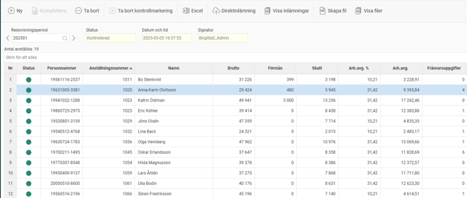
Ovanför listan finns ett sökfält där du kan söka på all information som visas i listan, såsom anställds namn, personnummer eller anställningsnummer.
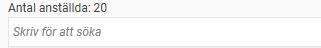
Till höger i bild visas detaljer om alla individ-uppgifter som redovisas för den anställd som är markerad i listan. U
ppgifterna är grupperade i ämnesområde, och du ser för varje fält Skatteverkets fältkod och redovisat värde. Se separat avsnitt för hur dessa värden beräknas av systemet.

Längst ner i vyn finns de huvuduppgifter som redovisas till Skatteverket. Med huvuduppgifter menas uppgifter som avser hela företaget, såsom avdrag för regionalt stöd, forskning och utveckling, samt summa arbetsgivaravgifter, skatt på ränta och utdelning, skatteavdrag och total sjuklönekostnad (tom 240630).

Skapa underlag
När du vill börja med redovisningen för en månad börjar du med att skapa underlag för redovisningen genom att klicka på knappen
Ny
i knappraden högst upp. I fönstret som kommer upp anger du år och månad redovisningen avser i fältet för redovisningsperiod. Därefter väljer du hur specifikationsnummer ska genereras (se nästa avsnitt), och startar beräkningen av underlaget genom att klicka på
Skapa
.
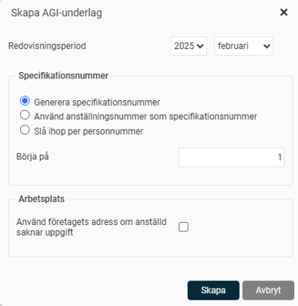
Specifikationsnummer
Vid redovisning till Skatteverket ska man ange ett specifikationsnummer som blir ett identifikationsnummer för rapporterade uppgifter per individ. Om man har personer med flera anställningsnummer kan man välja att slå ihop redovisningen eller särredovisa per anställningsnummer. Den viktigaste funktionen för specifikationsnummer är om man behöver skicka in en rättelse till Skatteverket, då man måste ange samma specifikationsnummer som man redovisat tidigare för att de rättade uppgifterna ska ersätta tidigare inskickade uppgifter.
När du skapar underlaget väljer du på vilket sätt specifikationsnummer ska genereras av systemet. Det genererade specifikationsnumret sparas sedan i anställdaregistret och används därefter för kommande redovisningar och rättelser.
Följande alternativ för generering finns:
Generera specifikationsnummer
Innebär att det första anställningsnumret för varje personnummer får det specifikationsnummer du valt under Börja på. Om vi som i exemplet ovan väljer att börja på 1, och har en anställd med två anställningsnummer, kommer det första få specifikationsnummer 1, och det andra specifikationsnummer 2. Personer som endast har ett anställningsnummer kommer att få specifikationsnummer 1.
Använd anställningsnummer som specifikationsnummer
Precis som det låter kommer man använda anställningsnummer som specifikationsnummer. Detta kan vara praktiskt eftersom anställningsnummer är identifikationsnummer i lönesystemet. Om du använder bokstäver i anställningsnummer kan denna funktion inte användas.
Slå ihop per personnummer
Om du väljer detta alternativ kommer redovisningen slås ihop per personnummer och få det specifikationsnummer du väljer. Fördelen är att man får en summerad redovisning per person, men det kan också innebära att det blir svårare att identifiera felaktiga belopp om man har flera anställningsnummer.
Det val du gjort kommer systemet ihåg till nästa redovisningsperiod.
Komplettera underlag
När du har skapat underlag och upptäcker att något blivit fel kan du komplettera underlaget för en eller flera anställda. Om du t.ex. upptäcker att en löneart inte varit styrd till en ackumulator på rätt sätt behöver du, efter att inställningarna på lönearten rättats, komplettera underlaget för AGI för att detta ska räknas om. Detta gör du genom att klicka på knappen
Komplettera
i knappraden och här välja vilka anställda som ska kompletteras.

Preliminärt underlag
När underlaget för en redovisningsperiod har skapats är underlaget preliminärt till dess att underlaget har markerats som kontrollerat. Du kan ha flera preliminära redovisningsperioder med AGI-underlag samtidigt om du t.ex. behöver göra rättelser. Ett preliminärt AGI-underlag kan inte redovisas till Skatteverket.
Du kan skapa ett preliminärt underlag även då det finns preliminära lönekörningar för redovisningsperioden för att kunna stämma av innan lönekörningen avräknas. Om du gör förändringar i en preliminär lönekörning räknas AGI-underlaget om automatiskt.
Varningar vid felaktiga värden
Systemet har inbyggda kontroller för att hjälpa till och undvika felaktig rapportering till Skatteverket. Viktigt att tänka på är dock att redovisningen kan vara felaktig trots att systemet inte ger några varningar. Om t.ex. en ersättning eller förmån inte matats in i systemet kommer inte heller redovisningen till Skatteverket att bli korrekt.
Det systemet kontrollerar är vad som enligt löneartens inställning är avgiftspliktig och skattepliktig bruttolön och förmån och jämför det med redovisade uppgifter på individnivå via ackumulatorer.
Följande kontroller finns:
Att skatt på individuppgiften stämmer överens med den anställdes bidrag på huvuduppgiften.
Orsaken till detta fel kan vara att lönearter för skatt inte styr till rätt ackumulator eller att ackumulatorn för skatt inte styr till rätt ruta i AGI.
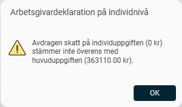
Att beräknad arbetsgivaravgift utifrån fält som är underlag för arbetsgivaravgifter (011, 012, 013, 018, 019) på individuppgiften stämmer överens med den anställdes bidrag till arbetsgivaravgiften på huvuduppgiften.
Orsaken till detta fel kan vara att lönearter för avgiftspliktig ersättning eller förmån inte styr till rätt ackumulator eller att en ackumulator inte styr till rätt ruta i AGI. Felet kan också vara att en löneart är skattefri men ska vara skattepliktig eller omvänt.
För att hitta felet är ett tips att ta fram en lista med den anställdes alla transaktioner och gå igenom vilka av dessa som är avgiftspliktiga och till vilken ackumulator/ruta de är styrda. Använd förslagsvis rapporten Fördelning av antal och belopp till Excel.
En mer utförlig instruktion finns i artikeln
Hur hittar jag diffar i skatt och arbetsgivaravgifter
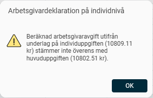
Att det inte finns några fält som innehåller negativa värden. Både individuppgifter och den anställdes bidrag till huvuduppgiften kontrolleras.
Orsaken till detta fel kan vara att den anställde hamnat i en skuldsituation (negativ bruttolön/nettolön).
Läs mer om hur du hanterar denna situation i artikeln
"Hur gör jag en rättelse av ett fel i tidigare arbetsgivardeklarationer (AGI) i
HRM Payroll?"
Felet kan också bero på felaktig styrning av löneart eller ackumulator. Du hittar enklast orsaken till felet genom att kontrollera de ackumulatorer och lönearter som styr till aktuellt fält.
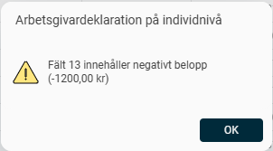
Om systemet detekterar något av dessa fel visas en röd signal i kolumnen för status. För att snabbt hitta anställda med varningar kan du sortera på kolumnen för status genom att klicka i kolumnrubriken.
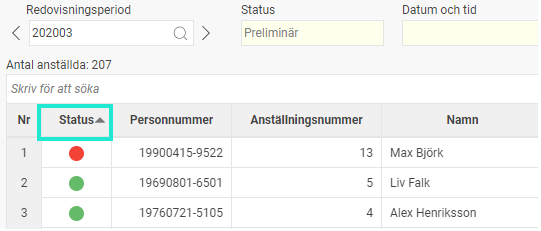
Genom att klicka på den röda signalen får du upp information om vad som är fel enligt exemplen i listan ovan.
Kontrollera underlaget
Innan redovisningen skickas in till Skatteverket behöver du kontrollera att allt ser ut att stämma. Detta gör du genom att granska underlaget i vyn eller genom att exportera underlaget till
Excel
.
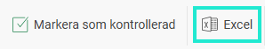
Du bör göra en rimlighetskontroll av beräknade arbetsgivaravgifter och preliminärskatt, samt stämma av att det är rätt antal individer som kommit med i redovisningen. Du bör också gå igenom eventuella varningar från systemet enligt
föregående avsnitt
.
När underlaget är kontrollerat och allt ser ut att stämma för redovisningsperioden markerar du underlaget som kontrollerat genom att klicka på den gröna bocken i knappraden.
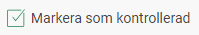
Underlaget blir då låst för ändringar och du kan nu ta ut filen för redovisning till Skatteverket. Tidpunkten och vem som markerat underlaget som kontrollerat loggas och finns synligt högst upp i vyn.
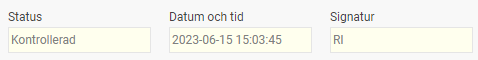
När du har markerat ett underlag som kontrollerat kan du därefter inte skapa en ny lönekörning med utbetalning under samma redovisningsperiod. Om du behöver göra en extrautbetalning eller korrigering i samma period måste du först ta bort kontrollmarkeringen för AGI-underlaget. Detta gör du genom att klicka på den bocken i knappraden en gång till. Du kan sedan fortsätta arbeta med löneutbetalningar för redovisningsperioden och därefter kontrollera det uppdaterade AGI-underlaget för att göra en korrekt redovisning till Skatteverket.
För mer information om hur du rättar redan inskickade uppgifter se artikeln om Rättelser.
Exportera underlaget till Excel
Du kan också exportera allt underlag till Excel för att få en överblick över alla siffror samt göra egna summeringar och beräkningar. Detta gör du genom att klicka på knappen i knappraden högst upp, och det är möjligt både på preliminärt och kontrollerat underlag.
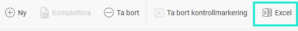
Excelarket är uppdelat i tre flikar för Huvuduppgifter, Individuppgifter, och Varningar. På respektive flik hittar du uppgifter motsvarande de som finns i vyn.
För att inte Excel-arket ska bli oöverskådligt med massor av tomma kolumner visas bara de kolumner som innehåller ett värde för någon anställd. På så sätt slipper du se fält som inte är relevanta.
Direktinlämning till Skatteverket
När underlaget är kontrollerat och allt ser bra ut är det sista steget att skicka in redovisningen till Skatteverket. Från version 2023.14 kan du välja att göra en direktinlämning till Skatteverket utan att behöva hantera en fil.
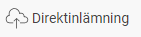
När du klickar på knappen
Direktinlämning
är det första steget att du behöver autentisera dig mot Skatteverket. Detta sker via personlig inloggning med e-legitimation på motsvarande sätt som vid inloggning på Skatteverkets Mina sidor.
För att starta inloggningen klickar du på
Fortsätt
.
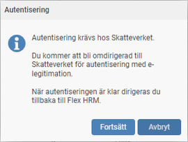
Följ därefter instruktionerna för att logga in på Skatteverket.
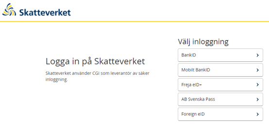
Efter inloggningen får du nedan fråga där du behöver godkänna att Flex HRM Payroll får skicka in uppgifterna till Skatteverket.

Därefter kommer du tillbaka till Flex HRM där du kan fortsätta med själva inskickandet av arbetsgivardeklarationen.
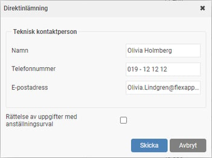
Här fyller du i uppgifterna för teknisk kontaktperson som du vill använda för redovisningen. När du klickar på
Skicka
påbörjas processen för att skicka in alla uppgifter till Skatteverket. Om allt går bra visas följande bekräftelse:
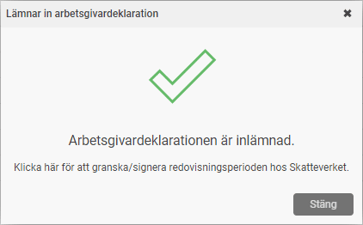
Arbetsgivardeklarationen som skickats in finns nu på företagets Eget utrymme hos Skatteverket där ett granskningsunderlag har skapats. Du får också tillbaka information om Skatteverket godkänner uppgifterna eller om något fel har påträffats (mer info längre ner). För att arbetsgivardeklarationen ska bli helt inlämnad måste du fortfarande signera och skicka in på Skatteverkets Mina sidor. Om du vill signera deklarationen direkt kan du från lönesystemet öppna den djuplänk du får tillbaka från Skatteverket genom att klicka på länken.
När du har gjort en direktinlämning visas också en inlämningsstatus. Du kan också få fram djuplänken för den inlämnade redovisningsperioden i efterhand genom att klicka på knappen
Djuplänk till Skatteverket
.
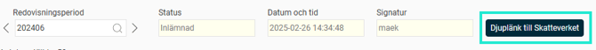
Om något skulle bli fel vid inlämningen kan du få olika typer av meddelanden beroende på var felet uppstod. Om det gick bra att skicka in uppgifterna, det vill säga att filen gick att skapa, men att Skatteverkets kontroller hittat fel i innehållet får du följande meddelande. Du kan här välja att öppna den felrapport som Skatteverket skickat tillbaka.
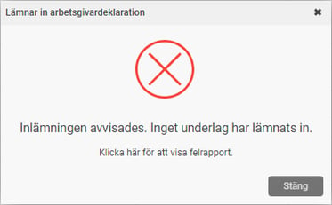
Du kan i efterhand se alla inlämningar som är gjorda genom att klicka på knappen
Visa inlämningar
.  Här finns både filen för redovisning till Skatteverket samt eventuellt en felrapport.
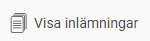
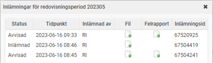
Skapa fil för redovisning till Skatteverket
När underlaget är kontrollerat och allt ser bra ut är det sista steget att skicka in redovisningen till Skatteverket. Detta gör du genom att exportera en XML-fil som du sedan laddar upp i Skatteverkets e-tjänst.
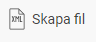
När du klickar på knappen
Skapa fil
i knappraden öppnas följande dialog:
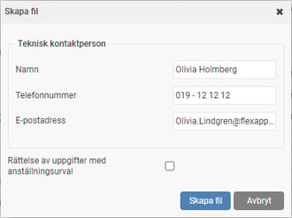
Här fyller du i uppgifterna för teknisk kontaktperson som du vill använda för redovisningen. Systemet fyller här automatiskt i den inloggade användarens uppgifter från anställdaregistret. Du kan också få meddelande om att lämna kontaktuppgifter i Skatteverkets e-tjänst när du skickar in filen om du inte sedan tidigare lagt in kontaktuppgifter under Mina sidor hos Skatteverket.
Om du vill skapa en fil för att göra en rättelse kan du välja att inte ta med alla anställda i filen. Detta kan användas om det t.ex. bara är en anställd som du behöver skicka in en rättelse för. Du kryssar då i Rättelse av uppgifter med anställningsurval, som då gör att extra fält för urval av anställda att ta med i filen kommer fram. Notera att det alltid är den senast inskickade filen för en redovisningsperiod som används av Skatteverket. Du kan alltså skicka in en hel fil igen, utan att markera rutan för rättelse, som då kommer ses som en rättelse hos Skatteverket.
För mer information om hur du rättar redan inskickade uppgifter se artikeln om Rättelser.
När du har klickat på
Skapa fil
får du en bekräftelse på att arbetet för att skapa filen är påbörjat. När filen sedan är färdig får du information om det och du kan klicka på länken för att ladda ner filen. Filens namn innehåller organisationsnummer samt redovisningsperiod.
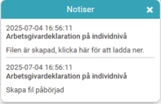
När filen skapas görs också en kontroll mot skatteverkets XML-schema för att i ett tidigt skede identifiera om filen innehåller felaktigheter. Dessa kontroller motsvarar de kontroller som Skatteverket gör vid inläsning av filen i e-tjänsten. Om fel upptäcks får man information enligt följande, och du kan klicka på länken för att ladda ner en loggfil med felmeddelanden.

Alla filer som är skapade ligger kvar i systemet för att kunna hämtas igen vid en senare tidpunkt. Genom att klicka på knappen
Visa filer
får du upp en lista på de filer som är skapade för den redovisningsperiod du står på. Här finns både filen för redovisning till Skatteverket samt eventuellt en fellogg. Du kan också välja att ta bort filer du inte längre vill ha kvar.
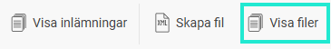
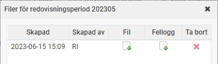
Se
Skatteverkets instruktioner
för mer information om hur du redovisar filen i deras e-tjänst.
Relaterade artiklar:
Hur gör jag en rättelse av ett fel i tidigare arbetsgivardeklarationer (AGI) i HRM Payroll?"
Hur hittar jag orsaken till diffar i arbetsgivaravgifter (AGI) i Flex HRM Payroll?
Hur gör jag inställningar för arbetsplats, tjänsteställe, till arbetsgivardeklarationen (AGI)
i HRM Payroll?
Hur ställer man in ackumulatorerna så att det blir rätt värde i rätt fält i AGIn?
Varför får jag en varning i arbetsgivaruppgifterna på individnivå (AGI) att det finns ett negativt belopp på fält 499?
