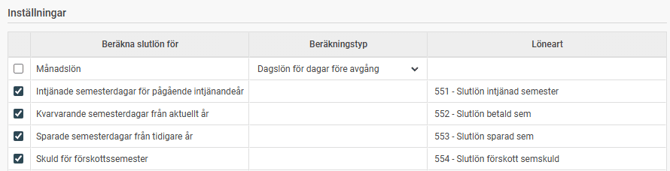
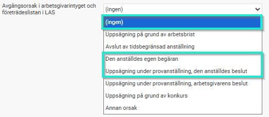
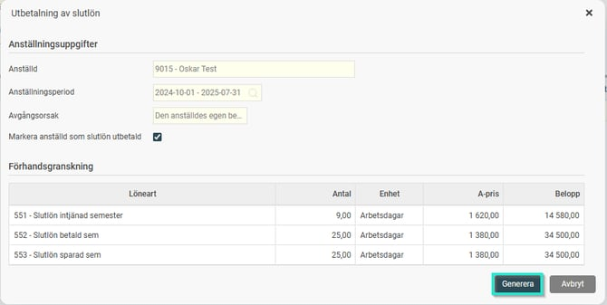
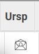

# Hur beräknar jag slutlön i HRM Payroll?

**Datum:** den 14 oktober 2025  
**Kategori:** Payroll  
**Underkategori:** Löneberedning  
**Typ:** howto  
**Svårighetsgrad:** advanced  
**Tags:** agi, lön, löneart, pension, semester  
**Bilder:** 6  
**URL:** https://knowledge.flexhrm.com/hur-ber%C3%A4knar-jag-slutl%C3%B6n-i-hrm-payroll

---

I denna artikel beskriver vi hur du gör för att beräkna slutlön i Payroll.
Förutsättning för att kunna beräkna slutlön är att man lagt in ett avgångsdatum på anställningen i anställdaregistret.
När en anställd slutar och man anger ett slutdatum är det oftast bra att sätta slutdatum på fasta transaktioner, månadslön, timlön, sysselsättningsgrad och schema samtidigt. Det kan framför allt spela roll för fasta transaktioner då anställda slutar mitt i månaden då man vill undvika att de får en full månadslön av misstag.
Funktionen för slutlön hittar du i
Lön > Löneberedning
, i knappraden ovanför löneberedningen.

Överst i fönstret för slutlön ser du uppgifter om den anställde. Här kan du välja vilken anställningsperiod du vill betala ut slutlön för. Slutlön kommer beräknas för alla anställningsperioder fram till och med vald period som slutlön inte betalats ut för tidigare. Det går bra att ha en ny pågående anställning och betala ut slutlön för en tidigare anställning vid t.ex. pensionering där man fortsätter ha en timanställning.
Normalt väljer man att Markera anställd som slutlön utbetald. Det som händer då är att anställningsperioderna vid generering av slutlön markeras som Slutlön utbetald i anställdaregistret för att indikera att slutlönen har betalats ut och alla skulder är reglerade. På så sätt vet systemet om den anställde ska tas med eller ej i kommande lönekörningar eller i semesterskuldsberäkningen framöver.
I vissa situationer vill man betala ut slutlönen i omgångar.
Ett exempel är om en anställd har innevarande intjänandeår för semester och tagit ut alla semesterdagar under sommaren och därefter slutar så att en skuld uppstår. Då kan det bli svårt att kvitta en sådan skuld månaden efter att den anställde slutat. Därför är det vanligt att man försöker reglera det som orsakar en skuld den sista månaden man får månadslön, och sedan slutför slutlönen i nästkommande lönekörning. Därför kan man i funktionen välja vilka delar av slutlönen man vill ta med vid beräkning för att på så sätt kunna dela upp slutlönen på olika löneperioder vid behov.

I
den nedre delen av funktionen under
Inställningar
finns en lista där du väljer vilka delar som ska tas med i slutlöneberäkningen genom att bocka i eller ur på varje rad om slutlön ska beräknas. Inställningen för vad som föreslås och vilken löneart som ska användas
finner du under
Administration > Inställningar Lön > Systemfasta lönearter
.

Vad betyder de olika raderna i listan?
Månadslön
För månadsavlönade som slutar mitt i månaden kan det vara lite olika beroende på kollektivavtalet hur lönen för del av månad ska beräknas. Det är vanligt att man hanterar det direkt i den vanliga lönearten för månadslön, men om man vill kan man här låta slutlönefunktionen lägga ut en annan löneart för del av månad. Man kan då välja mellan lägga ut
Daglön för dagar före avgång,
eller
Dagslöneavdrag för dagar efter avgång.
Intjänade semesterdagar för pågående intjänandeår
Denna gäller både då man har innevarande eller föregående år som intjänandeperiod för semester. För innevarande intjänandeår beräknas intjänade dagar minus uttagna dagar. Har man föregående år som intjänandeperiod beräknas här antal intjänade dagar från föregående semesterskifte fram till anställningens slut.
Kvarvarande semesterdagar från aktuellt år
Utbetalning av årets kvarvarande betalda dagar om man har föregående år som intjänandeår.
Sparade semesterdagar från tidigare år
Utbetalning av kvarvarande sparade semesterdagar.
Skuld för förskottssemester
Om man har en kvarvarande skuld för förskottssemester och avångsorsaken är typad som "egen begäran", "den anställdes beslut" eller "ingen" under inställningarna för LAS regleras den här. Om den anställde inte haft förskottssemester, om skulden är avskriven eller om avgångsorsaken är typad som något annat än dessa kommer inget belopp genereras.

När du gjort dina val klickar du på
Beräkna
.
Då kommer beräkning att göras och visas sedan i en förhandsgranskning med beräknat belopp för varje löneart.
Om resultatet ser bra ut klickar du
Generera
för att lägga ut lönearterna i löneberedningen. Det är även i detta steg som anställningsperioden markeras som
slutlön utbetald
i anställningsregistret.

I löneberedningen ser du vilka transaktioner som har kommit från slutlönefunktionen, dessa har en egen ikon i kolumnen Ursp (ursprung).

