# Hur fungerar den löpande hanteringen av ATK och ATF?

**Datum:** den 26 september 2025  
**Kategori:** Payroll  
**Underkategori:** Löneberedning  
**Typ:** howto  
**Svårighetsgrad:** advanced  
**Tags:** lön, löneart  
**Bilder:** 16  
**URL:** https://knowledge.flexhrm.com/hur-fungerar-den-l%C3%B6pande-hanteringen-av-atk-och-atf

---

I denna artikel kan du läsa om hur den löpande hanteringen med ATK/ATF fungerar, hur du kan se aktuellt saldo för de anställda och hur intjänande och uttag av ledig tid fungerar.
Saldon i anställdaregistret
Saldon i löneberedningen
Löpande intjänande – ATK
Löpande intjänande – ATF
Uttag av ledig tid
Översiktsvyn för årsrutiner
Anställda som byter avtal
Saldon i anställdaregistret
Via
Personal > Anställda >
fliken
ATK/ATF
, kan du se och hantera den anställdes avtal och saldon. Överst på sidan anger du det avtal som gäller för den anställde. Normalt är det personalkategorins avtal som gäller, men du kan också välja ett personligt avtal. Anställda som inte omfattas av ATK eller ATF ska du inte ange något avtal för.
Avtalet som du anger under denna flik gäller för den valda anställningsperioden. Det innebär att du kan välja olika avtal för olika anställningsperioder. Om du gör det är det avtalet i den sista anställningsperioden under ATK-/ATF-perioden som kommer användas.
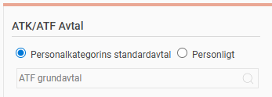
Nedanför valet för avtal hittar du den anställdes aktuella saldon för de olika perioderna. Överst markerat med
blå färg
ser du saldo för den
aktuella intjänandeperioden
. Nederst markerat med
grönt
ser du aktuellt saldo för
uttagsperioden
.
Exemplet nedan gäller en anställd med ATK. Under fliken
ATK/ATF
i anställdaregistret, ser du intjänat belopp för aktuell intjänandeperiod, samt intjänat, uttaget och kvarvarande saldo för både belopp och timmar under uttagsperioden då den anställde valt att ta ut som betald ledig tid.
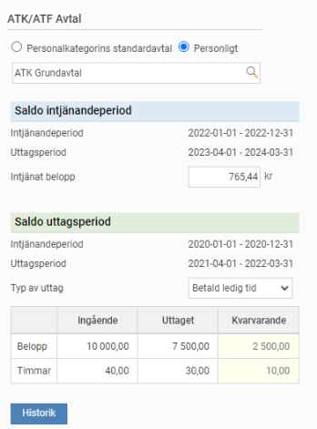
Under knappen
Historik
hittar du även gamla avslutade uttagsår i en översiktlig lista.
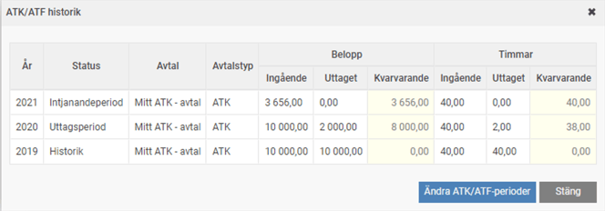
Exemplet nedan gäller en anställd med ATF. Här ser du intjänade timmar för aktuell intjänandeperiod, samt intjänade, uttagna och kvarvarande timmar för uttagsperioden.
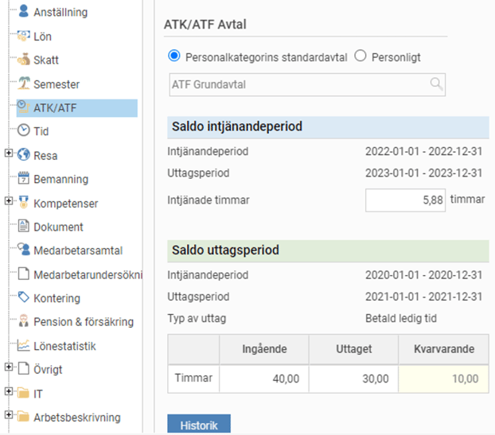
Saldon i löneberedningen
Du ser också den anställdes aktuella saldon för uttagsperioden och intjänandeperioden längst ned i löneberedningen, under fliken
ATK/ATF
. Notera att ingående och utgående värde här avser aktuell lönekörning och inte ska förväxlas med årets totala intjänade värde.
Exemplet nedan gäller en anställd med ATK.
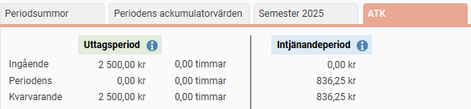
Exemplet nedan gäller en anställd med ATF.
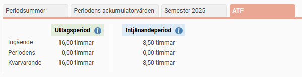
Genom att peka på
i
-symbolen får du mer info om vilket avtal som tillämpas, intjänandeperiod, uttagsperiod samt den anställdes val.
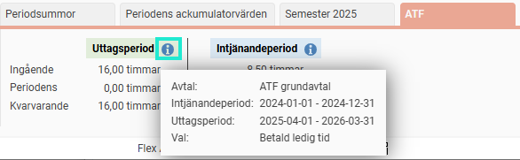
Löpande intjänande – ATK
För arbetstidskonto avsätts en viss procent av ATK-grundande ersättning. Procentsatsen anges direkt i ATK-avtalet, och du bestämmer vilka lönearter som ska ingå i beräkningsunderlaget med hjälp av kryssrutan på fliken Lön i löneartsregistret enligt exemplet nedan.
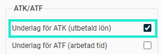
Beräkning för intjänande görs enligt följande:
Intjänat belopp = Underlag kr löneart * Avsättning procent
Under fliken
ATK
i löneberedningen, ser du hur mycket som tjänats in i lönekörningen.
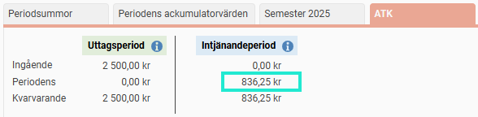
Löpande intjänande – ATF
För arbetstidsförkortning tjänar man in ett visst antal minuter per arbetad heltidsvecka. Detta ställer man in i ATF-avtalet. För att veta hur många timmar man tjänat in behöver systemet veta antalet arbetade timmar som ska vara underlag för beräkning. Detta anger du på de lönearter där timmar ska summeras från, på fliken
Lön
i löneartsregistret enligt exemplet nedan.
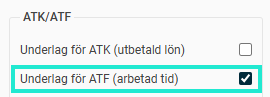
Observera att summering sker per utbetalningsdatum under intjänandeperioden. Om intjänandet börjar 1 januari summeras alltså arbetad tid som ligger i lönekörningen med utbetalning i januari även då de arbetade timmarna avser december månad.
Beräkning för intjänande görs enligt följande:
Intjänade minuter = Underlag timmar (löneart)Arbetsmått faktiskt * Avsättning /vecka * Syssgrad
Det är viktigt att både arbetsmått och sysselsättningsgrad finns inlagda på de anställda för att beräkning ska kunna göras.
Uttag av ledig tid
Anställda som har val att ta ut sitt intjänande som betald ledig tid kan göra detta löpande under hela uttagsperioden. När ledigheten registreras med en löneart minskas saldot om lönearten är inställd på att göra detta. För ATK gäller att både saldot för belopp och timmar ska minskas vid uttag, och för ATF är det endast saldot för timmar. På lönearten för uttag är det kryssrutorna enligt bilden bredvid som du hittar i löneartsregistret, fliken
Lön
.
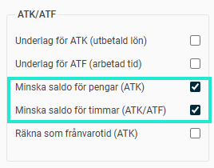
Så här kan det se ut för ATK då både saldo för belopp och timmar minskas.
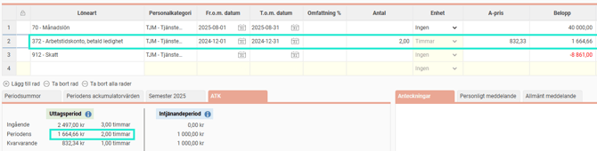
Så här ser det ut för ATF då endast saldot för timmar minskas.
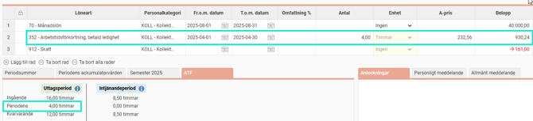
Översiktsvyn för årsrutiner
För att få en överblick på alla anställda samt arbeta med de årliga rutinerna som går igenom i detalj senare finns en översikt som du hittar under
Administration > Bearbetningar > Årsrutiner > ATK/ATF-årsskifte
.
I översikten ser du alla anställda i företaget som har något pågående ATK/ATF-år (intjänandeperiod, valperiod eller uttagsperiod). Kolumnerna i blått visar intjänat saldo för det aktuella intjänandeperioden. Kolumnerna i gult visar saldo för valperioden som den anställde just nu väljer vad de vill göra med. Kolumnerna i grönt visar kvarvarande saldo för aktuell uttagsperiod.
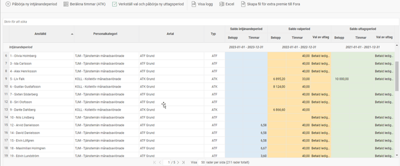
Listan är grupperad så att de anställda som befinner sig i samma läge visas tillsammans. I exemplet nedan har man verkställt den nya uttagsperioden för den anställde överst i listan, men inte för övriga. Det blir då två olika grupper som visar vilka datumperioder de olika saldona är intjänade.
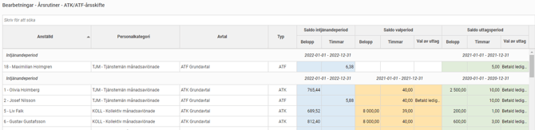
Listan i denna vy går att exportera till
Excel
.
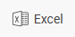
Anställda som byter avtal
För anställda som byter tjänst eller blir återanställda under samma intjänandeperiod och i och med det ska omfattas av ett annat ATK/ATF-avtal finns det några saker som är bra att tänka på. Vilket avtal som gäller för den anställde hör till vald anställningsperiod. Det innebär att du kan välja olika avtal för olika anställningsperioder och att det då är avtalet i den sista anställningsperioden under ATK-/ATF-perioden som kommer användas.
Detta kommer att påverka ett antal olika saker i hanteringen:
Intjänandet
Då intjänandet sker löpande i varje lönekörning kommer det senaste gällande avtalet som fanns vid tiden man gjorde lönekörningen att bestämma hur intjänandet blir.
Exempel:
En anställd har först ett ATK-avtal med 2% intjänande under lönekörningarna för april, maj och juni. Före julis lönekörning lägger man upp en ny anställningsperiod med ett ATK-avtal som ger 2,5% intjänande. Detta kommer göra att man från julis lönekörning kommer tjäna in 2,5%. Saldot för intjänandet kommer då att ha en blandning mellan intjänande på 2% och 2,5%. Det totala saldot kommer sedan att hanteras lika som alla andra saldon vid årsskiftesrutinerna.
Avtal med annan typ eller datumperiod
Om en anställd byter tjänst som ger en annan typ av avtal (ATK/ATF) eller en annan intjänandeperiod/uttagsperiod kommer systemet inte automatiskt förstå vad som ska göras. Systemet kommer fortsätta att räkna enligt det sista avtalet, vilket kan ge olika konsekvenser i olika situationer. Vid denna typ av byten behöver man hålla koll manuellt att allt blir korrekt vid bytet. Vår rekommendation är att man betalar ut alla kvarvarande saldon för den tidigare anställningen för att börja från noll med den nya.
Årliga rutiner
Anställda som har bytt avtal under intjänandeperioden kommer i samband med de årliga rutinerna att tillämpa de regler som finns i det avtal som gäller sist under intjänandeperioden. Detta gäller till exempel reglerna för den anställdes val.
Relaterade artiklar:
Vad är arbetstidskonto (ATK) och arbetstidsförkortning (ATF)?
Hur ser de årliga rutinerna för arbetstidskonto (ATK) ut?
