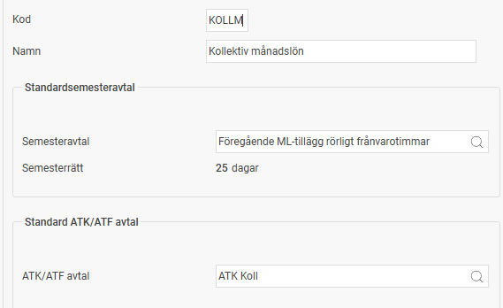
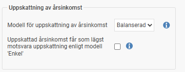

# ⚙️Hur fungerar Personalkategorier i HRM Payroll?

**Datum:** den 11 november 2025  
**Kategori:** Payroll  
**Underkategori:** Inställningar  
**Typ:** config  
**Svårighetsgrad:** advanced  
**Tags:** lön, löneart, semester, skatt  
**Bilder:** 4  
**URL:** https://knowledge.flexhrm.com/hur-fungerar-personalkategorier-i-hrm-payroll

---

Personalkategori är en gruppering av anställda som du vill ska tillämpa samma beräkningsregler baserat på avtal och regelverk. Personalkategorierna möjliggör t.ex. avvikelser på lönearter som ska hanteras olika för olika grupper av anställda och styr beräkningar i LAS.
Hantera personalkategorier
För att ställa in personalkategorier, gå till
Inställningar > Lön
och välj
Personalkategorier
.
Du ser då en vy där du kan fylla i följande fält:
Kod:
Ange en kod för personalkategorin.
Namn:
Skriv namnet på personalkategorin.
Standardsemesteravtal:
Välj det semesteravtal som ska vara standard för personalkategorin. Systemet kopplar sedan detta avtal när du lägger upp en ny person i anställdaregistret som tillhör denna kategori.
Standardavtal för ATK/ATF:
Välj det specifika avtal som gäller för arbetstidsförkortning om detta är aktuellt.

För medarbetare som tillhör Fora lägger du på personalkategorin in den standard uppmärkningskod som ska tillämpas på de anställda som tillhör kategorin.

Modell för uppskattning av årsinkomst
Här ställer du in vilken modell som ska användas för att uppskatta de anställdas årsinkomst.
Enkel
Om den anställda har löneformen månadslön, uppskattas årsinkomsten till: Månadslön x 12,2. För timlön uppskattas årsinkomsten till: Timlön x 2080 (vilket motsvarar en normal årsarbetstid).
Denna modell passar för anställda med liten variation i lönen och som inte har någon rörlig lön eller andra tillägg utöver grundlönen.
Balanserad
Årsinkomsten uppskattas baserat på den bruttolön och förmån som hittills har betalats ut under året. Därefter läggs en uppskattning enligt modellen
Enkel
till för den resterande delen av året.
Denna modell blir lite mer korrekt ju längre året går, eftersom den tittar på faktiskt utbetald lön.
Snitt på utbetalt
Systemet beräknar ett genomsnitt per månad på den bruttolön och förmån som hittills har betalats ut under året. Detta genomsnitt multipliceras sedan med tolv (12).
Denna modell passar anställda med en stor andel rörlig lön. Prognosen blir bättre ju fler månader som finns med i underlaget.

LAS
Ställ in gränsvärden för rätt till tillsvidareanställning för de olika anställningsformerna SÄVA och VIK, samt vilken beräkningsregel som ska tillämpas för arbetsdagar. Om modulen Time används räknas arbetsdagar från Tidrapporten i HRM Time. Om tidrapportering sker i ett annat försystem kan beräkningen istället göras från en löneart i HRM Payroll. Lönearten måste då läsas in från försystemet och innehålla antalet arbetsdagar som ska inkluderas i beräkningen i antalsfältet.

