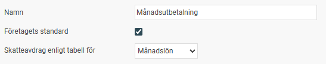
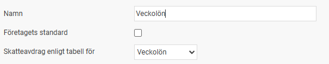
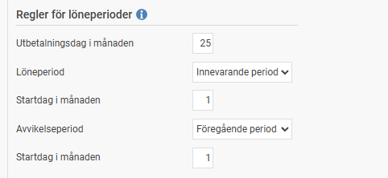
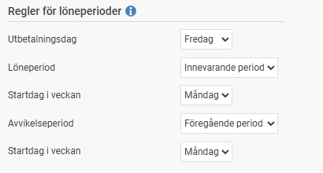
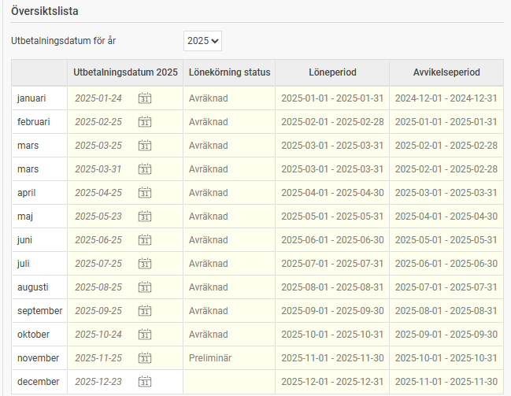

# ⚙️Hur fungerar Utbetalningsgrupper i HRM Payroll?

**Datum:** den 11 november 2025  
**Kategori:** Payroll  
**Underkategori:** Löneberedning  
**Typ:** config  
**Svårighetsgrad:** advanced  
**Tags:** lön, skatt  
**Bilder:** 5  
**URL:** https://knowledge.flexhrm.com/hur-fungerar-utbetalningsgrupper-i-hrm-payroll

---

Förbättring av Knowledgebase artiklar Anpassad Gem Här är den optimerade texten för kunskapsdatabasen. Hantera utbetalningsgrupper I HRM Payroll använder du utbetalningsgrupper för att kunna betala ut lön på olika datum för olika grupper av anställda och styra skatteberäkning för utbetalningen, till exempel veckovis och månadsvis. Detta gör det möjligt att ha flera olika lönekörningar öppna samtidigt. Utbetalningsgruppen styr också löneperioden och avvikelseperioden.
Hantera utbetalningsgrupper
Gå till
Inställningar > Utbetalningsgrupper
. Du får då upp följande vy:
Namn:
Här anger du namnet (i klartext) för den aktuella utbetalningsgruppen. Namnet visas i löneberedningen.
Företagets standard:
Markera denna ruta om utbetalningsgruppen ska gälla som standard för företaget.
Skatteavdrag enligt tabell för:
Ange den skattetabell som ska användas för beräkning av preliminärskatt för den aktuella utbetalningsgruppen.

Regler för löneperioder
För att få ett förslag på utbetalningsdatum, löneperiod och avvikelseperiod när du skapar en ny lönekörning kan du lägga in regler för detta på den valda utbetalningsgruppen. Reglerna du anger är olika beroende på om utbetalning sker per månad, vecka eller varannan vecka, enligt inställningen
Skatteavdrag enligt tabell för
.

Regler vid månadsutbetalning
Utbetalningsdag i månaden (default: 25):
Här anger du vilken dag i månaden du normalt gör utbetalningen. Om den angivna dagen i månaden inte är en bankdag, föreslår systemet den första bankdagen före detta datum.
Löneperiod:
Här väljer du om löneperioden ska sammanfalla med utbetalningsdatumet (innevarande period) eller vara perioden före utbetalningsdatumet (till exempel vid släpande månadslön). Du anger också en startdag i månaden för löneperioden, vilket kan användas om du har en bruten redovisningsperiod.
Avvikelseperiod:
Avvikelseperioden är normalt alltid föregående period, men du har möjlighet att välja sammanfallande period med utbetalningsdatumet om det behovet finns. Du anger också en startdag i månaden för avvikelseperioden, vilket kan användas om du har en bruten redovisningsperiod.

Regler vid veckoutbetalning/tvåveckorsutbetalning
Utbetalningsdag (default: Fredag):
Här anger du vilken dag i veckan du normalt gör utbetalningen. Om den angivna veckodagen inte är en bankdag, föreslår systemet den första bankdagen före detta datum. För tvåveckorslön blir utbetalningsdatumet denna veckodag, men varannan vecka.
Löneperiod:
Här väljer du om löneperioden ska sammanfalla med utbetalningsdatumet (innevarande period) eller vara perioden före utbetalningsdatumet (föregående period). Du anger också en startdag i veckan för löneperioden.
Avvikelseperiod:
Avvikelseperioden är normalt alltid föregående period, men du har möjlighet att välja sammanfallande period med utbetalningsdatumet om det behovet finns. Du anger också en startdag i veckan för avvikelseperioden.
Översiktslista

Denna lista ger dig en översikt över alla skapade samt planerade löneperioder under det år du angett i fältet
Utbetalningsdatum för år
. Observera att eventuella extrautbetalningar inte visas, utan endast ordinarie löneutbetalningar. Om du vill ändra något av datumen för planerade utbetalningar kan du manuellt välja ett annat datum i listan.
