# Hur gör jag en rättelse av ett fel i tidigare arbetsgivardeklarationer (AGI) i HRM Payroll?

**Datum:** den 21 oktober 2025  
**Kategori:** Payroll  
**Underkategori:** Skatt & AGI  
**Typ:** howto  
**Svårighetsgrad:** intermediate  
**Tags:** agi, lön, löneart, skatt  
**Bilder:** 13  
**URL:** https://knowledge.flexhrm.com/hur-g%C3%B6r-jag-en-r%C3%A4ttelse-av-ett-fel-i-tidigare-arbetsgivardeklarationer-agi-i-hrm-payroll

---

Artikeln beskriver hur du rättar fel i tidigare, redan insända arbetsgivardeklarationer, samt ger exempel på hur du kan korrigera olika situationer som uppstått; bland annat hur du kvitterar en skuld mot lön.
Rättelse av fel i tidigare arbetsgivardeklarationer
Om du har upptäckt felaktigheter i inskickad redovisning till Skatteverket ska du göra en rättelse på de felaktiga uppgifterna. Beroende på vad det är för typ av fel kan du behöva göra en rättelse i en redan inskickad arbetsgivardeklaration istället för att korrigera felet i en kommande period. Det är inte tillåtet att redovisa negativa belopp i något fält, vilket innebär att man inte kan göra vissa typer av korrigeringar i senare period.
Om du vill skapa en fil för att göra en rättelse kan du välja att inte ta med alla anställda i filen. Detta kan användas om det t.ex. bara är en anställd som du behöver skicka in en rättelse för. Du kryssar då i
Rättelse av uppgifter.
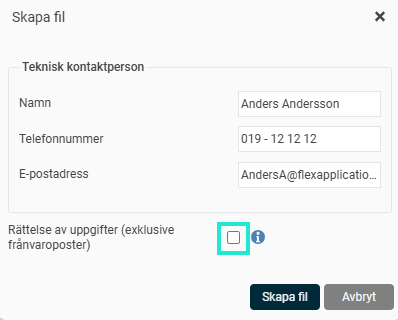
Detta gör att extra fält för urval av anställda att ta med i filen kommer fram.
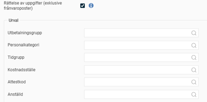
Notera att det alltid är den senast inskickade filen för en redovisningsperiod som används av Skatteverket. Du kan alltså skicka in en hel fil igen, utan att markera rutan för rättelse, som då kommer ses som en rättelse hos Skatteverket.
Nedan finns några exempel på olika situationer som kan uppstå och hur du löser dessa.
Extrautbetalning i redovisad period
Om du gjort klart den ordinarie löneutbetalningen, skickat in arbetsgivardeklarationen och därefter får reda på att det är något mer som ska betalas ut samma månad via en extrautbetalning gör du så här:
Ta bort kontrollmarkeringen på AGI-underlaget för aktuell redovisningsperiod.
Skapa en extra lönekörning för att göra de utbetalningar som ska med.
När du har avräknat den extra lönekörningen kontrollerar du på nytt AGI-underlaget för aktuell redovisningsmånad. När kontrollen är klar markerar du underlaget som kontrollerat.
Ta ut en fil med rättelse och skicka in till Skatteverket. Om du endast rättat ett fåtal anställda kan du välja att göra urval på dessa när du skapar filen för rättelse.
Skuld som kvittas mot lön i senare utbetalning
Om man upptäcker att en anställd har fått för stor ersättning en månad kan man välja att korrigera detta mot lön en senare månad enligt följande exempel:
Exempel 1 – Avdrag för VAB senare månad
I samband med löneutbetalningen i maj uppdagas att en anställd har varit frånvarande för vård av sjukt barn två dagar i mars, vilket missades att dras från löneutbetalningen i april. Detta löser du genom att lägga in detta avdrag för VAB i utbetalningen för maj på vanligt sätt. Vilken månad man varit frånvarande spelar ingen roll, då kontantprincipen tillämpas.
Exempel 2 – Skuld till nästa lön i samband med föräldraledighet
En anställd går på föräldraledighet i mitten av februari och vill att avdraget görs innevarande månad. Information om detta kom för sent till lönekontoret och därför gjordes inget avdrag för ledighet i februari.
Gör så här:
I utbetalningen för mars lägger du in avdrag för halva februari och hela mars enligt bilden, vilket resulterar i en negativ bruttolön. En bruttoskuld till nästa lön uppstår då och hanteras genom en löneart för skuld till nästa lön.
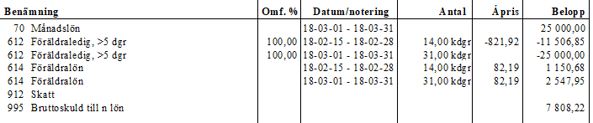
Arbetsgivardeklarationen på individnivå för mars månad blir då 0 kr i bruttolön och 0 kr i skatt för den anställde.
Nästkommande månader försöker man reglera bruttoskulden genom att dra av så mycket pengar som finns av skulden. Så länge föräldraledigheten varar är det mot föräldralönen pengar kan dras, och om det finns en skuld kvar när den anställde kommer tillbaka från föräldraledigheten drar man resterande skuld från månadslönen.
Skuld som inte kan kvittas mot senare utbetalning (återbetalning)
Om arbetsgivaren inte har möjlighet att reglera en löneskuld genom att göra ett avdrag på senare månads löneutbetalning kan han/hon kräva tillbaka det felaktigt utbetalda beloppet från den anställde.
Arbetsgivaren måste då kräva tillbaka det felaktiga bruttobeloppet, d.v.s. både nettobeloppet som den anställde fick och skattebeloppet som betalades in till Skatteverket. Anledningen till det är att arbetsgivaren inte har någon rätt att kräva tillbaka felaktigt inbetald skatt i systemet för arbetsgivardeklaration på individnivå.
I samband med återkravet ska arbetsgivaren också rätta redovisade uppgifter till Skatteverket och begära omprövning av beslutet om arbetsgivaravgifter. Om den anställde redan beskattats för den felaktiga utbetalningen, d.v.s. om korrigeringen sker ett senare år, måste den anställde själv begära omprövning av sin inkomstdeklaration.
Exempel 3 – En anställd har fått lön men har slutat och hela lönen ska betalas tillbaka.
En anställd får sin månadslön utbetald i september. Det visar sig dock att den anställde har slutat utan att lönekontoret blivit informerad och hela månadslönen ska betalas tillbaka.
Gör så här:
I den ordinarie lönekörningen för september har månadslönen betalats ut och redovisats enligt följande:
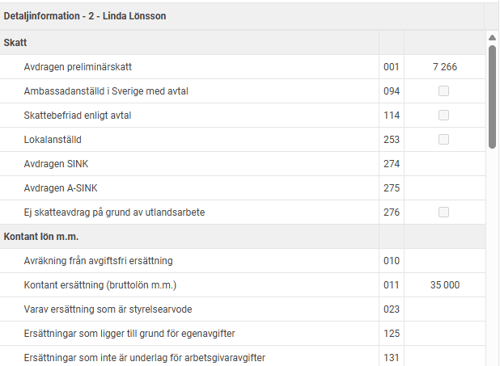
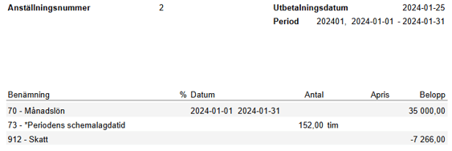
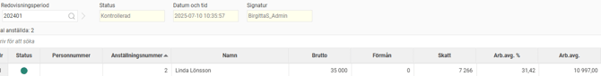
Ta bort kontrollmarkeringen på AGI-perioden och skapa en extra lönekörning för att rätta rapporteringen för den anställde. Extrakörningen måste ha ett utbetalningsdatum för samma månad som den felaktiga utbetalningen.
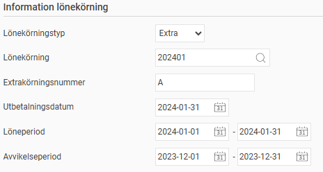
I extrakörningen lägger du in den löneart som är felaktigt utbetald med minustecken, som i detta fall är löneart 70 Månadslön. Då skatten inte kan korrigeras ska ingen rad för skatt läggas in. Bruttolönen ska då bli ett negativt värde och skatten 0.

Kontrollera att bruttolönen och arbetsgivaravgiften blivit nollad i AGI-underlaget, samt att skatten är oförändrad mot den tidigare rapporterade skatten.
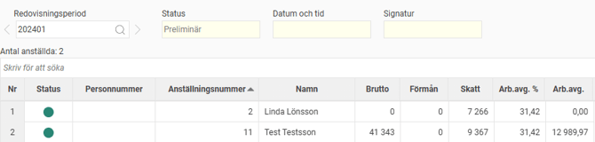
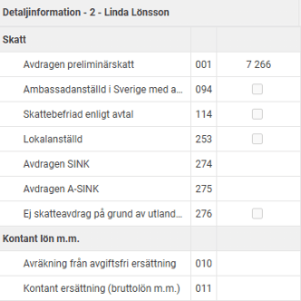
När allt ser bra ut avräknar du den extra lönekörningen.
Därefter kontrollmarkerar du AGI-underlaget och skapar filen med rättelse för den anställde som du redovisar till Skatteverket.
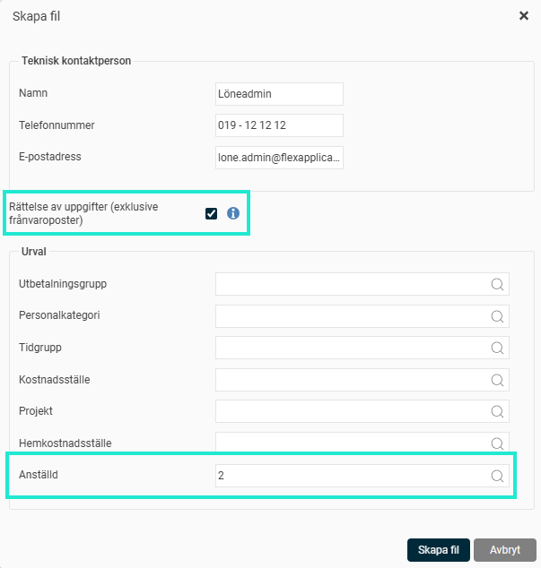
En anställd har fått en bilförmån, detta får man reda på tre månader senare
Det är viktigt att ersättningar och förmåner redovisas på rätt månad. Om bilförmån inte blivit korrekt rapporterad behöver man göra rättelser på dessa månader.
Gör så här:
Börja med att avmarkera klarmarkeringen för AGI de månader som bilförmånen ska läggas in.
Skapa en extra lönekörning för den första månaden, gör urval på de anställda för att endast få med dem vars AGI behöver rättas och lägg därefter in bilförmånsvärdet.
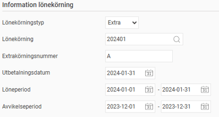
Ta ut en ny Arbetsgivardeklaration på individnivå och skicka in rättelsen.
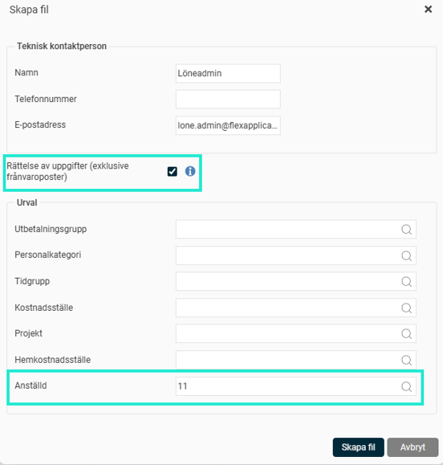
Fortsätt sedan och gör detta för alla de månader som det gäller.
Relaterade artiklar:
Hur arbetar jag med arbetsgivardeklaration på individnivå i Flex HRM Payroll?
Hur hittar jag orsaken till diffar i arbetsgivaravgifter (AGI) i Flex HRM Payroll?
Hur gör jag inställningar för arbetsplats, tjänsteställe, till arbetsgivardeklarationen (AGI) i HRM Payroll?
Varför får jag en varning i arbetsgivaruppgifterna på individnivå (AGI) att det finns ett negativt belopp på fält 499?
