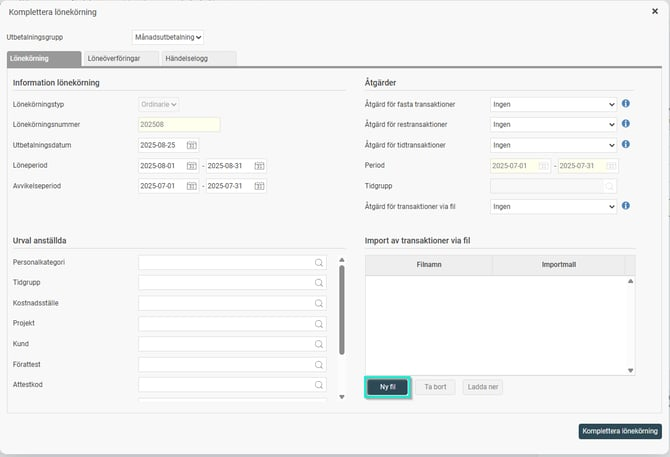
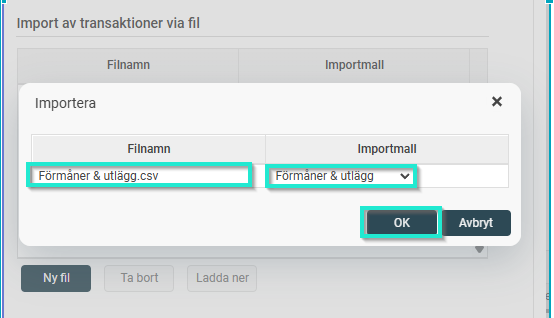
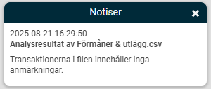
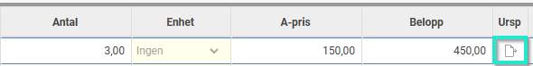

# Hur gör jag för att importera/läsa in en fil med lönetransaktioner i löneberedningen?

**Datum:** den 7 oktober 2025  
**Kategori:** Payroll  
**Underkategori:** Löneberedning  
**Typ:** howto  
**Svårighetsgrad:** intermediate  
**Tags:** lön  
**Bilder:** 4  
**URL:** https://knowledge.flexhrm.com/hur-g%C3%B6r-jag-f%C3%B6r-att-importera/l%C3%A4sa-in-en-fil-med-l%C3%B6netransaktioner-i-l%C3%B6neberedningen

---

Denna artikel beskriver hur du gör för att importera/läsa in en fil med lönetransaktioner i löneberedningen i HRM Payroll med hjälp av en importmall.
För att kunna läsa in en fil i löneberedningen måste det finnas en importmall uppsatt som matchar filens format. Hur du skapar en importmall kan du läsa
här
.
I
Lön > Löneberedning
,  klicka på
Lönekörning
och välj
Komplettera
.
Under Import av transaktioner via fil väljer du Ny fil.

Välj din fil som ska läsas in och den importmall som gäller för just denna fil, klicka på
OK
.

Systemet gör en kontroll av filen och du ska få ett meddelande i notiser när detta är klart. Om du får ett felmeddelande behöver du först korrigera dessa (ev justera i filen/ importmallen eller andra inställningar som kan behövas för att kunna läsa in filen). Backa ur genom att stänga fönstret och gör dina justeringar. Gör sen om ovan steg för att välja fil att importera efter justeringarna.

När du får meddelande att filen inte innehåller några anmärkningar, klicka på
Komplettera lönekörning
för att läsa in transaktionerna.
Transaktioner som lästs in via fil får en egen ikon, ett dokument, i kolumnen Ursp i löneberedningen.

Relaterade artiklar:
Var kan jag se vilka transaktioner som var med i en överföring/inläst fil?
Det visas en varning att det finns transaktioner som inte hämtats in i lönekörningen, hur hittar jag och hanterar dessa?
