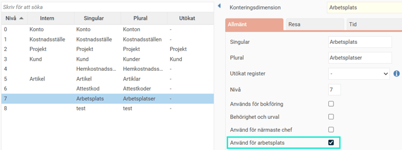
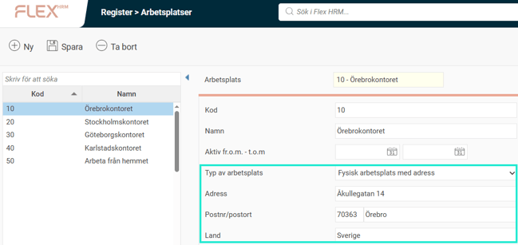
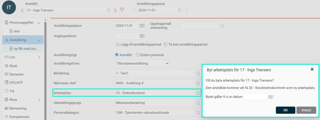
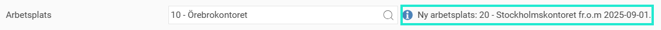
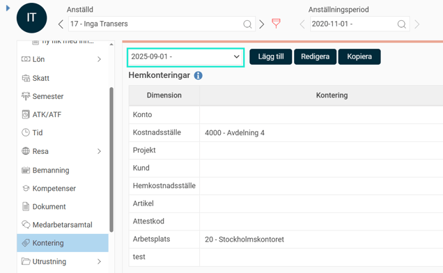
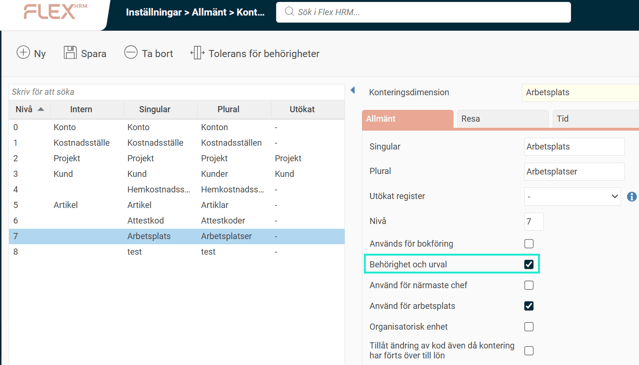

# ⚙️ Hur gör jag inställningar för arbetsplats, tjänsteställe, till arbetsgivardeklarationen (AGI) i HRM Payroll?

**Datum:** den 25 september 2025  
**Kategori:** Payroll  
**Underkategori:** Skatt & AGI  
**Typ:** howto  
**Svårighetsgrad:** intermediate  
**Tags:** agi, skatt  
**Bilder:** 7  
**URL:** https://knowledge.flexhrm.com/hur-g%C3%B6r-jag-inst%C3%A4llningar-f%C3%B6r-arbetsplats-tj%C3%A4nstest%C3%A4lle-till-arbetsgivardeklarationen-agi-i-hrm-payroll

---

Artikeln beskriver hur du gör inställningar för att kunna redovisa arbetsplatsens (tjänsteställets) adress i arbetsgivardeklarationen.
Observera att Skatteverket vanligtvis använder termen "tjänsteställe" när de beskriver arbetsplatsens adress. I denna artikel använder vi ordet "arbetsplats" som synonym till "tjänsteställe", vilket innebär att de båda begreppen avser samma sak.
Konteringsdimensioner
Register
Anställdaregistret
Arbetsplatsens adress i AGI
Konteringsdimensioner
Du som använder Flex HRM Payroll lägger in uppgifter om de anställdas arbetsplatser med hjälp av en hemkontering.  För att aktivera funktionen för arbetsplats behöver du  bestämma vilken av era konteringsdimensioner som är just arbetsplats. Detta gör du via
Administration > Inställningar > Allmänt > Konteringsdimensioner.
Observera att konteringsdimensionen kan heta vad som helst, exempelvis Arbetsplats,  Tjänsteställe eller något helt annat. I våra exempel, i denna artikel, har vi använt ordet Arbetsplats för tydlighetens skull.
Bocka i
Använd för arbetsplats
för att aktivera funktionen.

Register
När inställningen på konteringsdimensionen är markerad att användas för arbetsplats aktiveras nya fält i konteringsregistret för att kunna ange adressen för respektive arbetsplats i registret.

Du väljer mellan följande typer av arbetsplats:
Fysisk arbetsplats med adress
Används då arbetsplatsen är en fysisk plats, såsom ett kontor eller en fabrik. Du anger då adressen om den avviker från företagets huvudadress i företagsregistret.
Arbete från hemmet
Används då tjänstestället räknas från din hemadress.
Ingen fast arbetsplats
Används då det varken finns en fysisk arbetsplats eller man räknas arbeta från hemmet.
Anställdaregistret
Du kan registrera eller ändra arbetsplats på både fliken
Anställning
och
Kontering
, beroende på din behörighet och om ändringen gäller för framtiden eller historiskt. En ändring på en flik uppdaterar automatiskt informationen på den andra.
När du byter arbetsplats via fliken
Anställning
visas en dialogruta där du anger från vilket datum den nya arbetsplatsen ska börja gälla – endast framtida datum kan väljas här. Därefter ser du både aktuell och kommande arbetsplats direkt i vyn.

Kommande ny arbetsplats visas enligt nedan till höger om fältet där du ser aktuell arbetsplats.

När du ändrar arbetsplats på fliken
Anställning
skapas automatiskt ett nytt datumintervall på fliken
Kontering
, där befintliga konteringar förs över till det nya intervallet. Observera att endast på fliken
Kontering
kan du göra arbetsplatsändringar retroaktivt.

Då arbetsplats på många sätt fungerar som en vanlig kontering kan du både importera och exportera de anställdes arbetsplats. Du kan också välja att aktivera arbetsplats för urval i rapporter och behörigheter samt använda uppgiften i olika rapporter.

Arbetsplatsens adress i AGI
Du som arbetsgivare behöver lämna uppgift om adress och ort för arbetsplatsen där den anställde haft sin arbetsplats.
Mer information gällande arbetsplats (tjänsteställe) i AGI hittar du hos
Skatteverket
.
Arbetsplatsens gatuadress redovisas i fält 245 och ort i fält 246.
Observera att om en anställd bytt arbetsplats under månaden ska ingen adress rapporteras till Skatteverket.
När du skapar AGI-underlaget finns också en möjlighet att använda företagets adress för anställda som saknar uppgift om arbetsplats. Detta kan vara användbart om alla anställda i företaget arbetar på samma plats för att slippa onödig administration.

Relaterade artiklar:
Hur arbetar jag med arbetsgivardeklaration på individnivå (AGI) i Flex HRM Payroll?
