# ⚙️Hur gör jag inställningar för bankfiler med formatet ISO 20022 Pain.001 (XML) i HRM Payroll?

**Datum:** den 20 november 2025  
**Kategori:** Payroll  
**Underkategori:** Inställningar  
**Typ:** howto  
**Svårighetsgrad:** advanced  
**Tags:** lön  
**Bilder:** 21  
**URL:** https://knowledge.flexhrm.com/hur-g%C3%B6r-jag-inst%C3%A4llningar-f%C3%B6r-bankfiler-med-formatet-iso-20022-pain.001-xml-i-hrm-payroll

---

Artikeln beskriver vilka banker det finns stöd för i Payroll avseende filformatet ISO 20022, Pain.001 (XML) samt hur du gör inställningar för respektive bank.
Bankfiler på formatet ISO 20022 i Flex HRM Payroll
Bakgrund
Under de kommande åren kommer bankerna att fasa ut Bankgirots gamla system och filer för löneutbetalning, såsom KI och LB. De kommer att ersättas med en ny betalningsplattform som hanterar XML-filer enligt formatet ISO 20022, Pain.001 som är en världsstandard. Under övergångsperioden kommer alla företag som använder Bankgirocentralens gamla filer successivt behöva byta filformat för löneutbetalning i samråd med sin respektive bank.
De olika bankerna har kommit olika långt i övergången till det nya filformatet, där vissa redan har en färdig tjänst och andra precis har påbörjat sitt arbete med att ta fram en lösning. De banker som har en färdig tjänst gör ofta utskick till sina kunder och berättar på olika sätt att man snart behöver gå över till det nya formatet. Bankerna har dock en möjlighet att ha kvar stöd för Bankgirocentralens filer fram till att dessa fasas ut helt.
Stöd för skräddarsydda filer samt generell ISO-fil
Trots att man i det nya formatet använder standarden ISO 20022 och bankerna samarbetar kommer de olika bankerna i praktiken kräva att filen innehåller lite olika saker. Detta gör att vi som lönesystemsleverantör inte kan bygga en lösning som fungerar för alla banker (som med Bankgirocentralens filer), utan behöver bygga en separat fil för varje bank. För att skapa en så flexibel lösning som möjligt har vi, utöver de skräddarsydda filerna för respektive bank, byggt stöd för en generell ISO-fil där man via inställningar kan välja hur filen ska byggas upp. Detta kräver dock en djup kunskap om ISO-formatet och dialog med den aktuella banken.
Vilka banker kommer Flex att erbjuda stöd för?
Dessa banker har vi stöd för i Flex HRM Payroll:
Danske Bank
Handelsbanken
Nordea
SEB (uppdatering i version 2022.13)
J.P. Morgan (från version 2022.6)
BNP Paribas (från version 2023.7)
DNB (från version 2023.10)
Swedbank (från version 2025.79)
Dessa banker har vi dialog med, men de har idag ingen färdig tjänst för det nya ISO-formatet eller saknar stöd i Flex HRM Payroll:
CitiBank
Ica Banken
Länsförsäkringar
Svea Bank
Inställningar i Flex HRM Payroll
Nedan finns information om inställningarna och annat att tänka på för de banker vi har stöd för i Flex HRM Payroll. Dessa inställningar finns under
Administration > Inställningar > Lön >  Utbetalning av lön.
Klicka på länkarna nedan för att komma till information om respektive bank:
Danske bank
Handelsbanken
Nordea
SEB
Swedbank
JPMorgan
BNP Paribas
DNB
Generell fil
Danske Bank
Välj Danske Bank (ISO 20022 XML Pain.001) som Bank och filformat/tjänst enligt nedan.
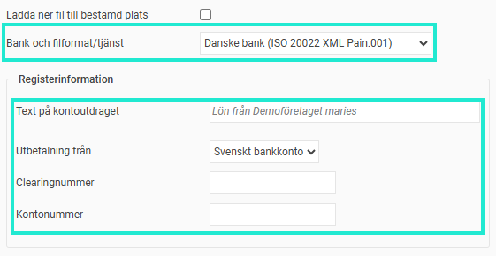
Text på kontoutdraget
Du kan här välja vilken text som ska komma med på den anställdes kontoutdrag. Observera att detta inte kommer fungera fullt ut innan Bankgirocentralens nya betalinfrastruktur på på plats och banken har stöd för hanteringen. Kontakta din bank för mer information.
Från vilket konto ska lön betalas ut?
Du som betalar ut via Danske Bank kan välja att ange ett svenskt bankkontonummer (Clearingnummer och Bankkontonummer), eller ett IBAN-nummer.
Identifikation hos banken
För att banken ska veta vem som skickar filen för löneutbetalning läggs företagets organisationsnummer till i filen (fältet InitiatingParty – Id). Du behöver inte göra någon inställning för detta.
Handelsbanken
Välj Handelsbanken (ISO 20022 XML Pain.001) som Bank och filformat/tjänst enligt nedan.
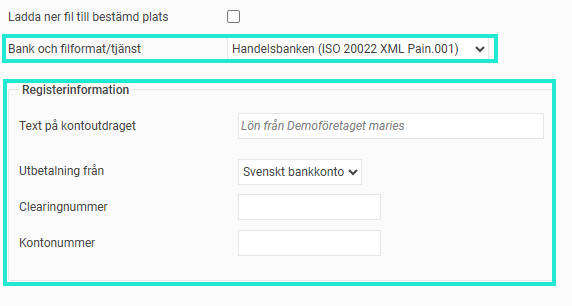
Text på kontoutdraget
Du kan här välja vilken text som ska komma med på den anställdes kontoutdrag. Observera att detta inte kommer fungera fullt ut innan Bankgirocentralens nya betalinfrastruktur på på plats och banken har stöd för hanteringen. Kontakta din bank för mer information.
Från vilket konto ska lön betalas ut?
Du som betalar ut via Handelsbanken kan välja att ange ett svenskt bankkontonummer (Clearingnummer och Bankkontonummer), eller ett IBAN-nummer.
Identifikation hos banken
För att banken ska veta vem som skickar filen för löneutbetalning läggs företagets organisationsnummer i filen (fältet InitiatingParty – Id samt Debtor - Id). Du behöver inte göra någon inställning för detta.
Nordea
Välj Nordea (ISO 20022 XML Pain.001) som Bank och filformat/tjänst enligt nedan.
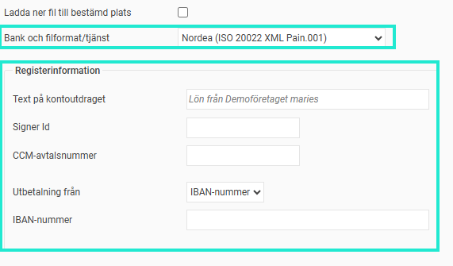
Text på kontoutdraget
Du kan här välja vilken text som ska komma med på den anställdes kontoutdrag. Observera att detta inte kommer fungera fullt ut innan Bankgirocentralens nya betalinfrastruktur på på plats och banken har stöd för hanteringen. Kontakta din bank för mer information.
Från vilket konto ska lön betalas ut?
Du som betalar ut via Nordea kan välja att ange ett PlusGirokonto, eller ett IBAN-nummer.
Identifikation hos banken
Beroende på hur du överför filen till Nordea behöver du ange olika information för att banken ska veta vem som skickar filen för löneutbetalning. Om du använder Corporate Access ska du lägga in CCM-avtalsnummer (som i filen läggs i fältet Debtor - Id), samt Signer Id (som i filen läggs i fältet InitiatingParty – Id).
Om du inte använder Corporate Access kan du välja att istället ange 9999999999 (10 st 9:or) i båda dessa fält.
SEB
Välj SEB ISO Lön LB som Bank och filformat/tjänst enligt nedan.
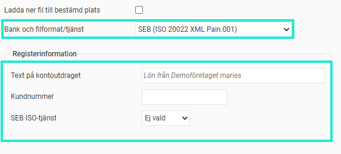
Text på kontoutdraget
Du kan här välja vilken text som ska komma med på den anställdes kontoutdrag. Observera att detta inte kommer fungera fullt ut innan Bankgirocentralens nya betalinfrastruktur på på plats och banken har stöd för hanteringen. Kontakta din bank för mer information.
Från vilket konto ska lön betalas ut?
SEB har två olika ISO-tjänster för utbetalning, ISO Lön och ISO LB. Filen som skapas ska se lite olika ut beroende på vilken tjänst man har, där en skillnad är hur man anger vilket konto lönen ska betalas ut från.
Du som använder tjänsten ISO Lön ska antingen ange ett svenskt bankkontonummer (clearingnummer och bankkontonummer) eller ett IBAN.
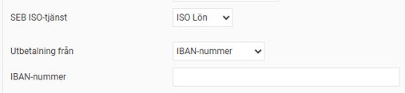
Du som använder tjänsten ISO LB anger ett Bankgironummer som lönerna ska betalas ut från.
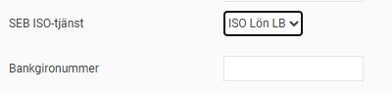
Identifikation hos banken
För att banken ska veta vem som skickar filen för löneutbetalning behöver du ange det kundnummer du fått från SEB. Kundnumret består vanligtvis av organisationsnummer + 0004. Kundnumret läggs i filen i fältet Debtor – Id.
Swedbank
Välj Swedbank (ISO 20022 XML Pain.001) som Bank och filformat/tjänst enligt nedan.
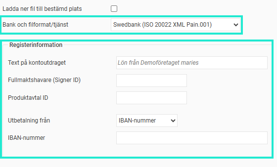
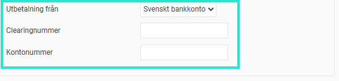
Identifikation hos banken
För att banken ska veta vem som skickar filen för löneutbetalning behöver du ange ett
Signer ID
som du fått från Swedbank (som i filen läggs i fältet InitiatingParty – Id). Du behöver även ange ett
Produktavtal ID
(som i filen läggs i fältet Debtor - Id)
Text på kontoutdraget
Du kan här välja vilken text som ska komma med på den anställdes kontoutdrag. Observera att detta inte kommer fungera fullt ut innan Bankgirocentralens nya betalinfrastruktur på på plats och banken har stöd för hanteringen. Kontakta din bank för mer information.
Från vilket konto ska lön betalas ut?
Du som betalar ut via Swedbank kan välja att ange ett svenskt bankkontonummer (Clearingnummer och Bankkontonummer), eller ett IBAN-nummer.
J P Morgan
Välj JP Morgan (ISO 20022 XML Pain.001) som Bank och filformat/tjänst enligt nedan.
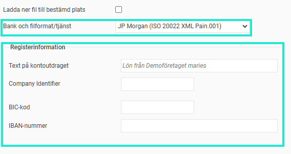
Text på kontoutdraget
Du kan här välja vilken text som ska komma med på den anställdes kontoutdrag. Observera att detta inte kommer fungera fullt ut innan Bankgirocentralens nya betalinfrastruktur på på plats och banken har stöd för hanteringen. Kontakta din bank för mer information.
Från vilket konto ska lön betalas ut?
Du som betalar ut via JP Morgan anger vilket IBAN-nummer samt vilken BIC-kod som lönerna ska betalas ut från.
Identifikation hos banken
För att banken ska veta vem som skickar filen för löneutbetalning behöver du ange ett Company Identifier som du fått från JP Morgan (som i filen läggs i fältet Debtor – Id). Utöver detta läggs också företagets organisationsnummer in i filen (läggs i fältet InitiatingParty – Id).
BNP Paribas
Välj BNP Paribas (ISO 20022 XML Pain.001) som Bank och filformat/tjänst enligt nedan.
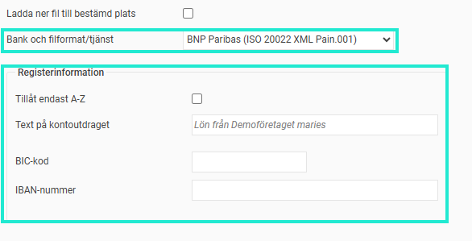
Tillåt endast A-Z
Om denna inställning aktiveras så kommer texter (namn och adresser m.m för företag och anställda) endast innehålla tecknen a-z (versaler och gemener), siffrorna 1-9, mellanslag samt understreck. Om det finns otillåtna tecken så kommer de att ersättas med tillåtna tecken. Exempelvis så ersätts å och ä med a, och ö ersätts med o.
Text på kontoutdraget
Du kan här välja vilken text som ska komma med på den anställdes kontoutdrag. Observera att detta inte kommer fungera fullt ut innan Bankgirocentralens nya betalinfrastruktur på på plats och banken har stöd för hanteringen. Kontakta din bank för mer information.
Från vilket konto ska lön betalas ut?
Du som betalar ut via BNP Paribas anger vilket IBAN-nummer samt vilken BIC-kod som lönerna ska betalas ut från.
DNB
Välj DNB (ISO 20022 XML Pain.001) som Bank och filformat/tjänst enligt nedan.
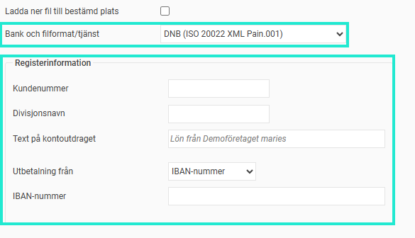
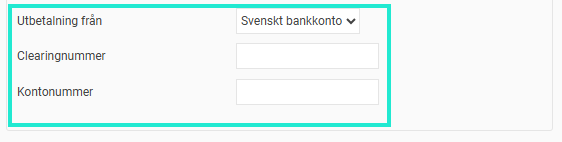
Identifikation hos banken
För att banken ska veta vem som skickar filen för löneutbetalning behöver du ange ett Kundenummer som du fått från DNB (som i filen läggs i fältet InitiatingParty – Id).
Om du har fått ett divisjonsnavn från DNB så ska det anges i detta fält (som i filen läggs i ett andra fält för InitiatingParty – Id).
Text på kontoutdraget
Du kan här välja vilken text som ska komma med på den anställdes kontoutdrag. Observera att detta inte kommer fungera fullt ut innan Bankgirocentralens nya betalinfrastruktur på på plats och banken har stöd för hanteringen. Kontakta din bank för mer information.
Generell fil
Om du använder en bank och en ISO-fil som inte finns i listan finns det en möjlighet att använda den generella ISO-filen. Du behöver då själv göra de inställningar som bestämmer vilka uppgifter som ska tas med i filen enligt bankens specifikation. Detta kräver djup förståelse för ISO-formatet eller god teknisk förståelse.
Observera också att man med den generella ISO-filen endast kan göra utbetalning via IBAN vilket innebär att du måste lägga in IBAN/BIC för alla anställda.
Välj Annan bank (ISO 20022 XML Pain.001) som Bank och filformat/tjänst enligt nedan.
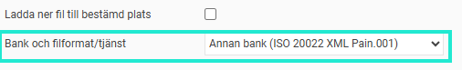
Följande inställningar kan göras. Benämningarna motsvarar de som används i ISO-formatet.
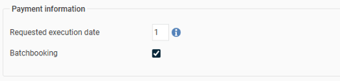
Requested execution date
Här kan du ange hur många bankdagar före utbetalningsdatum banken önskar som execution date. 0 innebär att execution date sätts till utbetalningsdatum.
Batchbooking
Om denna kryssas i dras den totala lönekostnaden från betalarens konto som en transaktion, annars blir det en transaktion per löneutbetalning (anställd).
Initiating Party

Initiating Party Id Code
Här anger du den kod som banken önskar, vanligtvis BANK eller CUST.
Initiating Party Id
Här anger du det ID som ska användas för identifiering i Initiating Party.
Debtor
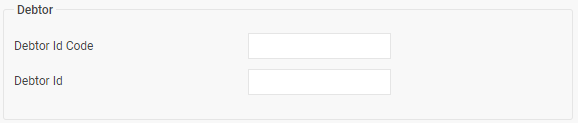
Debtor Id Code
Här anger du den kod som banken önskar, vanligtvis BANK eller CUST.
Debtor Id
Här anger du det ID som ska användas för identifiering i Debtor.
Debtor Account
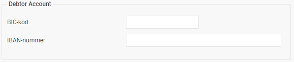
Här anger du IBAN-nummer och BIC-kod för det bankkonto som utbetalning ska göras från.
Creditor
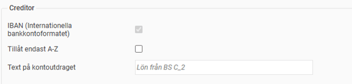
Här anges information om hur betalningsmottagaren ska hanteras.
IBAN (Internationella bankkontoformatet)
Då det inte finns något generellt stöd för svenska bankkontonummer i ISO-formatet kan man endast välja att göra utbetalning via IBAN/BIC till de anställda.
Tillåt endast A-Z
Om denna inställning aktiveras så kommer texter (namn och adresser m.m för företag och anställda) endast innehålla tecknen a-z (versaler och gemener), siffrorna 1-9, mellanslag samt understreck. Om det finns otillåtna tecken så kommer de att ersättas med tillåtna tecken. Exempelvis så ersätts å och ä med a, och ö ersätts med o.
Text på kontoutdraget
Du kan här välja vilken text som ska komma med på den anställdes kontoutdrag. Observera att detta inte kommer fungera fullt ut innan Bankgirocentralens nya betalinfrastruktur på på plats och banken har stöd för hanteringen. Kontakta din bank för mer information.
Internationella betalningar
Med ISO 20022 finns det teknisk möjlighet att göra löneutbetalningar till bankkonton i hela världen med hjälp av IBAN (International Bank Account Number). Men riktigt så enkelt är det inte. För att det ska vara möjligt måste den bank ert företag använder ha stöd för internationella betalningar.
De flesta svenska banker har valt att i ett första steg endast tillåta löneutbetalningar till svenska bankkonton. De flesta banker tillåter då att man anger det svenska bankkontonumret eller IBAN-numret för det svenska bankkontot.
Om du vill göra löneutbetalningar till bankkonton i andra länder behöver du ta kontakt med din bank och fråga vilka länder de har stöd för idag. Bankerna arbetar nämligen ständigt med att bygga in stöd för fler länder, och de flesta svenska banker börjar med de nordiska länderna, därefter EU-länderna och arbetar sig sedan vidare med resten av världen.
IBAN i anställdaregistret
Om din bank har stöd för internationella betalningar och du använder filformatet ISO 20022 till din bank kan du lägga in IBAN-nummer för de anställda på fliken Lön i anställdaregistret. Under Utbetalning av lön till väljer du IBAN-nummer och matar sedan in det IBAN-nummer och BIC-kod som den anställde vill ha sin lön utbetald till. Vid inmatning gör systemet en kontroll att angivet IBAN-nummer är på rätt format.
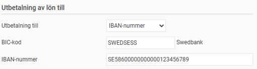
Uppgifterna om IBAN och BIC går också att importera via importmallen för användare/anställda.
Då man gör utbetalningar till utländska IBAN-konton måste man också skicka med adress (adress som är registrerad på den anställde) samt landskod i filen på grund av regler för penningtvätt (land registrerad på den anställde). För att detta ska fungera behöver du lägga in ett land som stämmer med landsregistret (under Administration –Systemregister – Länder).
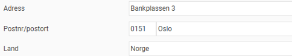
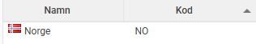
Ordlista
P27
P27 Nordic Payments Platform är en nordisk satsning där målet är att skapa en gemensam modern och framtidssäkrad infrastruktur för betalningar i Norden. Det är ett bankgemensamt projekt där syftet är att främja handeln inom och mellan de nordiska länderna bland annat genom att möjliggöra betalningar i realtid över gränserna. Planen var att P27 skulle ersätta Bankgirocentralen i Sverige, men projektet lades ner.
ISO 20022
Detta är en teknisk standard för att utbyta finansiell information, såsom betaltransaktioner mellan banker. Standarden är framtagen av ISO (International Standardization Organization) och är en världsstandard som bygger på XML-filer.
Pain.001
Den del i standarden ISO 20022 som används för betalningar (Payments Initiation). Det är denna del som används för löneutbetalningar.
XML
XML står för Extensible Markup Language och är ett regelverk för att strukturera data i filer.
IBAN
IBAN står för International Bank Account Number och är en internationellt accepterad standard för att identifiera bankkonton vid transaktioner mellan olika länder. Ett svenskt bankkonto som består av clearingnummer och kontonummer kan översättas till ett IBAN-nummer som då går att använda vid internationella betalningar.
BIC
BIC (Business Identifier Code), som tidigare kallades SWIFT, är precis som IBAN en internationell standard som används vid internationella transaktioner. BIC används för att identifiera banker på ett tillförlitligt sätt vid överföringar över landsgränser.
BBAN
BBAN står för Basic Bank Account Number och motsvarar ett landspecifikt bankkontonummer. BBAN är en del av IBAN, närmare bestämt den sista delen efter de 4 första tecknen i IBAN (innehållande landskod och checksiffror). BBAN ska inte förväxlas med ett bankkontonummer på svenskt format med clearingnummer och kontonummer. Ett svenskt bankkontonummer kan dock omvandlas till ett BBAN-nummer på det sätt som bestäms av varje bank (i Sverige).
Relaterade artiklar:
Hur gör jag för att byta bankfilsformat?
