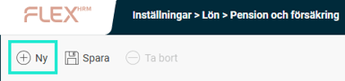
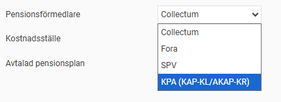
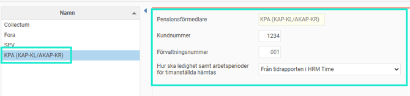
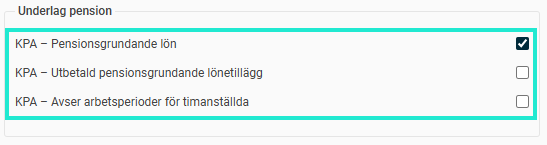
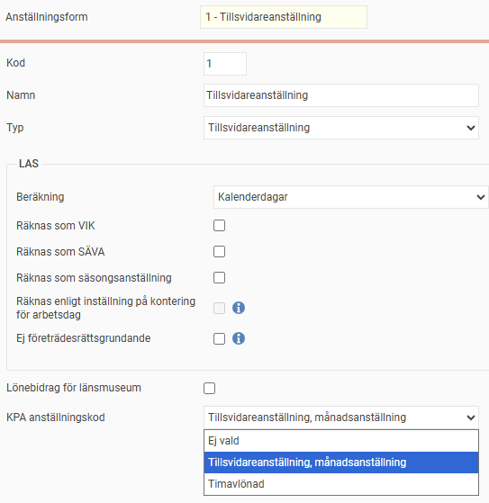

# ⚙️Hur gör jag inställningar i HRM Payroll för att kunna rapportera till KPA (KAP-KL/AKAP-KR)?

**Datum:** den 26 september 2025  
**Kategori:** Payroll  
**Underkategori:** Löneberedning  
**Typ:** howto  
**Svårighetsgrad:** advanced  
**Tags:** lön, löneart, pension  
**Bilder:** 6  
**URL:** https://knowledge.flexhrm.com/hur-g%C3%B6r-jag-inst%C3%A4llningar-i-hrm-payroll-f%C3%B6r-att-kunna-rapportera-till-kpa-kap-kl/akap-kr

---

Artikeln beskriver de olika inställningar som krävs för att kunna rapportera pensionsunderlag till KPA (KAP-KL/AKAP-KR).
Grundinställningar
Uppgifter på individnivå
Lönear
tsinställningar
Anställningsformer
Saker att tänka på före första rapporteringen i HRM Payroll
Grundinställningar
Första steget är att aktivera inställningarna för rapportering till KPA i aktuellt företag under
Administration > Inställningar > Lön > Pension och försäkring.
I listan till vänster ser du företagets aktiva rapporteringar till de olika pensionsförmedlarna. Om inte KPA (KAP-KL/AKAP-KR) finns i listan klickar du på knappen
Ny
och fyller i uppgifterna i formuläret för att aktivera rapportering till KPA.

Du kan här ange följande uppgifter:
Kundnummer
Här anger du kundnummer hos KPA. För dig med sjusiffrigt kundnummer används fälten kundnummer och förvaltningsnummer. De fyra första siffrorna anges i fältet för kundnummer och de tre sista siffrorna i fältet för förvaltningsnummer.
Förvaltningsnummer
Anges med 3 siffror. Använd 001 om du inte avser att rapportera på ett särskilt förvaltningsnummer. Förvaltningsnummer används som sorteringsbegrepp exempelvis på fakturor.
Hur ska ledighet samt arbetsperioder för timanställda hämtas
För timanställda gäller att man ska rapportera en unik anställningsperiod för varje tillfälle då man är inne och jobbar. Om man arbetar flera dagar i följd räknas det som ett tillfälle. Även dagar då den anställde varit sjuk ska räknas in.
Det finns två valbara lösningar för hur arbetsperioder för timanställda samt ledighet ska hämtas:
Från tidrapporten i HRM Time
För dig som använder Flex HRM Time hämtar du med fördel informationen direkt från de anställdas tidrapporter. Ledigheter hämtas då via frånvaroansökningar.
Från rapporteringslöneart i lönekörningen
Om du inte har möjlighet att använda Flex HRM Time måste du i stället använda en löneart för arbetsperioder. Du behöver då se till att det i lönekörningarna finns en lönetransaktion för varje enskild arbetsperiod med korrekta datum. Läs mer om detta under inställningar för lönearter. Ledigheter hämtas då från kalendariet i HRM Payroll.
Uppgifter på individnivå
I anställdaregistret, under fliken
Pension & försäkring
, anger du de villkor som gäller för den anställde vid rapportering till KPA.
Observera att dessa uppgifter gäller per anställningsperiod.

Du anger här följande uppgifter:
Pensionsavtal
Här anger du om den anställde räknas tillhöra KAP-KL eller AKAP-KR. Du kan också ange om den anställde inte alls ska rapporteras till KPA.
Avvikande förvaltningsnummer
Här kan du ange ett förvaltningsnummer som avviker mot företagets standard.
Avvikande avsättningsprocent över tak
Här kan du ange en avvikande procentsats för avsättningen över taket enligt pensionsavtalet.
Avvikande avsättningsprocent under tak
Här kan du ange en avvikande procentsats för avsättningen under taket enligt pensionsavtalet.
Löneartsinställningar
För att rapporteringen till KPA ska fungera behöver en rad uppgifter hämtas från lönearter. Därför måste du ange vilka lönearter som ska vara underlag för pensionsgrundande lön, lönetillägg samt arbetsperioder för timanställda med hjälp av dessa kryssrutor under fliken
Lön
, rubriken
Underlag
pension
, i löneartsregistret. För mer information om hur systemet använder dessa inställningar vid beräkning av löneunderlag, se artikeln "
Vilka uppgifter kommer med i rapporteringen till KPA (KAP-KL/AKAP-KR)?
" som ger fördjupad information om hur underlaget skapas.

Anställningsformer
För att kunna rapportera korrekt anställningskod till KPA behöver du göra inställningar under
Administration > Inställningar > Personal > Anställningsformer
. För varje anställningsform i Flex HRM anger du motsvarande anställningskod som ska rapporteras till KPA.

Saker att tänka på före första rapporteringen i HRM Payroll
Innan du gör den första rapporteringen bör du säkerställa att allt underlag för den period rapporteringen avser finns i systemet. Det gäller t.ex. uppgifter om pensionsgrundande lön och lönetillägg. En viktig sak att tänka på är också uppgifter om timanställdas arbetsperioder. Du kan läsa mer om hur arbetsperioder kan hanteras under avsnittet Inställningar – Grundinställningar.
Arbetsgivare som planerar byte av lönesystem ska kontakta KPA Pension via e-post: rapportering@kpa.se. Vid byte av lönesystem bör samma anställningsnummer som i det gamla lönesystemet användas som i det nya. Om man byter anställningsnummer måste en översättningsfil innehållande gamla och nya anställningsnummer skapas och rapporteras före första rapporteringen från nya lönesystemet. En sådan fil kan inte skapas i Flex HRM, utan måste i så fall skapas manuellt.
Relaterade artiklar:
Hur rapporterar jag pensionsunderlag till KPA (KAP-KL/AKAP-KR) i HRM Payroll?
Vilka uppgifter kommer med i rapporteringen till KPA (KAP-KL/AKAP-KR)?
