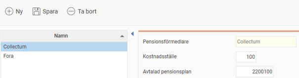
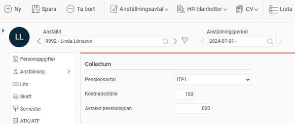
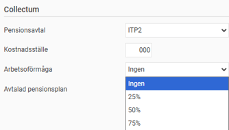
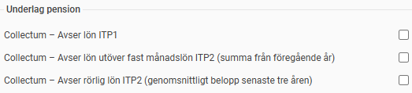
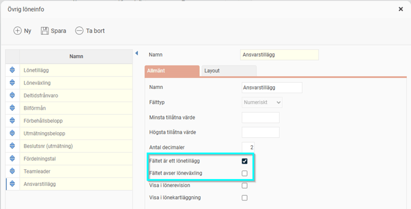
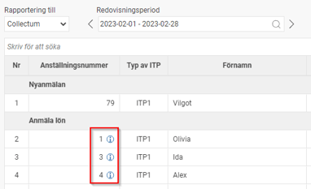

# ⚙️Hur gör man inställningar för rapportering till Collectum i HRM Payroll?

**Datum:** den 8 december 2025  
**Kategori:** Payroll  
**Underkategori:** Löneberedning  
**Typ:** howto  
**Svårighetsgrad:** advanced  
**Tags:** agi, lön, löneart, pension, semester  
**Bilder:** 6  
**URL:** https://knowledge.flexhrm.com/hur-g%C3%B6r-man-inst%C3%A4llningar-f%C3%B6r-rapportering-till-collectum-i-hrm-payroll

---

Denna artikel förklarar och beskriver de olika inställningar som krävs för att kunna göra rapportering till Collectum i systemet.
Grundinställningar
Uppgifter på individnivå
Löneartsinställningar
Lönetillägg och löneväxling (ITP2)
Vilka anställda tas med i Nyanmälan?
Vilka anställda tas med i Avanmälan?
Rapporterad lön för ITP1
Årslön för ITP2
Löneväxling för ITP2
Hopslagning per personnummer
Vad saknas det stöd för i filen från Flex HRM Payroll?
Grundinställningar
Första steget är att aktivera inställningarna för rapportering till Collectum i aktuellt företag under
Administration > Inställningar > Lön > Pension och försäkring.
I listan till vänster ser du företagets aktiva rapporteringar till de olika pensionsförmedlarna. Om inte Collectum finns i listan klickar du på knappen
Ny
och fyller i uppgifterna i formuläret för att aktivera rapportering till Collectum.

Du kan här ange följande uppgifter:
Kostnadsställe
För att dela upp fakturan från Collectum på olika avdelningar kan man rapportera de anställda på olika kostnadsställen. Här anger du företagets huvudsakliga kostnadsställe som ska vara standard för de anställda. Anställda som inte har ett annat kostnadsställe angivet kommer få detta kostnadsställe vid rapportering till Collectum.
Avtalad pensionsplan
Här anger du företagets kod för avtalad pensionskod hos Collectum. Koden du anger här kommer användas på alla anställda som inte har ett avvikande värde i anställdaregistret.
Uppgifter på individnivå
I anställdaregistret, under fliken
Pension & försäkring
, anger du vilka villkor som gäller för den anställde vid rapportering till Collectum.

Du anger här följande uppgifter:
Pensionsavtal
Välj om den anställde omfattas av ITP1 eller ITP2. Avtalen är till viss del åldersstyrda, men då en anställd som är född innan 1979 kan tillhöra ITP1 om företaget avtalat,  måste man här välja vilket avtal som gäller. Anställda som inte tillhör vare sig ITP1 eller ITP2 kommer inte med i rapporteringen till Collectum.
Kostnadsställe
Här anger du det kostnadsställe som den anställde ska rapporteras på. Om du inte anger ett kostnadsställe visas här företagets standard i grå kursiv stil som då kommer rapporteras.
Avtalad pensionsplan
Här anger du den avtalade pensionsplanen som gäller för den anställde. Om du inte anger en avtalad pensionsplan visas här företagets standard i grå kursiv stil som då kommer rapporteras.
Arbetsoförmåga
Om den anställde tillhör ITP2 ska man rapportera grad av arbetsoförmåga vid sjukskrivning efter dag 90. Sjukanmälan gör du via Collectums internetkontor. Uppgiften om arbetsoförmåga som du anger i Flex används vid rapportering av nyanmälan med arbetsoförmåga eller vid ändrad lön under tiden man är sjukskriven.

Löneartsinställningar
För rapportering av pensionsgrundande lön för ITP1 samt för beräkning av årslön för ITP2 behöver pensionsgrundande lön hämtas från vissa lönearter. Därför måste du ange vilka lönearter som ska vara pensionslönegrundande med hjälp av dessa tre kryssrutor under fliken
Lön
löneartsregistret (
Administration > Inställningar > Lön > Lönearte
r) .
Collectum - Avser lön ITP1 - inställningen anges på lönearter som ska inkluderas i summeringen av underlag för Rapporterad lön för ITP1.
Collectum - Avser lön utöver fast månadslön ITP2” (summa från föregående år) - inställningen anges på lönearter som ska inkluderas i beräkningen av årslön (utöver fast månadslön) för ITP2 baserat på utbetalningar föregående kalenderår (1 jan – 31 dec).
Collectum - Avser rörlig lön ITP2 (genomsnittlig belopp senaste tre åren) - inställningen anges på löneartersom ska inkluderas i beräkningen av årslön ITP2 (utöver fast månadslön) för de tre föregående kalenderåren (kontantprincipen, 1 jan - 31 dec).
För mer information om hur systemet beräknar löneunderlag, se avsnitten för
Rapporterad lön för ITP1
samt
Årslön för ITP2
längre ned i denna artikel.

Lönetillägg och löneväxling (ITP2)
För att kunna beräkna en korrekt årslön för ITP2 behöver vi veta om den anställde har fasta lönetillägg samt löneväxling. För att göra detta använder vi
Egna fält
som definieras under
Administration > Inställningar > Personal > Anställdaregistret - Egna fält
.
För alla fält som ska räknas som ett lönetillägg eller löneväxling sätter du respektive kryss. Om du har flera fält för lönetillägg sätter du krysset på samtliga fält.

För mer information om hur dessa fält används, se avsnittet
Årslön för ITP2
.
Fördjupad information om hur underlaget skapas
Nedan hittar du detaljerad information om hur underlaget skapas i systemet.
Vilka anställda tas med i Nyanmälan
En anställd nyanmäls enligt följande villkor.
Om den anställde tillhör ITP1
Den anställde börjar under perioden och är över 18 år.
Den anställde fyller 18 år under perioden.
Om den anställde tillhör ITP2
Den anställde börjar under perioden och har faktiskt arbetsmått på minst 8 h/vecka.
Vilka anställda tas med i Avanmälan
En anställd avanmäls enligt följande villkor.
Om den anställde tillhör ITP1 eller ITP2
När den anställde slutat under perioden (avgångsorsak 1).
Om man föregående period rapporterat avanmälan, och man denna period påbörjat en ny anställningsperiod görs en annullering av avanmälan (avgångsorsak 9). Ingen nyanmälan ska då göras.
Rapporterad lön för ITP1
Rapporterad månadslön för ITP1 utgörs av belopp på lönetransaktioner med lönearter som är markerade som ”Avser lön ITP1” och som finns i lönekörningar med utbetalningsdatum under rapporteringsperioden.
Årslön för ITP2
Årslönen för anställda tillhörande ITP2 räknas ut enligt följande formel:
(ML + LT - LV) x 12,2 + A + B + C
ML = Den faktiska månadslönen enligt personregistret
LT = Lönetillägg räknas som värden från egna numeriska fält som är markerade som lönetillägg.
LV = Löneväxling räknas som värdet från egna numeriska fält som är markerade som löneväxling. Läs mer om löneväxling i avsnittet om
Löneväxling för ITP2
nedan.
A = Summa belopp från lönetransaktioner med löneartsinställningen ”Collectum - Avser lön utöver fast månadslön ITP2” summerad på föregående kalenderår (1 jan – 31 dec).
B = Genomsnittligt belopp från lönetransaktioner med löneartsinställningen ”Collectum - Avser rörlig lön ITP2” summerat på utbetalningsdatum de tre föregående kalenderåren (1 jan – 31 dec) (kontantprincipen). De år som saknar anställningsperiod räknas ej med i snittberäkningen. Anställningsperioder markerade som "Slutlön utbetald" kommer inte att tas med i beräkningen.
Snittberäkning: (Belopp år -1 + Belopp år -2 + Belopp år -3) / Antal år med anställningsperiod.
Även om ett år inte har något belopp tas det alltså med i beräkningen, däremot ändras snittet om en anställd bara varit anställd i två år av de tre.
C (Semestertillägg på rörlig lön/bonus) = (0,5 * Semesterrätt/100) x B
Löneväxling för ITP2
Löneväxling innebär att arbetsgivaren och den anställde kommer överens om att den anställde avstår en del av sin lön i utbyte mot någon annan förmån, såsom extra avsättning till pension.
För anställda som omfattas av ITP2 ska arbetsgivaren rapportera årslönen efter löneväxling, dvs. nedräknad enligt ovanstående avsnitt för årslöneberäkning. Den nedräknade årslönen ska då redovisas i fältet för Årslön, vilket är det vanligaste.
Arbetsgivaren kan dock välja att kompensera den anställde för premiebortfall som löneväxlingen innebär genom att rapportera dubbla löner till Collectum, dvs. både den högre lönen (årslön före löneväxling) samt den lägre lönen (årslön efter löneväxling). Den högre lönen ska då rapporteras i fältet för Årslön, och den lägre i fältet ÅrslönEfterLöneavstående. Denna variant har vi i dagsläget inte stöd för i Flex HRM Payroll, då den är relativt ovanlig.
Hopslagning per personnummer
Om man har flera anställningsnummer för samma person som ska rapporteras till Collectum måste dessa slås ihop vid rapportering. Detta gör systemet automatiskt från version 2023.7 för både för ITP1 och ITP2. Både pensionsgrundande lön samt händelserna nyanmälan och avanmälan hanteras vid sammanslagningen.

Om en sammanslagning har gjorts i rapporteringen visas en liten i-symbol i pensionsunderlaget. När du håller muspekaren över får du information om vilka anställningsnummer som har slagits ihop.
Vad saknas det stöd för i filen från Flex HRM Payroll?
Det finns några uppgifter som är möjliga att rapportera i filen till Collectum men som ännu inte går att rapportera från Flex HRM Payroll.
Löneväxling för ITP2 då man vill rapportera dubbla årslöner
Se information under avsnittet
Löneväxling för ITP2
.
Avanmälan vid tjänstledighet och föräldraledighet
Om en anställd är tjänstledig eller föräldraledig under längre tid ska man i vissa fall avanmälas till Collectum. Då det redan är en viss manuell hantering för dessa via Collectums internetkontor har vi valt att inte bygga stöd för detta i filen. Detta gäller både ITP1 och ITP2.
Tjänstledighet på deltid för ITP2
För anställda med ITP2 som är tjänstlediga på deltid ska man i vissa fall göra en avanmälan och i andra fall räkna ner årslönen. Denna hantering sker inte automatiskt i systemet utan behöver hanteras manuellt via Collectums internetkontor.
Flytt av anställda inom koncern
Om en anställd ska flyttas till ett annat företag inom koncernen eller till ett annat kostnadsställe kan man rapportera detta via filen till Collectum. Vi har i dagsläget inte byggt stöd för detta och hänvisar tillsvidare till Collectums internetkontor.
Relaterade artiklar:
Hur genomför man rapportering till Collectum i Flex HRM Payroll?
