# ⚙️Hur hanteras kompskuld och skuld på valfria ackumulatorer i HRM Payroll?

**Datum:** den 7 oktober 2025  
**Kategori:** Payroll  
**Underkategori:** Löneberedning  
**Typ:** config  
**Svårighetsgrad:** advanced  
**Tags:** bokföring, lön, löneart  
**Bilder:** 12  
**URL:** https://knowledge.flexhrm.com/hur-hanteras-kompskuld-och-skuld-p%C3%A5-valfria-ackumulatorer-i-hrm-payroll

---

I Flex HRM Payroll kan du beräkna och bokföra en skuld för valfria ackumulatorer, till exempel kompsaldot. För dessa ackumulatorer kan du också aktivera en automatisk beräkning av slutlön för anställda som slutar.
I den här artikeln använder vi kompsaldo som exempel, men du kan använda samma metod för vilken ackumulator du vill. Vi går igenom inställningarna du behöver göra och hur den löpande hanteringen fungerar. Vi förklarar också vad du behöver tänka på om ni tidigare har hanterat kompskuld via lönearter.
Funktionen finns tillgänglig från och med version 2022.13.
Inställningar i Ackumulatorregistret
Löneart för slutlön
Formel för skuldberäkning
Inställningar för bokföring
Beräkna skuld löpande (Skuldhantering)
Skapa bokföringsunderlag
Hantera slutlön
Guide: Byta från kompskuld på lönearter till den nya funktionen
Viktigt vid bokföring av förändring
Inställningar i Ackumulatorregistret
För att kunna beräkna en skuld på ett ackumulatorvärde behöver du först göra några inställningar.
Gå till
Administration > Inställningar > Lön > Ackumulatorer
.
Välj den ackumulator du vill använda, till exempel den för kompsaldo.
På den första fliken kan du ange en
Enhet
(till exempel timmar eller belopp). Det hjälper dig i nästa steg när du ska skapa en formel för skuldberäkningen.
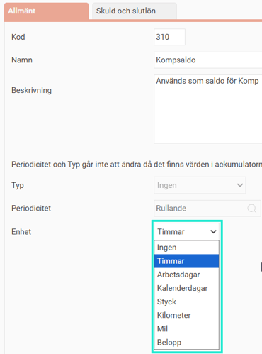
Gå till fliken
Skuld och slutlön
.
Bocka i kryssrutan
Använd för skuldberäkning och slutlön
.
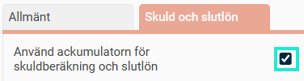
Löneart för slutlön
Ange den löneart som ska användas när ett eventuellt kvarvarande saldo ska betalas ut som slutlön.
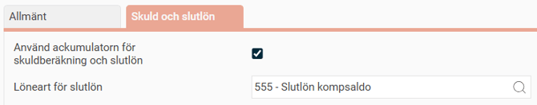
Viktigt:
Lönearten du väljer måste vara inställd på att minska saldot för ackumulatorn. Den bör inte heller ha en egen beräkningsformel, eftersom systemet beräknar slutlönen baserat på den bokförda skulden.
Formel för skuldberäkning
Under
Ackumulatorer - fliken Skuld och slutlön
, i rutan F
ormel för A - pris
, anger du en formel för a-priset i skuldberäkningen. Om du behöver olika formler för olika personalkategorier kan du välja en kategori i listan och ange en specifik formel för den.
Bra att veta:
Om ackumulatorns enhet är "Belopp" behöver du ingen formel. Systemet använder då hela ackumulatorvärdet som skuld.
Inställningar för bokföring
För att skulden ska kunna bokföras behöver du ange vilka konton som ska användas.
Gå till
Administration > Inställningar > Lön > Bokföring och skuldhantering
.
Under rubriken
Inställning för bokföring av
väljer du först vilken ackumulator det gäller i den övre listan.
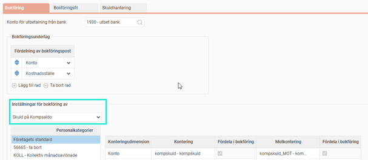
Ange de bokföringskonton du vill använda.
Välj genom att bocka i kryssrutorna vilka konteringsdimensioner skulden ska fördelas på.
För att även bokföra arbetsgivaravgifter på skulden, väljer du motsvarande skuld för arbetsgivaravgifter i listan och gör samma inställningar.
Beräkna skuld löpande (Skuldhantering)
Den löpande hanteringen med att beräkna och fastställa skulden gör du under
Lön > Skuldhantering
.
Välj vilken skuld du vill arbeta med under
Typ av skuld
.
Klicka på
Ny
för att skapa en ny skuldberäkning.
I dialogrutan väljer du beräkningstyp:
Bokföring av skuld:
Används för att fastställa den månatliga skulden som blir underlag för bokföringen.
Slutlön för anställd:
Används för att se hur stor den totala skulden är till en anställd som slutar. Detta kan användas som en kontroll vid slutlöneberäkning.
När beräkningen är skapad visas en lista över alla anställda som inte har fått sin slutlön utbetald.
Du kan klicka på en siffra i listan för att se detaljerad information om hur den har räknats fram och från vilken lönekörning saldot är hämtat.
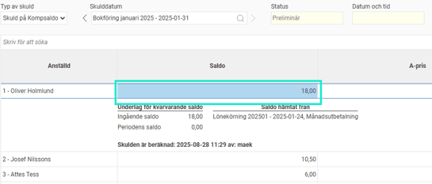
När du har kontrollerat att allt stämmer, klicka på
Markera som kontrollerad
. Skulden är nu redo att bokföras.
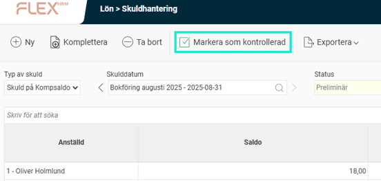
Skapa bokföringsunderlag
När skulden är fastställd kan du skapa ett bokföringsunderlag för överföring till ditt ekonomisystem.
Gå till
Lön > Bokföring
och klicka på
Ny
för att skapa ett nytt underlag.
I avsnittet
Bokför skuld
bockar du i de skulder du vill ha med. Endast skulder som har en fastställd beräkning visas här.
Välj om du vill bokföra den
totala skulden
för en viss månad, eller
förändringen
mellan två månader.
Använd kryssrutorna för att välja om själva skulden och/eller arbetsgivaravgifterna ska tas med.
Välj sedan vilken eller vilka skuldperioder som ska bokföras.
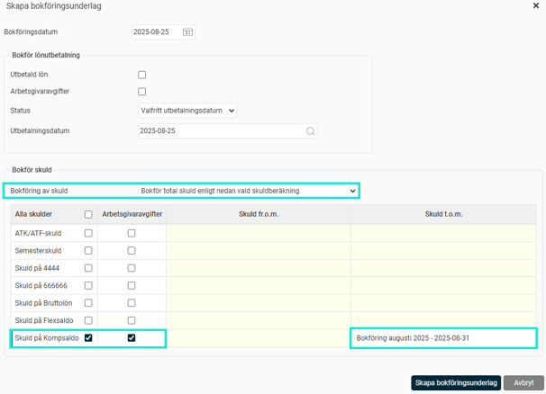
När underlaget är skapat kan du skriva ut en bokföringsorder och skapa en bokföringsfil.
Hantera slutlön
När en anställd slutar kan du enkelt betala ut ett kvarvarande saldo (till exempel komptid) med hjälp av funktionen för slutlön i löneberedningen.

I funktionen visas de ackumulatorer där du har aktiverat inställningen för skuld och slutlön.
Efter att du har beräknat slutlönen kan du på fliken för ackumulatorer i löneberedningen se att saldot är nollställt. Om du behöver kan du betala ut delar av saldot vid olika löneperioder.
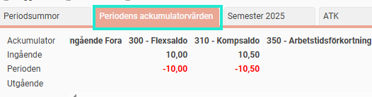
Om något blivit fel kan du ta bort lönearterna för slutlönen direkt i löneberedningen. Då återställs saldona.
Guide: Byta från kompskuld på lönearter till den nya funktionen
Om ditt företag tidigare har hanterat kompskuld via passiva lönearter i löneberedningen är det viktigt att du följer stegen nedan för att undvika dubbel bokföring.
Ta fram den senaste kompskulden.
Skapa en rapport (använd med fördel rapporten "Fördelning av antal och belopp") på de lönearter ni har använt för detta (till exempel löneart 960 och 961 i detta exempel).
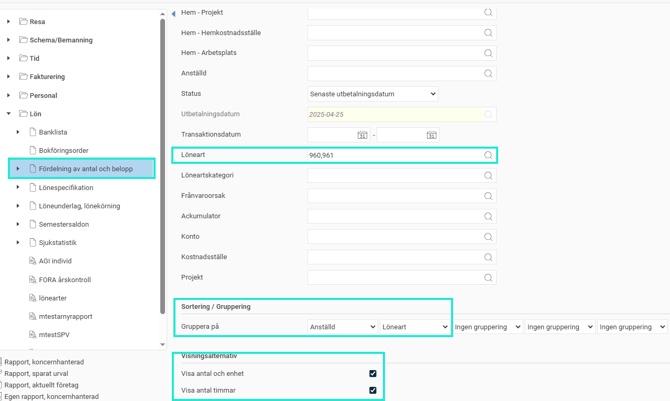
Inaktivera de gamla lönearterna.
På de lönearter som tidigare har beräknat skulden, gå till fliken
Allmänt
och ta bort bocken för
Överföring till bokföring
. Sätt dem även som inaktiva.
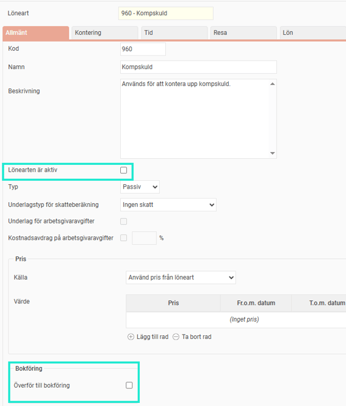
Ta bort den automatiska kopplingen.
Se till att lönearterna inte längre genereras automatiskt i löneberedningen (ofta finns kopplingen på lönearten för månadslönen). Gå in i löneartsregistret på vald löneart och
ta bort
de rader som genererar ut dessa lönearter.
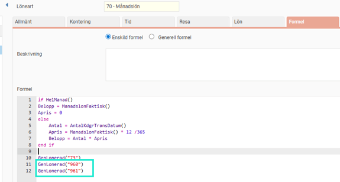
Skapa en ny kompskuld.
Använd den nya funktionen under
Lön > Skuldhantering
för att ta fram en skuld för samma månad.
Jämför skulderna
för att säkerställa att de stämmer överens.
Viktigt vid bokföring av förändring
Om du vill börja bokföra
förändringen
av skulden måste du först skapa en
total
skuld för månaden innan.
Exempel:
För att kunna bokföra förändringen av kompskulden i december måste du först skapa och fastställa en total skuld för november. Därefter kan du skapa underlaget för december och välja att bokföra förändringen.
