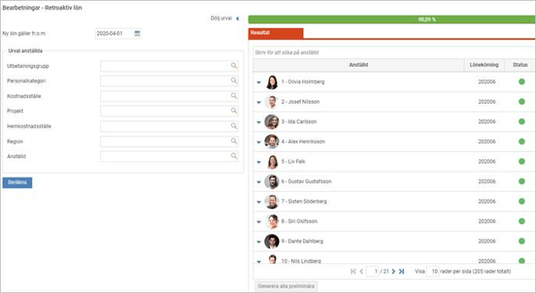
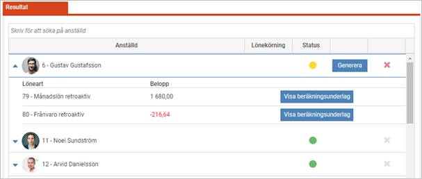
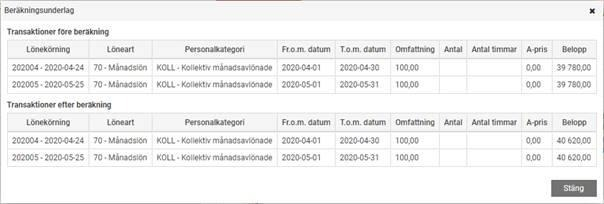
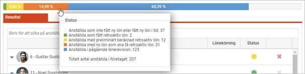
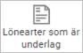
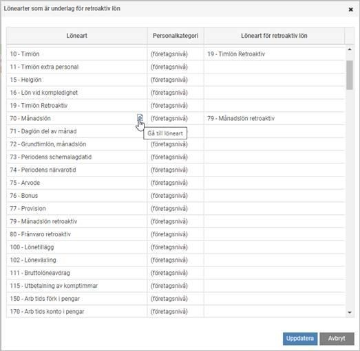
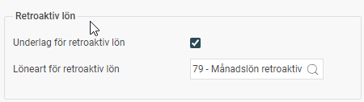
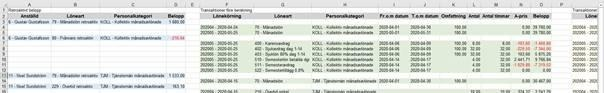
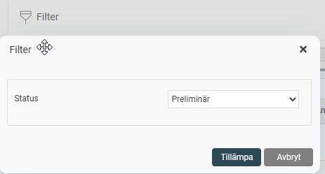
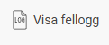

# Hur hanteras retroaktiv lön vid lönerevision i HRM Payroll?

**Datum:** den 17 december 2025  
**Kategori:** Payroll  
**Underkategori:** Semesterhantering  
**Typ:** howto  
**Svårighetsgrad:** advanced  
**Tags:** lön, löneart, semester  
**Bilder:** 10  
**URL:** https://knowledge.flexhrm.com/hur-hanteras-retroaktiv-l%C3%B6n-vid-l%C3%B6nerevision-i-hrm-payroll

---

Varje år genomförs vanligen en lönerevision för att sätta nya löner för medarbetarna. Det är vanligt att de nya lönerna blir klara efter att de har börjat gälla. Om det händer behöver du betala ut löneförhöjningen retroaktivt för tidigare löneperioder. Detta gäller inte bara retroaktiv månadslön, utan omfattar allt som påverkas av en ny lön, som till exempel frånvaroavdrag, sjuklön, semesterlön och föräldralön.
Så använder du funktionen Retroaktiv lön
Gå till
Administration > Bearbetningar > Retroaktiv lön
för att påbörja arbetet.
Gör urval för beräkning
Ange det datum som den nya lönen ska gälla från. Listan till höger och statusinformationen uppdateras baserat på ditt valda datum.
Tips: Nästa gång du går in i funktionen kommer Flex HRM att föreslå detta datum automatiskt.
Välj om du vill göra beräkningen för en specifik medarbetare, en grupp eller för alla. Om du inte gör ett aktivt urval tas alla medarbetare med som har fått en ny lön från det angivna datumet.
Klicka på
Beräkna
.
Kontrollera resultatet
När beräkningen är klar ser du resultatet i listan.

Du kan granska detaljerna för att säkerställa att allt är korrekt:
Klicka på raden för en medarbetare för att se den totala retroaktiva lönen.
Klicka på den
blå pilen
för att se detaljerade resultat per medarbetare.
Klicka på
Visa beräkningsunderlag
för att se exakt hur beloppet har räknats fram. I den övre listan ser du de ursprungliga transaktionerna och i den nedre listan ser du uträkningen med den nya lönen.

Om du upptäcker något fel kan du justera uppgifterna och klicka på
Beräkna
igen för den aktuella personen.
Generera retroaktiv lön
När du har kontrollerat att underlaget stämmer är det dags att föra över beloppen till lönekörningen (för att kunna utföra detta steg behöver du ha en öppen lönekörning):
För att generera för en person i taget: Klicka på
Generera
på medarbetarens rad.
För att generera för alla samtidigt: Klicka på
Generera alla preliminära
under listan.
Den retroaktiva lönen läggs nu till i den preliminära lönekörningen.
Statusinformation och överblick
Ovanför listan finns en stapel som visar status för årets lönerevision. De olika färgerna visar hur långt medarbetarna har kommit i processen.
Håll muspekaren över stapeln för att se vad färgerna betyder och hur många personer som finns i varje steg.
När hela fältet är grönt har alla fått sin retroaktiva lön utbetald och revisionen är klar.
Klicka på ett färgsegment för att se en lista på de medarbetare som ingår där. Om du klickar på den orangea delen ser du vilka som har fått ny lön men där retrolön ännu inte är beräknad. Du kan då använda snabbknappen längst ner för att starta beräkningen för dessa personer.

Se underlag för lönearter
I knappraden finns en knapp för att visa vilka lönearter som är underlag för retroaktiv lön.

När du klickar på den ser du:
En lista på alla berörda lönearter.
Vilken löneart som används för utbetalning av den retroaktiva lönen.
En genväg för att öppna löneartens inställningar i en ny flik om du behöver ändra något.

Inställningar – Lönearter
Inställning görs i  löneartsregistret under fliken
Lön
för att kunna ange vilka lönearter man ska beräkna retroaktiv lön på samt vilken löneart som retrolön ska läggas ut på, på fliken Lön:

Exportera till Excel
Du kan exportera beräkningsunderlaget för en eller flera medarbetare till Excel för att göra egna kontroller. I Excel-filen visas:
Blått:
Det uträknade retroaktiva beloppet.
Grönt:
Underlaget innan beräkning med den nya lönen.
Gult:
Underlaget efter beräkning med den nya lönen.

Filter och fellogg
Filter:
Som standard visas endast de medarbetare som har status
Preliminär
(de som ännu inte har genererats till en lönekörning). Om du vill se de som redan är klara ändrar du status i filtret.

Fellogg:
Om något går fel vid beräkning eller generering får du information om detta. I felloggen kan du se vilka medarbetare det gäller och vad felet beror på.

