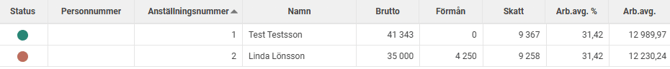
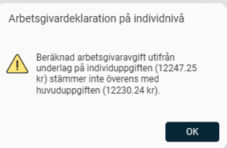
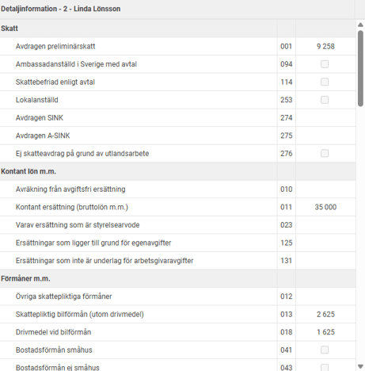
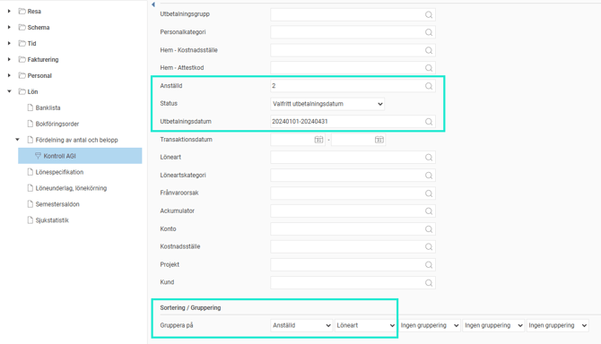
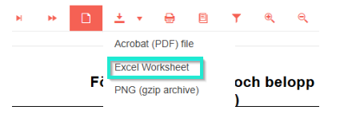
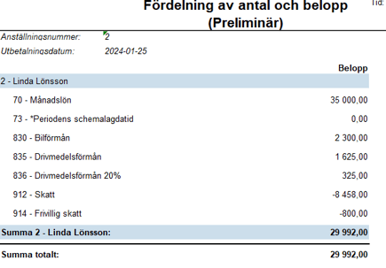
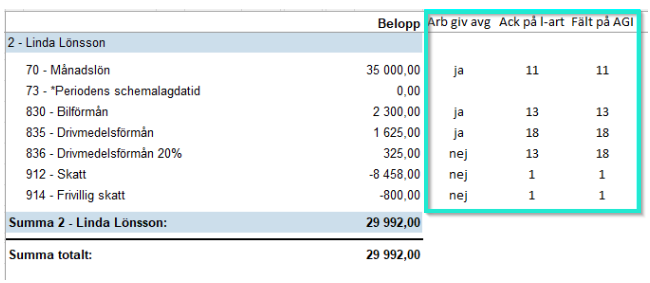
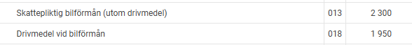

# Hur hittar jag orsaken till differenser i arbetsgivaravgifter (AGI) i Flex HRM Payroll?

**Datum:** den 25 september 2025  
**Kategori:** Payroll  
**Underkategori:** Skatt & AGI  
**Typ:** howto  
**Svårighetsgrad:** intermediate  
**Tags:** agi, lön, löneart, skatt  
**Bilder:** 8  
**URL:** https://knowledge.flexhrm.com/hur-hittar-jag-orsaken-till-diffar-i-skatt-och-arbetsgivaravgifter-agi-i-hrm-payroll

---

Artikeln beskriver hur du kan göra för att hitta orsaken till en differens avseende arbetsgivaravgifter.
Hur hittar jag differenser i skatt och arbetsgivaravgifter?
Om du i arbetsgivardeklarationen har fått en varning om att beräknad arbetsgivaravgift eller skatt inte stämmer mellan individuppgiften och huvuduppgiften kan du följa dessa steg för att undersöka orsaken till felet.
Exempel:
Vi får en varning på en anställd som indikeras i systemet med en röd boll till vänster.

Genom att klicka på
den röda bollen
får vi upp följande information om att det är arbetsgivaravgiften som inte stämmer.

Till höger kan vi se vilka belopp som redovisas per fält.

De fält som är underlag för arbetsgivaravgift i detta fall är fält 011, 013 och 018. Beloppet i ruta 018 är dock det uppräknade värdet för drivmedelsförmånen, vilket innebär att arbetsgivaravgift inte ska betalas för hela beloppet (utan beloppet delat på 1,2). Utifrån dessa uppgifter kan vi beräkna arbetsgivaravgifterna enligt följande:
(35 000 + 2 625+ (1 625/1,2)) × 31,42% = 12 247, 25
Detta belopp stämmer med vad meddelandet säger är redovisat i individuppgiften. Men på huvuduppgiften är en arbetsgivaravgift på 12 332 kr beräknat, vilket man kan se i huvudlistan. Detta är uträkningen systemet gör och meddelar om en differens finns.
För att hitta orsaken till felet behöver vi titta på den anställdes lönetransaktioner och kontrollera hur de är redovisade i arbetsgivardeklarationen på individnivå.
Gör så här:
Ta ut rapporten "Fördelning av antal och belopp" för den anställde och aktuell redovisningsperiod till Excel med följande urval.

Exportera rapporten till Excel.

Vi får då ut följande i Excel:

Lägg manuellt in dessa tre kolumner och fyll i vilka rader som ska vara underlag för arbetsgivaravgifter, vilken ackumulator lönearten styr till enligt löneartsregistret och vilket fält i AGI som ackumulatorn styrs till enligt ackumulatorregistret.

Efter att ha fyllt i ser vi att löneart 836, Drivmedelsförmån, 20%, styrs till ackumulator 13 (istället för 18) och därmed till fel fält även på AGI. Den ska styras till ack nr 18 och fält 18 på AGI.
För att korrigera detta rättar vi löneart 836, så att den styr till ackumulator 18 – Drivmedelsförmån. Därefter räknar vi om AGI-underlaget genom att komplettera underlaget för alla anställda eller berörd anställd. När vi har gjort detta ändras värdet i ruta 18 till 1 950 kr som är det korrekta värdet, och den röda bollen lyser nu grönt.

Relaterade artiklar:
Hur arbetar jag med arbetsgivardeklaration på individnivå i Flex HRM Payroll?
Hur gör jag en rättelse av ett fel i tidigare arbetsgivardeklarationer (AGI) i
HRM Payroll?
Hur arbetar jag med arbetsgivardeklaration på individnivå i Flex HRM Payroll?
