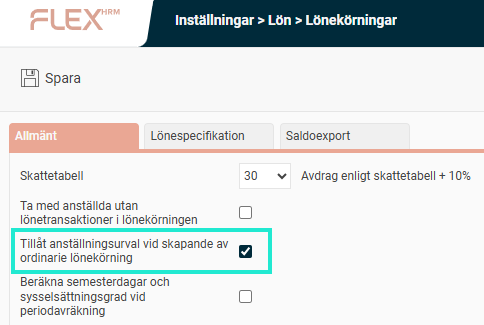
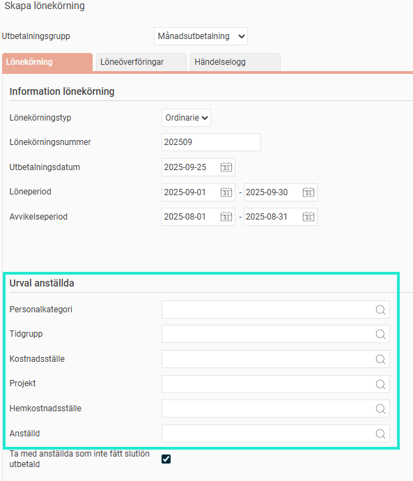

# Hur kan jag göra urval på anställda när jag skapar en ordinarie lönekörning i Flex HRM Payroll?

**Datum:** den 2 oktober 2025  
**Kategori:** Payroll  
**Underkategori:** Löneberedning  
**Typ:** howto  
**Svårighetsgrad:** intermediate  
**Tags:** lön  
**Bilder:** 2  
**URL:** https://knowledge.flexhrm.com/hur-kan-jag-g%C3%B6ra-urval-p%C3%A5-anst%C3%A4llda-n%C3%A4r-jag-skapar-en-ordinarie-l%C3%B6nek%C3%B6rning-i-flex-hrm-payroll

---

För att kunna göra urval på anställda i en ordinarie lönekörning krävs det att man aktiverar inställningen "Tillåt anställningsurval vid skapande av ordinarie lönekörning".
När man skapar en ny lönekörning i Flex HRM Payroll är det standard att man
inte
ska kunna göra urval på anställningsnummer; detta på grund av att risken att missa någon anställd. Man har endast den möjligheten när man skapar en extra lönekörning. Men, i vissa fall kan man vilja göra urval på anställda även i en ordinarie lönekörning. För detta krävs att man aktiverar en inställning.
Inställningen hittar du under menyns
Administration > Inställningar > Lön > Lönekörningar
och den heter "Tillåt anställningsurval vid skapande av ordinarie lönekörning".

När den är inställd går det att göra urval på anställda när du skapar en ny ordinarie lönekörning.

