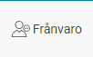
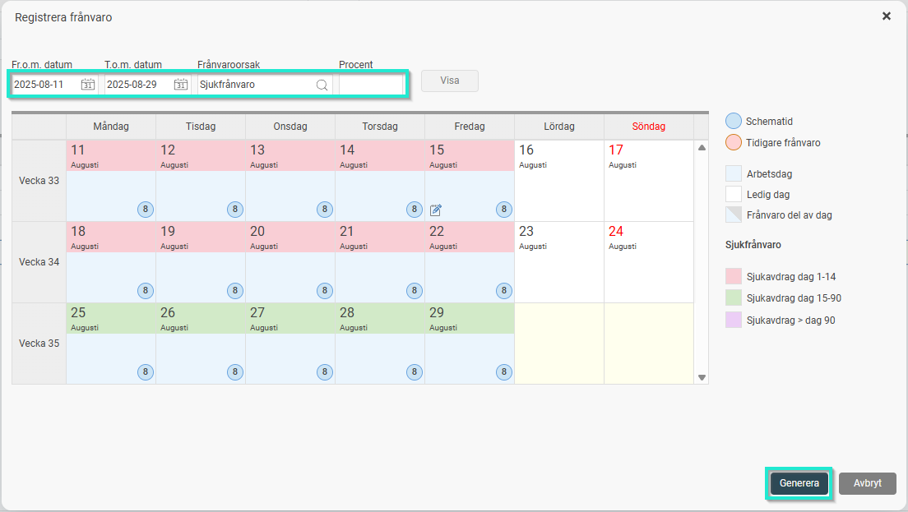

# Hur lägger jag till en frånvarotransaktion manuellt i löneberedningen?

**Datum:** den 7 oktober 2025  
**Kategori:** Payroll  
**Underkategori:** Löneberedning  
**Typ:** howto  
**Svårighetsgrad:** advanced  
**Tags:** lön, löneart  
**Bilder:** 2  
**URL:** https://knowledge.flexhrm.com/hur-l%C3%A4gger-jag-till-en-fr%C3%A5nvarotransaktion-direkt-i-l%C3%B6neberedningen

---

Denna artikel beskriver hur du registrerar frånvaro för korrekt beräkning direkt i lönekörningen.
Frånvaro läggs in i lönekörningen/registreras via frånvarohanteraren, klicka på Knappen Frånvaro.

Detta för att systemet ska föreslå rätt löneart utifrån reglerna på frånvaroorsakerna (t.ex. arbetsdagsavdrag vs kalenderdagsavdrag/ sjukfrånvaro utifrån var i frånvarokedjan medarbetaren är dag 1-).
Ange datum, frånvaroorsak och omfattning i frånvarofönstret (om ingen omfattning anges beräknas frånvaron som 100%) och klicka på Visa. Du ser då föreslaget avdrag och lägger ut detta i löneberedningen genom att klicka på Generera.

