# Hur rapporterar jag pension till Fora månadsvis i Flex HRM Payroll?

**Datum:** den 11 november 2025  
**Kategori:** Payroll  
**Underkategori:** Löneberedning  
**Typ:** howto  
**Svårighetsgrad:** advanced  
**Tags:** lön, löneart, pension  
**Bilder:** 15  
**URL:** https://knowledge.flexhrm.com/hur-rapporterar-jag-pension-till-fora-m%C3%A5nadsvis-i-hrm-payroll

---

Denna artikel beskriver hur du månadsrapporterar till Fora i Flex HRM Payroll: från att skapa underlag och fil till uppladdning på Foras hemsida, inklusive beräkningar.
Ny uppmärkning av anställda
Nytt regelverk för premieberäkning – Lön hänförlig till annan månad
Löpande arbete för rapportering till Fora
Skapa fil för rapportering
Skicka in filen till Fora
Fördjupad information om hur underlaget skapas
Observera att tjänstemän inte omfattas av det nya regelverket ännu och ska därför fortsatt rapporteras in årligen.
Den nya uppmärkningen av anställda
Uppmärkning är grunden för att företagets arbetare ska omfattas av rätt försäkringar och får rätt premier inbetalda till sin tjänstepension. I samband med övergången till månatlig lönerapportering till Fora 2024 ska alla arbetare tilldelas en ny uppmärkning.
Uppmärkningen består av en FOK-kod och representerar ett kollektivavtal eller en grupp i ett kollektivavtal. De flesta företag kommer endast att ha en uppmärkningskod för alla arbetare, men om du tillämpar flera olika kollektivavtal
kommer du ha flera olika koder som de anställda ska märkas upp med. Du hittar företagets uppmärkningskoder på Foras Mina sidor.
Läs mer på Foras hemsida om hur uppmärkningen fungerar.
Nytt regelverk för premieberäkning – Lön hänförlig till annan månad
I samband med övergången till månadshantering kommer pensionspremien beräknas per månad utifrån gränsen 7,5 inkomstbasbelopp (IBB) delat på tolv månader.
För lönedelar som understiger 7,5 IBB/12 är premien 4,5 procent.
För lönedelar som överstiger 7,5 IBB/12 är premien 30,0 procent.
Om den pensionsgrundande lönen för en viss månad innehåller lönedelar som hör till andra månader än utbetalningsmånaden eller avvikelseperioden (månaden innan), ska de rapporteras som ”lön hänförlig till annan månad”. På så sätt kan man fördela lönen på rätt månad och kan undvika att få en hög premie den månaden man betalar ut lönedelar som avser tidigare månader. Det är upp till arbetsgivaren att särskilja vilka delar av lönen som är hänförliga till andra månader i rapporteringen till Fora.
Exempel på användningsområden kan vara när en anställd under en period har tjänat in prestations- eller ackordslön, eller där annat än ordinarie månadslön har betalats ut.
Läs mer om hur hänförlig lön ska fördelas längre ned i denna artikel.
Löpande arbete för rapportering till Fora
Varje månad ska man rapportera löneunderlag för arbetare till Fora. Uppgifterna redovisas på individnivå, och består i huvudsak av pensionsgrundande lön samt en uppmärkning som talar om vilket kollektivavtal den anställde omfattas av. Detta gör du i Flex HRM Payroll under Lön – Pension.
Skapa underlag
Första steget i rapporteringen är att skapa ett underlag för månadens rapportering. Detta gör du genom att välja Rapportering till Fora och därefter klicka på knappen Ny i knappraden.
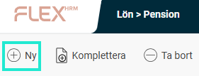
Du väljer här redovisningstyp månad samt vilken månad du vill rapportera löneunderlag för. Du kan också välja att göra urval på anställda om du skulle vilja.
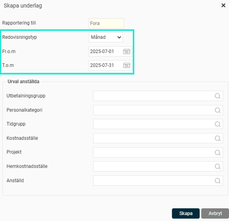
När du klickar på knappen
Skapa
påbörjas arbetet med att skapa underlag. När underlaget är skapat ser du underlaget med statusen satt som
Preliminär
i vyn.
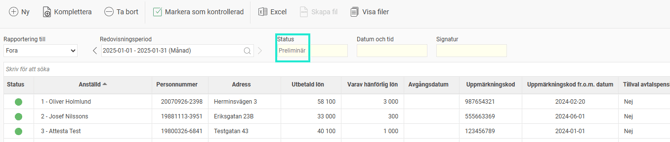
Komplettera och ta bort underlag
Om du hittat ett fel i underlaget kan du beräkna om underlaget för alla eller ett urval av anställda genom att klicka på knappen
Komplettera
och där göra önskat urval.
Du kan också ta bort ett underlag genom att klicka på knappen
Ta bort
, om du vill börja om från början eller inte längre vill ha underlaget sparat.
Kontrollera underlaget
Nästa steg är att kontrollera underlaget innan du skickar in uppgifterna till Fora. Detta gör du genom att granska underlaget i vyn.
Överst i vyn väljer du vilken rapportering (om du har fler än Fora) samt vilken redovisningsperiod du vill titta på. Tidigare redovisningar finns kvar och är enkelt tillgängliga.
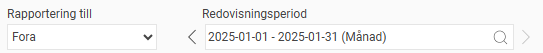
I listan visas underlaget för alla arbetare som sammanställts och som kommer med i filen till Fora. Ovanför listan finns ett sökfält där du kan söka på olika uppgifter, såsom namn och personnummer.
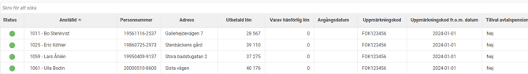
Först på varje rad ser du en status som ger en indikation på om något är fel eller borde tittas närmare på. Här får du t.ex. en varning om en anställd saknar personnummer eller samordningsnummer, samt om den anställde saknar uppmärkning trots att det finns en anställning. Om systemet inte hittar några avvikelser visas en grön boll. Detta betyder dock inte att alla uppgifter i underlaget är korrekta, bara att ingen varning har registrerats.
I kolumnen för
Varav hänförlig lön
kan du klicka i fältet för att se detaljer om vilka månader som den hänförliga lönen kommer fördelas på. Läs mer om hur hänförlig lön beräknas i avsnittet för
fördjupad information om hur underlag skapas
.
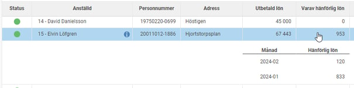
Om den anställde har haft fler uppmärkningar under rapporteringsmånaden visas en siffra inom parentes i kolumnen för uppmärkningskoden. Genom att klicka på den anställdes uppmärkningskod kan du se alla de uppmärkningar som rapporteras för den anställde. Här ser du också de tillval som rapporteras.
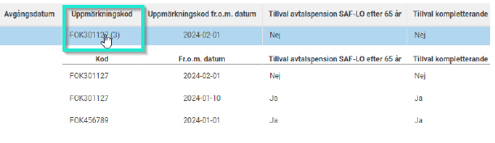
När underlaget är granskat markerar du underlaget som kontrollerat genom att klicka på knappen
Markera som kontrollerad
i knappraden.
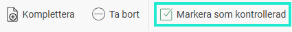
Statusen på underlaget ändras då till
Kontrollerad
, vilket innebär att underlaget nu är låst för ändringar. Datum, tid samt signatur för användaren som markerade underlaget som kontrollerat sparas ner på underlaget.
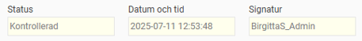
Om du hittar ett fel i ett kontrollerat underlag kan du ta bort kontrollmarkeringen igen. Då sätts statusen om till
Preliminär
, och du kan nu komplettera underlaget igen. När du därefter markerar underlaget som kontrollerat igen sätts en ny tidpunkt när underlaget blev kontrollerat för att du ska kunna se om filen som skickats in till Fora är skapad från det senast uppdaterade underlaget.
Skapa fil för rapportering
När underlaget är markerat som kontrollerat kan du skapa filen för redovisning av arbetare till Fora. Detta gör du med knappen för
Skapa fil
i knappraden.
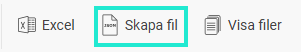
I dialogen som öppnas ser du vilken period som kommer med i filen.
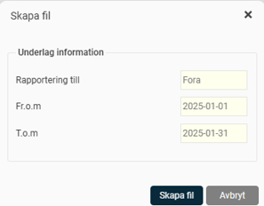
När filen är skapad visas en notis om detta på sidan.
Du kan välja att ladda ner filen för rapportering genom att klicka på länken i notisen.
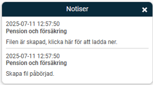
Du kan också se och hämta filen för rapportering samt felloggar genom att klicka på knappen
Visa filer
i knappraden.
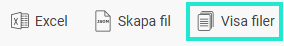
Filen kvar till dess att du väljer att ta bort den från listan. Filerna visas för det underlag du står på i vyn.
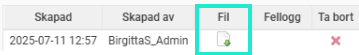
Om något fel upptäckts när filen skapades, visas information om det via en notis på sidan. Du kan se fler detaljer om vad som är fel genom att öppna loggfilen.

Skicka in filen till Fora
När filen är skapad i Flex HRM laddar du ner den enligt ovan och skickar in den till Fora. Detta gör du genom att logga in på Foras hemsida och där följa instruktionerna för rapportering av arbetare via fil.
För information om hur du rättar fel i tidigare rapportering, klicka på
länken nedan:
"Hur rättar redan jag inlämnad rapportering till Fora?"
Fördjupad information om hur underlaget skapas
Nedan hittar du detaljerad information om hur underlaget skapas i systemet.
Grundläggande principer
Den grundläggande principen för rapporteringen per månad till Fora är att allt som berör rapporteringsmånaden kommer med.
Pensionsgrundande lön som betalas ut under månaden
Uppmärkningskoder som avser anställningsperioder som pågår under månaden
Vilka anställda tas med i underlaget till Fora?
En anställd tas med enligt följande villkor:
Den anställde har en anställningsperiod markerad som kategori Arbetare under rapporteringsmånaden.
Om den anställde fått pensionsgrundande lön utbetald under månaden med ett utbetalningsdatum där man inte har en anställningsperiod och man tidigare haft en anställning som arbetare. Detta kommer då räknas som slutlön för anställningen som arbetare.
Observera att alla kommer med i rapporteringen oberoende av ålder. Detta innebär dock inte att den anställde kommer tjäna in pensionspremier. Pensionspremien beräknas av Fora som tar hänsyn till avtalstillhörighet, ålder samt om man har gjort tillvalen att fortsätta tjäna in pension efter 65 år.
Sammanslagning per personnummer
Om en anställd har flera anställningsnummer kommer underlagen för dessa att slås ihop, då rapportering till Fora endast kan göras med en post per personnummer.
Följande gäller:
Pensionsgrundande lön samt hänförlig lön kommer summeras för samtliga anställningsnummer.
Uppmärkningskoder och tillval för det anställningsnummer med högst sysselsättningsgrad kommer redovisas till Fora. Om flera anställningsnummer har samma sysselsättningsgrad kommer det lägsta anställningsnumret användas. Detta beror på att det är den huvudsakliga anställningen man ska rapportera uppmärkningskoden för.
Beräkning av löneunderlag
Den pensionsgrundande lönen och den hänförliga lönen som rapporteras är det som har utbetalats under rapporteringsmånaden och där något av följande kriterier stämmer:
Det finns en anställningsperiod som Arbetare på utbetalningsdatumet.
Då det inte finns en anställningsperiod på utbetalningsdatumet men det finns en tidigare anställningsperiod som Arbetare. Detta kommer räknas som slutlön.
De lönearter som räknas med i underlaget som utbetald lön är de som är markerade som Fora – Avser lön.
De lönearter som räknas med i underlaget som varav hänförlig lön är de som är markerade som Fora – Avser hänförlig lön. Lönearter som avser hänförlig lön ska alltså ha båda kryssrutorna markerade.
Fördelning av hänförlig lön per månad
Den hänförliga lönen som avser lön för tidigare perioder ska fördelas på de månader den avser. Detta görs genom att beloppet för varje lönetransaktion först delas på antalet kalenderdagar mellan lönetransaktionens start- och slutdatum för att få ett värde per dag.
Slutlön sparad se
mester ska däremot inte få annat transaktionsdatum i löneberedningen, vi har i bakgrunden byggt in att systemet rapporterar det som hänförlig lön utifrån Foras regler (dvs hänförs till de 12 månader som föregår månaden då den sista anställningsdagen inträffar).
Därefter räknar man ut hur många dagar som tillhör respektive månad och multiplicerar med värdet per dag för att få värdet per månad.
Exempel:
Följande två transaktioner utbetalda i redovisningsmånad april
2024-01-01 - 2024-02-28; 8 850 kr (värde per dag blir då 8 850/59 = 150 kr)
2024-01-16 - 2024-03-31; 15 000 kr (värde per dag blir då 15 000/75 = 200 kr)
Dessa delas upp enligt följande:
2024-01: 7 850 kr  (4 650 kr från transaktion 1 och 3 200 kr från transaktion 2)
2024-02: 9 800 kr  (4 200 kr från transaktion 1 och 5 600 kr från transaktion 2)
2024-03: 6 200 kr  (200 x 31=6 200 kr från transaktion 2)
Uppmärkningskoder och slutdatum på anställning
Utgångspunkten för uppmärkningen som tas med i rapporteringen är alla anställningsperioder som Arbetare som helt eller delvis infaller under rapporteringsmånaden. För arbetare som slutat i tidigare månad och får slutlön utbetald skickas ingen uppmärkningskod då slutlönen kopplas ihop med redan rapporterad uppmärkning hos Fora.
Den uppmärkning som kommer gälla följder denna prioriteringsordning:
I första hand gäller den uppmärkning som ligger på den anställde i anställdaregistret, fliken Pension & försäkring.
Om uppmärkning enligt första punkten saknas för en period då det finns en anställning som arbetare kommer uppmärkningen hämtas från anställningsperiodens gällande personalkategori om denne har uppmärkningskod.
Om personalkategorin också saknar uppmärkningskod kommer ingen uppmärkning komma med i rapporteringen för den anställde. Du behöver då göra uppmärkningen manuellt på Foras Mina sidor.
Slutdatum för anställning skickas om det finns en anställningsperiod som Arbetare som slutar under rapporteringsmånaden, även om det finns fler anställningsperioder efter rapporteringsmånaden då varje anställningsperiod rapporteras separat. Om det finns flera anställningsperioder som slutar under månaden är det det sista slutdatumet som kommer med i rapporteringen. Detta beror på en begränsning i filen till Fora som bara kan innehålla ett slutdatum per anställd och månad.
Relaterade artiklar:
Vilka inställningar krävs för att rapportera månadsvis till Fora i HRM Payroll?
Hur hanteras Foras FOK-koder i Flex HRM Payroll?
Hur rättar jag redan inlämnad rapportering till Fora i HRM Payroll?
