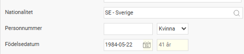

# Hur registrerar jag samordningsnummer eller medarbetare som ännu inte fått ett samordningsnummer/personnummer?

**Datum:** den 1 december 2025  
**Kategori:** Payroll  
**Underkategori:** Skatt & AGI  
**Typ:** howto  
**Svårighetsgrad:** intermediate  
**Tags:** agi, skatt  
**Bilder:** 2  
**URL:** https://knowledge.flexhrm.com/hur-registrerar-jag-samordningsnummer-eller-medarbetare-som-%C3%A4nnu-inte-f%C3%A5tt-ett-samordningsnummer/personnummer

---

Samordningsnummer är en identitetsbeteckning för personer som inte är eller har varit folkbokförda i Sverige. Syftet med samordningsnummer är att myndigheter och andra samhällsfunktioner ska kunna identifiera personer även om de inte är folkbokförda i Sverige. I HRM Payroll används samordningsnummer t.ex. för rapportering av arbetsgivardeklaration (AGI).
För att kunna registrera ett samordningsnummer måste
nationalitet Svensk väljas under fliken Personuppgifter.
Samordningsnumret anges i fältet för Personnummer på fliken Personuppgifter.

Om samordningsnummer eller svenskt personnummer saknas lämnas fältet för personnummer blankt och födelsedatum anges istället tillsammans med värden i fälten Födelseort och Landskod födelseort på fliken Skatt i anställningsregistret.

