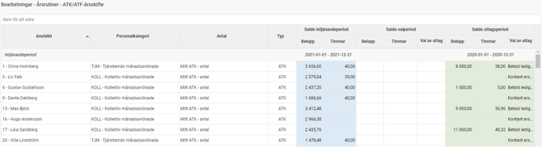
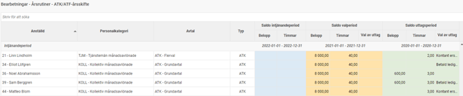
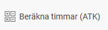
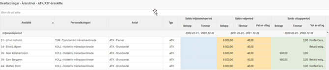
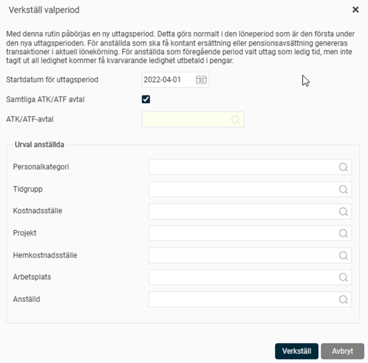
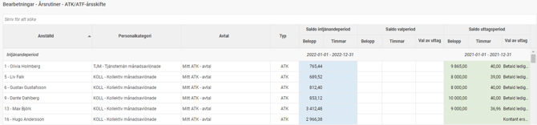
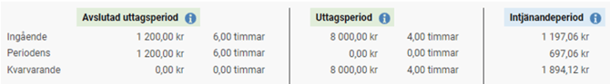
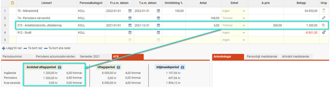
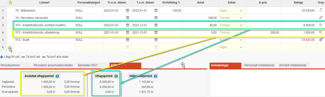

# Hur ser de årliga rutinerna för arbetstidskonto (ATK) ut?

**Datum:** den 23 oktober 2025  
**Kategori:** Payroll  
**Underkategori:** Löneberedning  
**Typ:** howto  
**Svårighetsgrad:** advanced  
**Tags:** lön, löneart, pension  
**Bilder:** 11  
**URL:** https://knowledge.flexhrm.com/hur-ser-de-%C3%A5rliga-rutinerna-f%C3%B6r-atk-ut

---

Artikeln beskriver de olika rutinerna som ska köras under året om du använder ATK.
Årscykel för ATK i HRM Payroll
Här beskriver vi de olika rutiner du behöver köra under året när du använder ATK (arbetstidskonto). Stegen utgör en cykel som upprepas varje år.
Observera att om det är första gången du använder funktionen för ATK i HRM Payroll, är det inte säkert att du ska börja med steg ett.
1. Påbörja ny intjänandeperiod
Det första steget i årscykeln är att starta en ny intjänandeperiod. Detta ska du göra när den sista lönekörningen för den gamla intjänandeperioden är helt klar och avräknad, men innan du skapar den första lönekörningen för den nya perioden.
Om intjänandeperioden enligt kollektivavtalet startar den 1 januari, ska du alltså vara helt klar med lönekörningen för december innan du påbörjar lönekörningen för januari.
Det är mycket viktigt att du inte påbörjar den nya intjänandeperioden innan du är helt säker på att inga fler utbetalningar ska göras under den gamla perioden, eftersom det inte går att ångra det här steget.
Gör så här:
Gå till
Administration > Bearbetningar > Årsrutiner > ATK/ATF-skifte
. I översiktsvyn ser du de anställda som har en pågående intjänandeperiod och en uttagsperiod.

Klicka på knappen
Påbörja ny intjänandeperiod
högst upp.
I fönstret som öppnas anger du startdatum för det nya intjänandeåret. Systemet kommer då att hitta alla anställda med ett ATK-avtal som har samma startdatum.

Markera kryssrutan
Beräkna antal timmar för betald ledig tid
om systemet samtidigt ska beräkna hur många timmars ledighet den anställde får ta ut för den period som precis avslutats. Detta är samma beräkning som beskrivs i steg två och det är vanligt att man gör detta samtidigt.
Du kan göra urval på ett specifikt ATK/ATF-avtal eller på anställda om du vill köra rutinen för en grupp i taget.
Starta rutinen genom att klicka på
Skapa
.
När beräkningen är klar uppdateras listan. Du ser nu den nya, tomma intjänandeperioden i den blå kolumnen. Den avslutade intjänandeperioden har flyttats till de gula kolumnerna för valperioden. Det är dessa intjänade pengar som den anställde nu ska välja vad hen vill göra med.

2. Beräkna timmar (ATK)
Om den anställde enligt avtalet kan välja att ta ut sitt arbetstidskonto som betald ledig tid, behöver du räkna ut antalet timmar hen kan vara ledig. Detta görs oftast i samband med att du påbörjar den nya intjänandeperioden (se föregående steg), men kan också köras separat.
Du kör beräkningen genom att klicka på knappen
Beräkna timmar (ATK)
i översiktsvyn. Beräkningen görs bara på den anställdes valperiod och kan köras flera gånger.

Beräkningen baseras på schematiden för intjänandeåret, med hänsyn till eventuell frånvarotid. Utifrån detta underlag beräknas sedan antalet timmar med den intjänandeprocent som är angiven för ATK.
Formel för beräkning:
A = Antal schematimmar under intjänandeperioden
B = Antal frånvarotimmar från lönearter markerade med ”Räkna som frånvarotid (ATK)” under intjänandeperioden.
Observera att summering görs för de lönerader som har ett datum under intjänandeåret. Transaktioner utan datum räknas tillhöra avvikelseperiodens tom-datum.
Antal timmar = (A–B) × ATK avsättning %
Resultatet avrundas och kontrolleras mot den maxgräns som finns inställd i ATK/ATF-avtalet.
3. Den anställdes val
Nästa steg är att den anställde väljer vad hen vill göra med sitt intjänade arbetstidskonto. Om de anställda inte har något val, till exempel om avtalet endast tillåter uttag i ledig tid, anger du detta som standardval i ATK/ATF-avtalet och kan gå direkt till nästa steg.
För anställda som ska göra ett val anger du en deadline i ATK/ATF-avtalet. Du kan också ställa in påminnelser via e-post, notiser i HRM Mobile eller på startsidan i Flex HRM, för att påminna anställda och chefer om att det är dags att göra ett val.
Den anställde gör sitt val på startsidan i Flex HRM, i panelen för ATK/ATF. Tänk på att den anställde måste ha behörighet till denna panel. Efter att valet är inskickat kan den anställde ändra sitt svar fram till deadline.
Som administratör kan du alltid registrera den anställdes val manuellt i anställdaregistret under fliken
ATK/ATF
.
4. Verkställ val och påbörja ny uttagsperiod
När alla anställda har gjort sina val ska du verkställa dem. Denna rutin påbörjar även en ny uttagsperiod för de som valt ledig tid och skapar transaktioner i löneberedningen för de som valt kontant ersättning, pensionspremie eller har kvarvarande tid som ska betalas ut.
På grund av detta måste det finnas en preliminär lönekörning för alla berörda anställda innan du kör rutinen. Detta bör vara den första ordinarie lönekörningen i den nya uttagsperioden.
Viktigt att tänka på:
Rutinen för att verkställa val ska köras som ett sista steg i lönekörningen, efter att du har hämtat in avvikelser som frånvaro. Detta för att saldot för ATK-ledighet ska räknas ner korrekt innan eventuell kvarvarande tid betalas ut.
Den här rutinen går inte att backa.
Gör så här:
Kontrollera i översiktsvyn att alla anställda har gjort ett val i de gula kolumnerna. Om du använder ett standardval för de som inte väljer aktivt, behöver inte alla ha gjort ett val.

Klicka på knappen
Verkställ val och påbörja ny uttagsperiod
.
I dialogrutan anger du startdatum för den nya uttagsperioden.

Du kan göra urval på avtal eller anställda. Det kan vara en bra idé att först testa på en enskild anställd för att säkerställa att alla lönearter fungerar som de ska.
Klicka på
Verkställ
.
När rutinen är klar ser du i översiktsvyn att valperioden har blivit den nya uttagsperioden.

Längst ned i löneberedningen, under fliken
ATK
, kan du nu se både den avslutade uttagsperioden (där eventuellt kvarvarande saldo har betalats ut) och den nya uttagsperioden.

Exempel på utfall i löneberedningen
Exempel 1:
En anställd hade kvar lediga timmar från föregående period och har valt betald ledig tid även för den nya perioden. Systemet betalar då ut kvarvarande saldo från det avslutade året, och det nya saldot för uttagsperioden visas.

Exempel 2:
En anställd har kvarvarande saldo från föregående period som betalas ut (markerat i gult). För den nya perioden har hen valt att få pengarna utbetalda (markerat i blått). Både den avslutade och den nya uttagsperioden nollställs.

Exempel 3:
En anställd hade 20 timmar kvar vid lönekörningens start och tog ut 16 timmar i slutet av perioden. Efter att avvikelser hämtats in körs rutinen för att verkställa val. De återstående fyra timmarna betalas då ut. Hen har även valt kontant ersättning för den nya perioden, vilket också betalas ut.

5. Inbetalning av extra pensionsavsättning
Om anställda har valt extra pensionsavsättning behöver detta hanteras manuellt.
Du kan enkelt ta fram ett underlag genom rapporten
Fördelning av antal och belopp
. Välj att summera den löneart du använder för pensionsavsättning och gruppera per anställd för att få en tydlig lista.
Utifrån listan genomför du sedan den extra pensionsavsättningen enligt ert kollektivavtal och den pensionsförsäkring ni använder.
Relaterade artiklar:
Vad är arbetstidskonto (ATK) och arbetstidsförkortning (ATF)?
Hur fungerar den löpande hanteringen av ATK och ATF?
