# Hur ser de årliga rutinerna för ATF ut?

**Datum:** den 24 november 2025  
**Kategori:** Payroll  
**Underkategori:** Löneberedning  
**Typ:** howto  
**Svårighetsgrad:** advanced  
**Tags:** agi, lön, löneart, pension  
**Bilder:** 13  
**URL:** https://knowledge.flexhrm.com/hur-ser-de-%C3%A5rliga-rutinerna-f%C3%B6r-atf-ut

---

Stegen nedan utgör den cykel som upprepas varje år.
1. Påbörja ny intjänandeperiod
Första steget i cykeln är att påbörja en ny intjänandeperiod.
Detta ska göras när den sista
lönekörnin
gen under den gamla intjänandeperioden är avräknad, och innan den första
lönekörningen under den nya intjänandeperioden skapas. Om intjänandeperioden enligt
kollektivavtalet startar 1 januari ska
man alltså vara helt klar med lönekörningen för
december, men innan man påbörjar lönekörningen för januari månad.
Det är viktigt att du inte påbörjar den nya intjänandeperioden innan du är helt säker på att inga fler utbetalningar ska göras under den gamla intjänandeperioden, då det inte går att backa detta steg.
För att påbörja en ny intjänandeperiod går du in i översiktsvyn under Administration –
Bearbetningar – Årsrutiner – ATK/ATF-skifte. Här bör de anställda du ska påbörja en ny
intjänandeperiod för i översiktsvyn ha en pågående intjänandeperiod (den som ska avslutas),
och en uttagsperiod. Det kan då se ut så här.
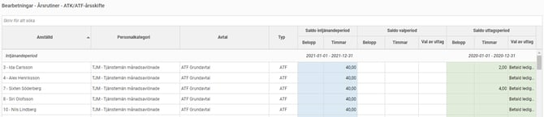
Högst upp i knappraden klickar du på
Påbörja ny intjänandeperiod
. Du får då upp urvalsvynför att starta en ny intjänandeperiod.
Överst anger du startdatumet för det nya intjänandeåret. Systemet kommer använda detta
datum för att hitta alla anställda med ett ATF-avtal med samma startdatum och påbörja en
ny intjänandeperiod för dessa.
Kryssrutan för att Beräkna antal timmar för betald ledig tid gäller endast anställda med ATK
och påverkar inte alls de som har ATF.
Du kan också göra urval på ett specifikt ATK/ATF-avtal samt urval på anställda om du vill
påbörja en ny intjänandeperiod för en grupp i taget.
När du gjort dina urval startar du rutinen genom att klicka på Skapa. När beräkningen är klar
uppdateras listan och du ser resultatet.
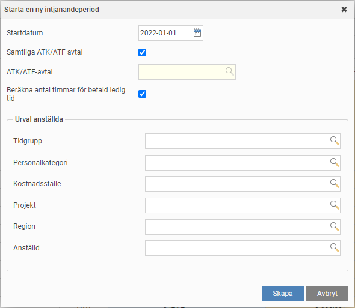
I den blåa kolumnen ser du den nya intjänandeperioden som är tom då de anställda ännu
inte tjänat in något. Här kommer värden fyllas på så snart en lönekörning skapas för den nya
perioden. Den avslutade intjänandeperioden har ny hamnat i de gula kolumnerna för
valperioden. Det är dessa intjänade timmar som den anställde, beroende på avtalet, ska välja
vad hen vill göra med. Om man har ett avtal där man inte kan välja visas uttagstypen direkt
som i bilden nedan.
De gröna kolumnerna längst till höger är fortfarande oförändrade.
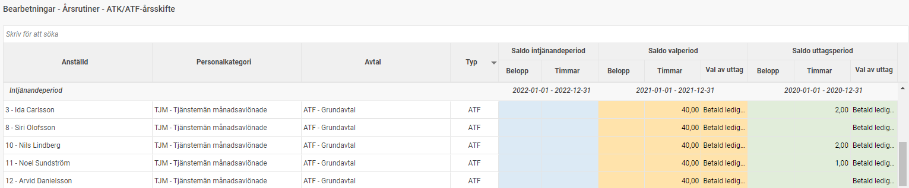
2. Den anställdes val
Om den anställde enligt avtal ska kunna välja vad man ska göra med de intjänade timmarna
sker detta som nästa steg.
Om de anställda inte kan välja, t.ex. om man enligt avtal bara får ta ut som ledig tid, då anger man detta som standardval i ATK/ATF-avtalet och kan direkt köra rutinen Verkställ val och påbörja ny uttagsperiod som nästa steg (se nästa punkt).
För anställda som ska göra ett val anger man i ATK/ATF-avtalet en deadline då den anställde
senast ska ha gjort sitt val. Om man önskar kan man också ställa in påminnelser till den
anställde och/eller chefer att det är dags att gå in och göra sitt val eller påminna om att
deadline närmar sig. Påminnelser kan man få både som e-post, notiser i HRM Mobile
eller via startsidan i Flex HRM.
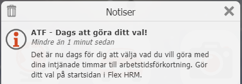
Själva valet gör den anställde på startsidan i Flex HRM i panelen för ATK/ATF. Tänk på att den
anställde måste ges behörighet till denna panel. Nedan ser du ett exempel på hur det ser ut
för en anställd som inte gjort sitt val ännu.
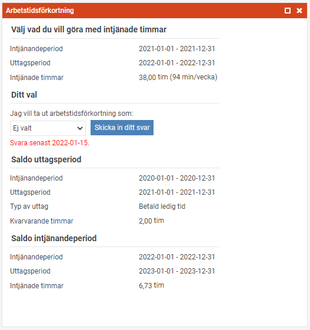
När den anställde gjort sitt val och skickat in svar ser det ut som i bilden nedan. Den
anställde kan enkelt ändra sitt svar även i efterhand om så önskas.
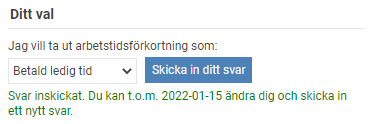
Som administratör kan du alltid lägga in den anställdes val direkt i anställdaregistret, på fliken
ATK/ATF.
3. Verkställ val och påbörja ny uttagsperiod
När alla anställda gjort sitt val/alternativt om inget val ska göras ska skiftet verkställas, och en ny uttagsperiod påbörjas för de som erhåller  ledig tid. Denna rutin genererar också transaktioner i löneberedningen för de anställda som valt kontant ersättning, pensionspremie (passiv löneart) samt de som har kvarvarande tid från föregående uttagsperiod som ska betalas ut.
På grund av detta måste det finnas en preliminär lönekörning för alla anställda som ska
verkställas innan rutinen körs. Detta bör vara den första ordinarie lönekörningen i den nya
uttagsperioden.
Exempel:
Om uttagsperioden enligt avtal börjar den 1 januari ska du först starta den ordinarie lönekörningen med utbetalning i januari.
Tänk på att rutinen för verkställande ska köras som ett sista steg i lönekörningen, dvs efter
att man hämtat in avvikelser (frånvaro) från föregående månad. Detta för att räkna ner saldot
för uttag av ATF-ledighet i slutet av den gamla uttagsperioden innan den nya uttagsperioden
startas och kvarvarande ledighet från den gamla perioden betalas ut.
Innan du verkställer den anställdes val och påbörjar en ny intjänandeperiod bör du befinna
dig i läget enligt bilden nedan. I de gula kolumnerna för aktuell valperiod bör de se att de
anställda gjort sitt val om detta tillämpas enligt avtal. Om du tillämpar ett standardval för de
som inte gjort sitt val är det okej om inte alla gjort något val, annars behöver du se till att alla
gjort ett val.
Du kan också titta lite på de gröna kolumnerna för den gamla uttagsperioden. Där bör det
inte finnas så mycket kvarvarande timmar.
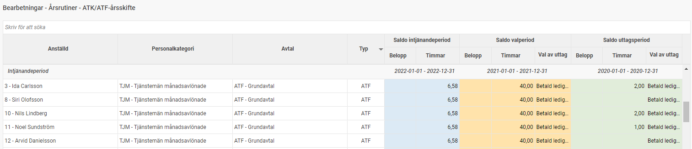
Om allt ser bra ut kan du nu köra själva rutinen för att Verkställa val och påbörja ny uttagsperiod.
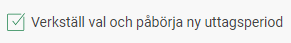
I dialogrutan anger du startdatumet för den nya uttagsperioden. Detta datum används för att
hitta alla anställda med ett avtal där uttagsperioden stämmer med detta datum. Du kan
också göra urval på ATK/ATF-avtal eller en grupp av anställda om du inte vill köra för alla anställda på en gång. Det kan vara bra att testa på en enstaka anställd först för att se att alla
lönearter fungerar korrekt.
När du klickar på Verkställ startar rutinen. Observera att denna rutin inte går att backa. När
beräkningen är klart ser du i översiktsvyn att valperioden är borta och nu har blivit den nya
uttagsperioden.
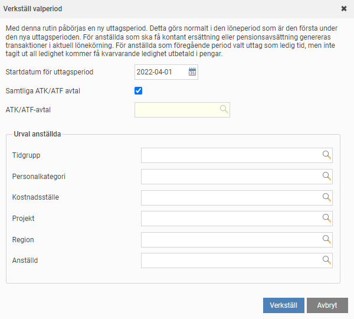
När du klickar på
Verkställ
startar rutinen. Observera att denna rutin inte går att backa. När
beräkningen är klart ser du i översiktsvyn att valperioden är borta och nu har blivit den nya
uttagsperioden.
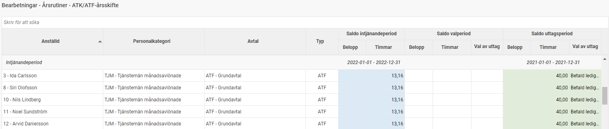
I löneberedningen, på fliken ATF, kan man nu se två uttagsperioder i den lönekörningen där
verkställandet av ny uttagsperiod gjorts. Dels den nu avslutade uttagsperioden där
eventuellt kvarvarande saldo betalats ut, dels det nya uttagsåret som den anställde nyligen
valt hur de vill ta ut.
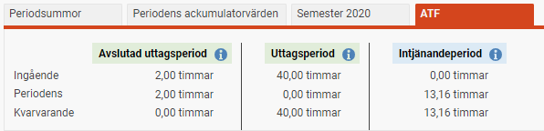
Exempel
Nedan visar vi exempel på hur det kan bli för anställda i olika scenarier.
Exempel 1:
En anställd har under föregående uttagsperiod valt betald ledig tid, men har inte tagit ut alla
timmar. Den anställde har också i den nya uttagsperioden valt betald ledig tid. Systemet
kommer då betala ut kvarvarande timmar från det avslutande året. För det nya uttagsåret ser
man det nya saldot.
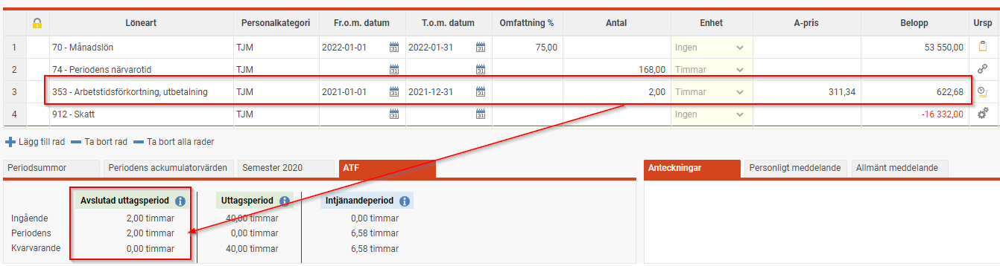
Exempel 2:
En anställd har 4 timmar betald ledighet kvar från den föregående uttagsperioden då
lönekörningen startades. Den anställde tog ut 3 av dessa som betald ledig tid i slutet av
uttagsperioden (löneart 352). Dessa har hämtats in från tidrapporten som vanligt uttag av
ATF-ledighet. Därefter har man kört rutinen för att verkställa den anställdes val och påbörja
en ny uttagsperiod. Då den anställde har ytterligare 1 timme kvar i den avslutade
uttagsperioden betalas detta ut (löneart 353).
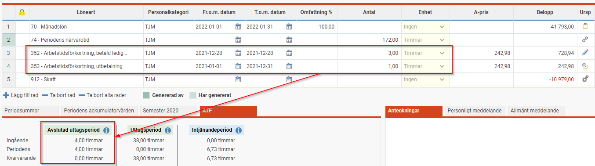
4. Inbetalning av extra pensionsavsättning
Om du har ett avtal som tillåter det och har anställda som valt avsättning som extra
pensionsavsättning behöver detta hanteras manuellt (för rapportering till Fora, se ”Skapa fil
för extra pensionspremie till Fora). Du kan enkelt sammanställa de belopp som ska avsättas
per anställd genom att ta ut rapporten Fördelning av antal och belopp. Välj att summera den
löneart/de lönearter du använder för pensionsavsättning, och gruppera per anställd för att få
en bra lista.
När du tagit fram listan behöver du sedan utföra den extra pensionsavsättningen till de
anställda enligt ditt kollektivavtal och den pensionsförsäkring ni använder.
