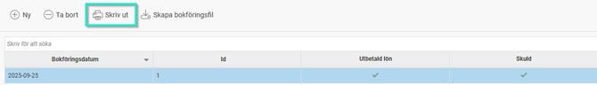
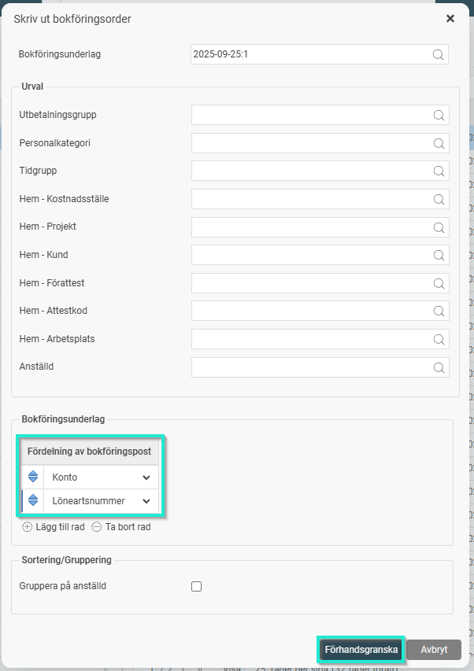
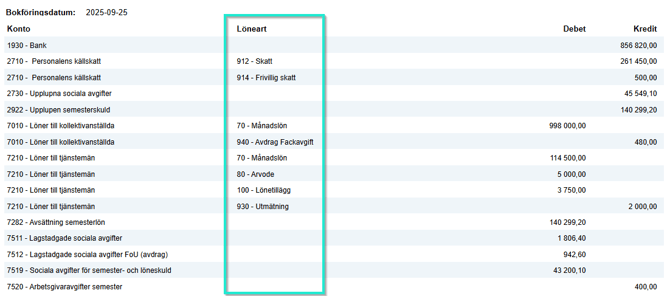
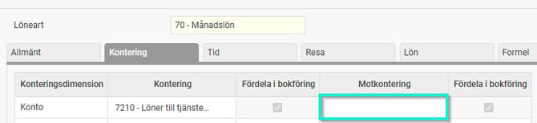
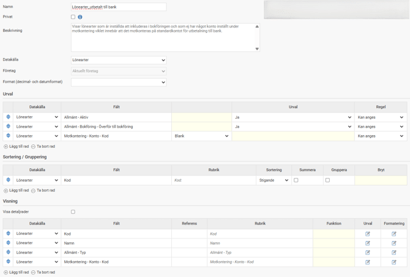

# Hur ser jag vilka belopp och poster som bokförts på ett specifikt konto i bokföringsunderlaget?

**Datum:** den 10 oktober 2025  
**Kategori:** Payroll  
**Underkategori:** Bokföring  
**Typ:** howto  
**Svårighetsgrad:** intermediate  
**Tags:** bokföring, lön, löneart  
**Bilder:** 5  
**URL:** https://knowledge.flexhrm.com/hur-ser-jag-vilka-belopp-och-poster-som-bokf%C3%B6rts-p%C3%A5-ett-specifikt-konto-i-bokf%C3%B6ringsunderlaget

---

För att se vilka lönearter som har bokförts på ett specifikt konto, förhandsgranskar du bokföringsunderlaget. Under inställningen Fördelning bokföringspost, väljer du att visa Konto och Löneartsnummer.
Om du vill se vad som har bokförts på ett specifikt konto i bokföringen kan du förhandsgranska bokföringsunderlaget.
Genom att använda olika inställningar för förhandsgranskningen kan du specificera exakt vilken information du vill se.
För att till exempel se vilka lönearter som har bokförts på ett visst konto gör du så här:
Gå till
Lön > Bokföring
och välj det aktuella bokföringsunderlaget i listan. Klicka sen på Skriv ut.

Under inställningen
Fördelning bokföringspost
, väljer du att visa
Konto och Löneartsnummer
. Klicka sen på Förhandsgranska.

I förhandsgranskningen ser du då vilka lönearter som har bokförts på respektive konto.

Tips: Vill du istället se konteringar t.ex. på ett visst kostnadsställe eller per anställningsnummer kan du välja att visa den/de konteringsnivåerna i fördelningsposten. Här kan du ta bort och lägga till fält utefter ditt behov, det påverkar bara hur vyn skrivs ut/förhandsgranskas. Dina ursprungliga inställningar kommer tillbaka nästa gång du går in under Skriv ut.
Belopp som saknar löneart bokas enligt inställningarna under
Bokföring och skuldhantering
(skulder, arbetsgivaravgifter, avdrag på arbetsgivaravgifter, utbetalning till bank).
Kontot för utbetalning till bank summerar alla lönearter som har en inställning att skickas till bokföringen och som ej har något motkonto angivet under fliken Kontering i fältet Motkontering.

För att se vilka lönearter som inkluderas i bokföringen och ej har ett motkonto kan en rapport i Rapportgeneratorn användas.
1. Välj Datakälla Lönearter.
2. Gör urval på Aktiva lönearter med inställning att överföras till bokföring och blankt i fältet Motkontering - Konto - Kod.
3. Sortera på Löneartens kod.
4. Välj att visa följande fält: Löneartens kod och namn, löneartens typ och fältet för motkontering- konto- kod.

