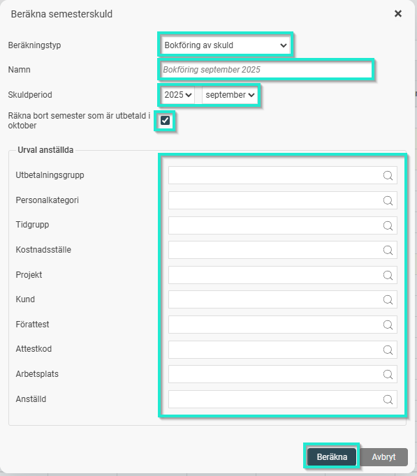
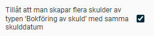
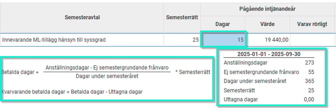
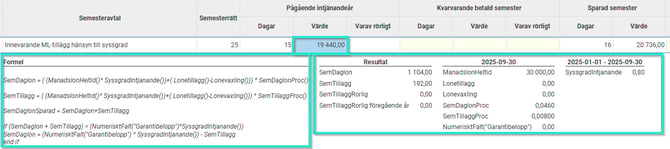

# Hur skapar jag en beräkning av skuld (t.ex. semesterskuld, kompskuld) i HRM Payroll?

**Datum:** den 7 oktober 2025  
**Kategori:** Payroll  
**Underkategori:** Bokföring  
**Typ:** howto  
**Svårighetsgrad:** advanced  
**Tags:** bokföring, lön, semester  
**Bilder:** 6  
**URL:** https://knowledge.flexhrm.com/hur-skapar-jag-en-ber%C3%A4kning-av-skuld-t.ex.-semesterskuld-kompskuld-i-hrm-payroll

---

I HRM Payroll kan du beräkna olika typer av skulder, till exempel semesterskuld eller kompskuld. Du gör detta under funktionen för skuldhantering.
Så här beräknar du en skuld
Gå till
Lön > Skuldhantering
.
Välj vilken typ av skuld du vill beräkna i fältet
Typ av skuld
och klicka sedan på
Ny
.

I fönstret som öppnas fyller du i inställningarna för din beräkning:
Beräkningstyp
: Välj
Bokföring av skuld
.
Skuldperiod
: Ange vilken period beräkningen gäller.
Inkludera uttagen semester
: Om du beräknar en semesterskuld, anger du här om uttag från den aktuella löneperioden ska inkluderas (förutsätter att ni aktiverat inställningen "Räkna bort semester som betalas ut månaden efter skulddatumet" under Inställningar > Lön > Bokföring och skuldhantering).
Urval
: Du kan också göra kompletterande urval på exempelvis personalkategori eller konteringar om du inte vill beräkna för alla.

4.  Klicka på
Beräkna
för att starta beräkningen enligt dina val.
Skapa flera skulder för samma period
För att kunna skapa flera skulder för samma period behöver du först aktivera en inställning.
Gå till
Inställningar > Lön > Bokföring och skuldhantering
och välj fliken
Skuldhantering
. Bocka i rutan
Tillåt att man skapar flera skulder av typen ‘Bokföring av skuld’ med samma skulddatum
.

Granska beräkningen
När beräkningen är klar visas en skuldlista där du ser medarbetarens semesteravtal och semesterrätt samt tillhörande skuldvärden. För att se hur systemet har kommit fram till de olika värdena kan du klicka i listan.
Klicka på ett specifikt värde i listan för att se formeln och de olika parametrar som ingår i uträkningen. Formeln för beräkningen av dagarnas värde kommer från semesteravtalet.

Kontrollmarkera skulden för användning i bokföringsunderlag
För att kunna ta ut ett bokföringsunderlag på skulden behöver du slutligen kontrollmarkera skuldlistan. Det gör du genom att klicka på knappen Markera som kontrollerad.

