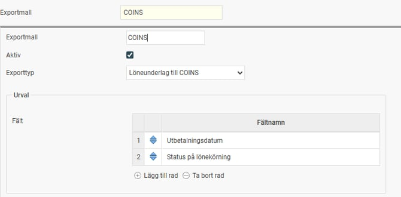
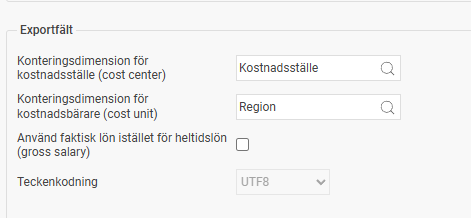
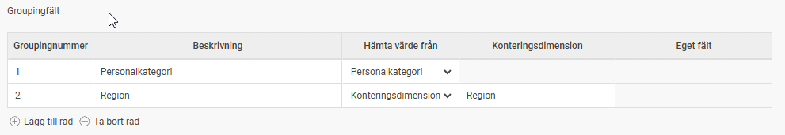

# ⚙️Hur skapar jag en COINS-fil?

**Datum:** den 21 november 2025  
**Kategori:** Payroll  
**Underkategori:** Löneberedning  
**Typ:** howto  
**Svårighetsgrad:** intermediate  
**Tags:** lön, pension  
**Bilder:** 3  
**URL:** https://knowledge.flexhrm.com/hur-skapar-jag-en-coins-fil

---

COINS är FörsäkringsGirots system för administration av olika försäkringar som t.ex. pensionsförsäkringar. För att COINS ska kunna beräkna många av sina uppgifter krävs att grundinformation om anställda och utbetalda löner exporteras från ett lönesystem till COINS via en XML-fil. Denna XML-fil används också av andra aktörer i branschen.
Tilläggsmodul
För att kunna använda denna funktion behöver du tilläggsmodulen Flex HRM COINS. Kontakta våra säljare för mer information och beställning.
När du har aktiverat tilläggsmodulen på systemnivå går du in under
Administration - Allmänt - Företag
, fliken
Licens
, för att aktivera COINS för de företag där du vill använda denna funktion.
Skapa exportfil för löneunderlag till COINS
För att kunna exportera en fil med uppgifter till COINS måste du först skapa en
exportmall
. I exportmallen väljer du vilka uppgifter som ska inkluderas i filen.
Skapa exportmall
Gå till
Administration > Inställningar > Allmänt > Exportmallar
.
Välj att skapa en
ny exportmall
.
Välj exporttypen
Löneunderlag till COINS
.
Gör dina val under rubrikerna
Urval
och
Exportfält
.
Urval
Under
Urval
väljer du vilka fält du ska kunna filtrera på när du skapar exportfilen.
Utbetalningsdatum:
Vi rekommenderar att du alltid inkluderar urval på
utbetalningsdatum
. Det gör att du enkelt kan skapa en fil med endast den senaste månadens utbetalning.
Lönekörningens status:
Du kan också välja urval på lönekörningens status. Detta ger dig möjlighet att exportera preliminära lönekörningar.

Exportfält
Under
Exportfält
bestämmer du vilka specifika uppgifter som ska komma med i filen.
Val för exportfält
Beskrivning
Konteringsdimension för kostnadsställe (cost center)
Om du vill ha med uppgifter om den anställdes kostnadsställe anger du här vilken konteringsdimension det motsvarar i Flex HRM.
Konteringsdimension för kostnadsbärare (cost unit)
Om du vill ha med uppgifter om den anställdes kostnadsbärare anger du här vilken konteringsdimension det motsvarar i Flex HRM.
Använd faktisk lön istället för heltidslön (gross salary)
Normalt exporteras heltidslönen i fältet för
gross salary
. Om du i stället vill exportera den faktiska lönen för deltidsanställda kan du välja det här.
Teckenkodning
Ska alltid vara
UTF8
och kan inte ändras.

Groupingfält
Här väljer du vilka uppgifter som ska skickas med i filens så kallade
groupingfält
.
Groupingnummer:
Börja oftast på
1
för det första groupingfältet. Detta värde hamnar i fältet
id
i filen.
Beskrivning:
Ange en text som kommer att hamna i fältet
typeDesc
i filen.
Hämta värde från:
Välj vilken typ av uppgift som ska hämtas. Det är vanligt att inkludera till exempel
personalkategori
.
Du kan även exportera valfri konteringsdimension eller värde från ett eget fält. Du måste då specificera vilken konteringsdimension/vilket eget fält som ska exporteras i de två följande kolumnerna.

Skapa exportfilen
När du har skapat din exportmall kan du skapa själva exportfilen.
Gå till
Administration > Bearbetningar > Servicerutiner > Export
.
Välj
namn
och
filnamn
för exporten.
Välj den exportmall du skapade för COINS.
Välj de
urval
du vill tillämpa.
Att tänka på vid skapande av exportfilen
Filändelse:
Filen ska helst ha filändelsen
.xml
.
Utbetalningsdatum:
Vi rekommenderar att du alltid använder urval på utbetalningsdatum. Om du inte gör det kommer
alla
utbetalningar att exporteras.
Om du till exempel vill skapa en exportfil för föregående månads utbetalning gör du lämpliga urval på datumet.
Lönekörningens status:
Om du i exportmallen valde att inkludera urval för lönekörningens status, kan du här välja om du ska ta med endast
avräknade
, endast
preliminära
eller
båda
.
Schemalägg exporten
Du kan även automatisera uttaget av exportfilen genom att schemalägga exporten. Gå till
Administration > Inställningar > Allmänt > Schemalagda körningar
.
Vad inkluderas i filen?
Filen innehåller en rad uppgifter om den anställde som hämtas från anställningsregistret, samt alla lönetransaktioner från den aktuella lönekörningen. Här beskriver vi de viktigaste detaljerna om de uppgifter som exporteras.
Vilka anställda kommer med?
En anställd inkluderas i filen om något av följande kriterier är uppfyllt:
Hen har fått
lön utbetald
under den valda perioden.
Hen har
slutit sin anställning
inom sex månader före den valda perioden (detta för att få med information om de som slutat).
Hen har en
anställning
under den valda perioden (detta för att få med nyanställda).
Flera anställningsnummer på samma personnummer
Om en person har flera anställningsnummer med samma personnummer, kommer lönetransaktionerna för dessa att slås ihop och rapporteras på ett av anställningsnumren.
Det anställningsnummer som används är det som har den mest aktuella anställningsperioden.
Vid parallella anställningar används det anställningsnummer som har högst sysselsättningsgrad.
Flera utbetalningar under en månad
Om det finns flera utbetalningar under den valda perioden kommer alla att inkluderas i exporten. De läggs in på det högsta utbetalningsdatumet för att inkludera extrautbetalningar under samma månad.
Viktigt:
Var noga med att
inte
inkludera flera månader i urvalet. Det finns då risk för dubbelrapportering av underlag, vilket kan vara svårt att upptäcka.
Frånvaroperioder från HRM Time
Om ni använder HRM Time exporteras även de anställdas beviljade frånvaroansökningar för:
Sjukdom
Tjänstledighet
Föräldraledighet
Dessa exporteras tolv månader framåt i tiden och läggs i fältet
employmentStatus
i filen.
