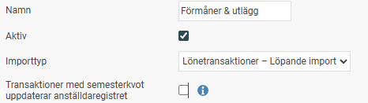
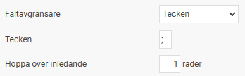
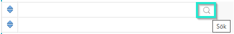
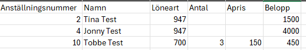
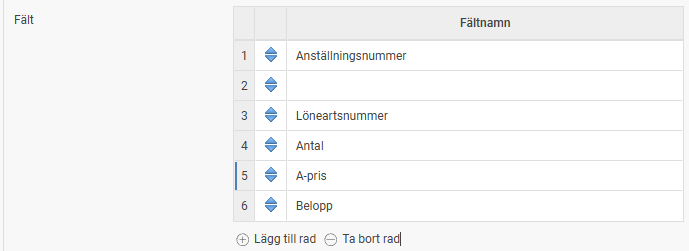
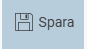

# ⚙️Hur skapar jag en importmall för att kunna importera/läsa in lönetransaktioner i löneberedningen?

**Datum:** den 2 oktober 2025  
**Kategori:** Payroll  
**Underkategori:** Inställningar  
**Typ:** howto  
**Svårighetsgrad:** intermediate  
**Tags:** lön, löneart, semester  
**Bilder:** 6  
**URL:** https://knowledge.flexhrm.com/hur-g%C3%B6r-jag-f%C3%B6r-att-importera-i-l%C3%B6neberedningen-l%C3%B6netransaktioner

---

Denna artikel går igenom stegen för att skapa en importmall för att kunna importera en fil med lönetransaktioner i löneberedningen i HRM Payroll.
För att kunna importera/läsa in transaktioner från en fil behöver du först skapa en importmall , detta görs under
Administration >Inställningar > Import/export> importmall.
Ge din nya mall ett namn och välj importtypen Lönetransaktioner - Löpande import. Om filen innehåller transaktioner med semesterkvot uppdateras denna i anställdaregistret om bocken för detta är ifylld.

Ange hur fältavgränsningen ser ut i filen. Tecken och
;
motsvarar en kommavgränsad (.csv) fil som kan skapas i excel.

Nästa steg blir att ange vilka fält som ska läsas in och i vilken ordning de kommer i filen. Tänk på att läsa beskrivningen så att importfilen blir korrekt! Varje rad motsvarar en kolumn i filen, rad 1 = första kolumnen, rad 2 = andra kolumnen o.s.v.
Vill du se hela listan med tillgängliga fält kan du klicka på förstoringsglaset i fältet.

Om din fil t.ex. innehåller följande kolumner: Anställningsnummer, Namn, Löneart, Antal, Apris, Belopp

ska din importmall innehålla motsvarande fält (då namn inte är ett fält i löneberedningen lägger du ett tomt fält i mallen så struntar den i värdena i filen i den kolumnen):

Spara din mall.

