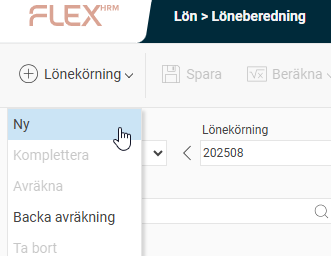
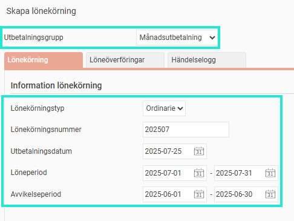
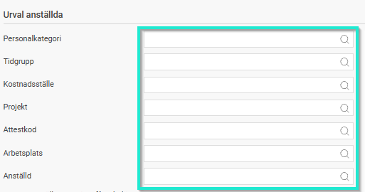
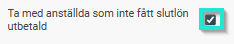
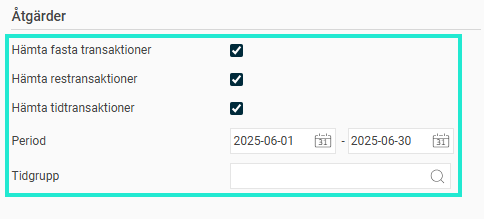
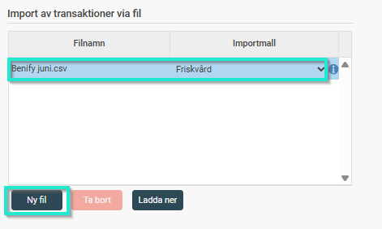
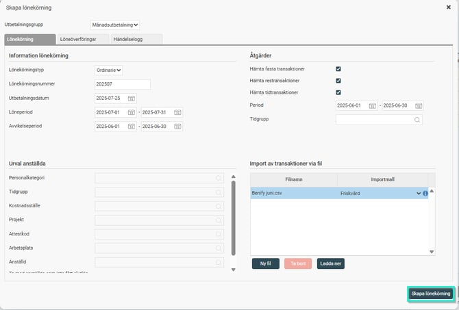

# Hur skapar jag en ny lönekörning i HRM Payroll?

**Datum:** den 7 oktober 2025  
**Kategori:** Payroll  
**Underkategori:** Löneberedning  
**Typ:** howto  
**Svårighetsgrad:** advanced  
**Tags:** lön  
**Bilder:** 7  
**URL:** https://knowledge.flexhrm.com/hur-skapar-jag-en-ny-l%C3%B6nek%C3%B6rning-i-payroll

---

Denna artikel går igenom stegen för att skapa (öppna) en ny lönekörningsperiod i Payroll.
Skapa en ny lönekörning
För att kunna skapa en lönekörning behöver du dels ha behörigheter för Lön på din roll samt en användare i Lön.
Funktionen för att skapa en ny lönekörning når du via
Lön > Löneberedning.
I denna funktion skapas en ny lönekörning och systemet förbereder registrering av den nya perioden. Fasta transaktioner för perioden hämtas automatiskt från personregistret. Om integration finns med Flex HRM Travel eller Flex HRM Time inkluderas även transaktioner därifrån. Du kan också importera egna filer i löneberedningen, förutsatt att en importmall har skapats.
Klicka på knappen
+Lönekörning
och välj
Ny
.

Ett nytt fönster öppn
as där du måste göra urval för den lönekörning du vill skapa. Baserat på dina systeminställningar för lönekörningar får du förslag på urval som kan redigeras.
Information Lönekörning
Utbetalningsgrupp - Det första steget är att välja den utbetalningsgrupp för vilken du önskar skapa lönekörningen. Du kan välja bland de grupper som finns registrerade i systemet under
Administration > Inställningar > Lön > Utbetalningsgrupper
.
Lönekörningstyp – Ange först aktuell lönekörningstyp: extra eller ordinarie. Förutsättningen för att kunna skapa en extra lönekörning är att en ordinarie lönekörning har körts för vald utbetalningsgrupp. En extra lönekörning gör du om du har missat något och det är för sent att ändra i den ordinarie lönekörningen. Genom att klicka på förstoringsglaset i fältet för lönekörningsnummer kan du välja vilken lönekörning som ska köras extra.
Lönekörningsnummer – I fältet Lönekörningsnummer (ordinarie lönekörning) respektive Extrakörningsnummer (extra lönekörning) anger du numret för den aktuella lönekörningen. Lämpligt är att ange årtal samt den månad, vecka eller annan periodicitet som lönekörningen avser. Har du valt ett lönekörningsnummer och klickat på
Skapa lönekörning
kan du inte ändra detta i efterhand.
Löneperiod – I detta fält anger du första och sista datum i den period som lönekörningen avser. Detta värde kan ändras även efter det att lönekörningen har initierats.
Avvikelseperiod – I detta fält anger du datumintervall under vilket avvikelserna ska gälla.

Urval Anställda
Lönekörningen gäller för alla anställda i den valda utbetalningsgruppen. Det går per default inte att ange urval vid en ordinarie lönekörning pga. av risken att missa någon anställd (om man ändå vill ha funktionen krävs det att man aktiverar inställningen "
Tillåt anställningsurval vid skapande av ordinarie lönekörning
"). Däremot går det att välja urval på anställda vid en extra lönekörning.
Om man inte önskar köra på alla går det att ”Ta bort” ett urval av personer. Välj då
Ta bort
och välj vilka som ska sorteras bort. Du kommer att få en lista på hur många som kommer att tas bort.

Här väljer du också om du vill ta med anställda som avslutat sin anställning men ä
nnu inte fått slutlön utbetald.

Åtgärder
Hämta fasta transaktioner – Detta fält ska markeras om systemet ska hämta in de fasta transaktioner som finns registrerade för respektive person. Dessa transaktioner registreras under
Personal –>Anställda  > Lön > Fasta transaktioner
. Dessa transaktioner är sådana som återkommer regelbundet vid varje löneutbetalning, som t.ex. månadslön, lönetillägg, fackavgift och dyl. Du slipper då registrera dessa på nytt vid varje ny löneberedning. OBS! Systemet hämtar endast fasta transaktioner för den aktuella löneperioden, inget retroaktivt.
Hämta resetransaktioner – Detta fält ska markeras om systemet ska hämta in transaktioner för de reseräkningar som är attesterade och klara för utbetalning (vid integration med Flex HRM Travel).
Hämta tidtransaktioner – Detta fält ska markeras om systemet ska hämta in transaktioner för de tidrapporter som är klara för utbetalning enligt angivet tidsintervall i fältet Period och ev. angiven tidgrupp i fältet Tidgrupp (vid integration med Flex HRM Time).

Import av transaktioner via fil
Här kan du välja en fil som ska importeras i lönekörningen.  För att denna funktion skall fungera och synas måste man först ha skapat en importmall för import av lönetransaktioner, det kan du läsa mer om
här
.  För mer information om import av transaktioner via fil kan du även läsa
här
.

När du är klar med dina urval, klickar du på knappen
Skapa lönekörning
. Detta öppnar en preliminär löneberedning där du kan göra ändringar/tillägg.

