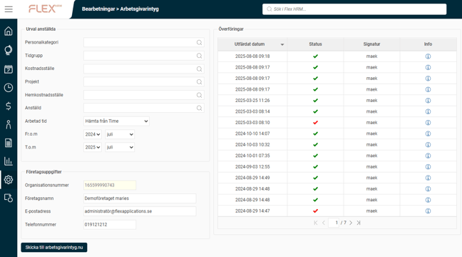
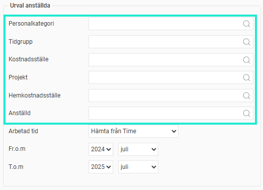
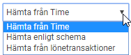
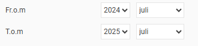
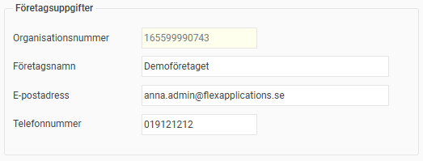
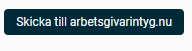
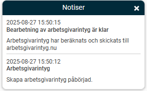
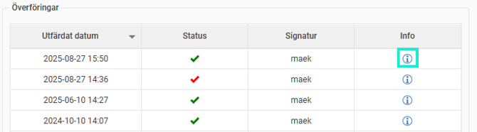

# Hur skapar jag ett arbetsgivarintyg i Flex HRM Payroll?

**Datum:** den 7 oktober 2025  
**Kategori:** Payroll  
**Underkategori:** Semesterhantering  
**Typ:** howto  
**Svårighetsgrad:** intermediate  
**Tags:** lön, löneart, semester  
**Bilder:** 8  
**URL:** https://knowledge.flexhrm.com/hur-skapar-jag-ett-arbetsgivarintyg-i-flex-hrm-payroll

---

Denna artikel beskriver hur du i Flex HRM Payroll skapar och skickar in ett arbetsgivarintyg till a-kassornas digitala tjänst arbetsgivarintyg.nu.
Skapa och skicka in ett arbetsgivarintyg
Som arbetsgivare är du skyldig att lämna ett arbetsgivarintyg till före detta anställda för att de ska kunna söka ersättning från en a-kassa. För att göra detta så enkelt som möjligt har Sveriges a-kassor skapat den digitala tjänsten arbetsgivarintyg.nu som gör det möjligt att skicka underlag digitalt. Detta gör du i Flex HRM Payroll under
Administration > Bearbetningar >Arbetsgivarintyg
.

Urval anställda
Högst upp anger du vilken eller vilka anställda du vill skicka in ett arbetsgivarintyg för. Vill du skicka intyg för en grupp anställda samtidigt kan du alltså göra det.

Därefter anger du varifrån systemet ska hämta information om arbetad tid, frånvaro, övertid och mertid. Här finns det tre olika möjligheter enligt följande:
Hämta från Time
Om du använder Flex HRM Time för tidrapportering kan du välja att hämta information om arbetad tid, frånvaro, övertid samt mertid direkt från tidrapporterna. På så sätt kan du skapa intyg redan innan lön för arbetad tid och frånvaro är utbetald.
Hämta enligt schema
Detta alternativ innebär att arbetad tid hämtas från schemat. Frånvaro hämtas från kalendariet och räknas då bort som arbetad tid från schemat. Övertid och mertid hämtas från lönearter som är markerade som övertid respektive mertid.
Hämta från lönetransaktioner
Om du väljer detta alternativ hämtas arbetad tid, övertid och mertid från lönetransaktioner enligt inställningar på lönearterna. Frånvarotid hämtas från kalendariet men räknas inte bort från närvarotiden. Frånvarotid från kalendariet som är inställd att räknas som närvarotid (inställning på frånvaroorsaken), som t.ex. semester, summeras till arbetad tid.
Du väljer sedan vilken period som arbetad tid ska summeras för i arbetsgivarintyget. Systemet föreslår alltid de senaste 13 månaderna, vilket är rekommendationen från Sveriges a-kassor.

Har den anställde haft flera anställningsperioder under intervallet kommer de redovisas separat eller slås ihop enligt riktlinjerna från Sveriges a-kassor. Anställningsperioder som ligger i direkt följd och har samma typ av anställningsform kommer slås ihop. Provanställning och tillsvidareanställning räknas som samma anställningsform.
Företagsuppgifter
Under urvalen för anställda visas uppgifter om företaget inklusive kontaktuppgifter. Systemet föreslår automatiskt kontaktuppgifter för den inloggade användaren.

Skicka in underlag
När alla urval är ifyllda klickar du på knappen för att skicka underlaget till arbetsgivarintyg.nu.

När underlagen är skickade får du information om detta via notis och intygen är därefter tillgängliga på arbetsgivarintyg.nu.

I listan under Överföringar till höger kan du se information om alla överföringar som gjorts. För att få mer information om vilka anställda som intyg skickats för samt eventuella felmeddelanden kan du klicka på i-symbolen.

Relaterade artiklar:
Vilka inställningar behöver jag för att kunna skicka arbetsgivarintyg till Arbetsgivarintyg.nu?
